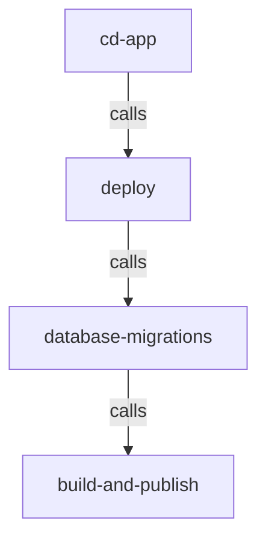

# CI/CD

The CI/CD for this project uses [reusable Github Actions workflows](https://docs.github.com/en/actions/using-workflows/reusing-workflows).

## 🧪 CI

### Per app workflows

Each app should have:

- `ci-[app_name]`: must be created; should run linting and testing
- `ci-[app_name]-vulnerability-scans`: calls `vulnerability-scans`
  - Based on [ci-app-vulnerability-scans](https://github.com/navapbc/template-infra/blob/main/.github/workflows/ci-app-vulnerability-scans.yml)
- `ci-[app_name]-pr-environment-checks.yml`: calls `pr-environment-checks.yml` to create or update a pull request environment (see [pull request environments](/docs/infra/pull-request-environments.md))
  - Based on [ci-app-pr-environment-checks.yml](/.github/workflows/ci-app-pr-environment-checks.yml)
- `ci-[app_name]-pr-environment-destroy.yml`: calls `pr-environment-destroy.yml` to destroy the pull request environment (see [pull request environments](/docs/infra/pull-request-environments.md))
  - Based on [ci-app-pr-environment-destroy.yml](https://github.com/navapbc/template-infra/blob/main/.github/workflows/ci-app-pr-environment-destroy.yml)

### App-agnostic workflows

- [`ci-docs`](./ci-docs.yml): runs markdown linting on all markdown files in the file
  - Configure in [markdownlint-config.json](./markdownlint-config.json)
- [`ci-infra`](./ci-infra.yml): run infrastructure CI checks

## 🚢 CD

Each app should have:

- `cd-[app_name]`: deploys an application
  - Based on [`cd-app`](https://github.com/navapbc/template-infra/blob/main/.github/workflows/cd-app.yml)

The CD workflow uses these reusable workflows:

- [`deploy`](./deploy.yml): deploys an application
- [`database-migrations`](./database-migrations.yml): runs database migrations for an application
- [`build-and-publish`](./build-and-publish.yml): builds a container image for an application and publishes it to an image repository

```mermaid
graph TD
  cd-app
  deploy
  database-migrations
  build-and-publish

  cd-app-->|calls|deploy-->|calls|database-migrations-->|calls|build-and-publish
```

### Releases

[`cd-release`](./cd-release.yml) ("Release Deploy") orchestrates deploys and it runs in two ways:

- **On a published GitHub release:** builds and deploys the release's tag to prod,
  then to training.
- **Manually (`workflow_dispatch`):** deploys to the chosen `environment`.

#### Releasing a specific tag

The manual run accepts an optional `version` input so you can release a specific tag
on demand. When `version` is left blank, the
workflow falls back to the branch/tag it was run from.

To release a tag:

1. Go to **Actions → Release Deploy → Run workflow**.
2. Keep **Use workflow from** set to `main` so the latest workflow definitions are used.
3. Set **environment** to the target environment.
4. Set **version** to the tag to release (e.g. `2026.07.01`).

## ⛑️ Helper workflows

- [`check-ci-cd-auth`](./check-ci-cd-auth.yml): verifes that the project's Github repo is able to connect to AWS
