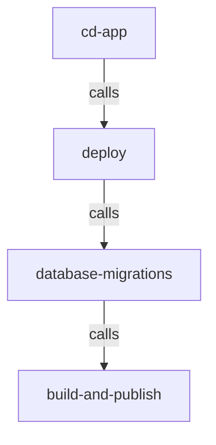

# CI/CD

The CI/CD for this project uses [reusable Github Actions workflows](https://docs.github.com/en/actions/using-workflows/reusing-workflows).

## 🧪 CI

### Per app workflows

Each app should have:

- `ci-<APP_NAME>`: must be created; should run linting and testing
- `ci-<APP_NAME>-vulnerability-scans`: calls `vulnerability-scans`
  - Based on [ci-{{app_name}}-vulnerability-scans](https://github.com/navapbc/template-infra/blob/main/.github/workflows/ci-{{app_name}}-vulnerability-scans.yml.jinja)
- `ci-<APP_NAME>-pr-environment-checks.yml`: calls `pr-environment-checks.yml` to create or update a pull request environment (see [pull request environments](/docs/infra/pull-request-environments.md))
  - Based on [ci-{{app_name}}-pr-environment-checks.yml](https://github.com/navapbc/template-infra/blob/main/.github/workflows/ci-{{app_name}}-pr-environment-checks.yml.jinja)
- `ci-<APP_NAME>-pr-environment-destroy.yml`: calls `pr-environment-destroy.yml` to destroy the pull request environment (see [pull request environments](/docs/infra/pull-request-environments.md))
  - Based on [ci-{{app_name}}-pr-environment-destroy.yml](https://github.com/navapbc/template-infra/blob/main/.github/workflows/ci-{{app_name}}-pr-environment-destroy.yml.jinja)

### App-agnostic workflows

- [`ci-docs`](./ci-docs.yml): runs markdown linting on all markdown files in the file
  - Configure in [markdownlint-config.json](./markdownlint-config.json)
- [`ci-infra`](./ci-infra.yml): run infrastructure CI checks

## 🚢 CD

Each app should have:

- `cd-<APP_NAME>`: deploys an application
  - Based on [`cd-{{app_name}}`](https://github.com/navapbc/template-infra/blob/main/.github/workflows/cd-{{app_name}}.yml.jinja)

The CD workflow uses these reusable workflows:

- [`deploy`](./deploy.yml): deploys an application
- [`database-migrations`](./database-migrations.yml): runs database migrations for an application
- [`build-and-publish`](./build-and-publish.yml): builds a container image for an application and publishes it to an image repository

## ⛑️ Helper workflows

- [`check-ci-cd-auth`](./check-ci-cd-auth.yml): verifies that the project's Github repo is able to connect to AWS
