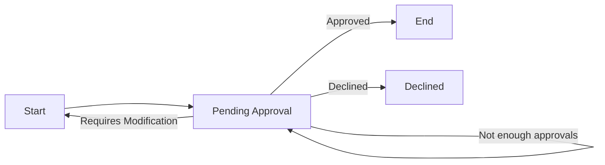

# Overview
This folder contains functionality for running our
workflows via state machines.

Many more docs are coming soon, this doc especially
is very much a work-in-progress as we build out the logic.

## Information

### Approvals

An approval event needs to account for multiple scenarios in how
it should handle responding to the approval based on the approval
response type.
* `Approved` which has two scenarios
  * Has received enough approval events and can go on to the next state
  * Has not received enough approval events and will remain in the current state
* `Declined` - a rejection which will send it to a declined end state
* `Requires Modification` - a soft rejection sending the workflow back to an earlier state, invalidating any approvals that have occurred.

Exactly how we organize these states will be dependent on the workflow, but this
should serve as a rough guideline for how to handle it.



# How-to

## Add an approval to a workflow state machine

In a future ticket we'll document the process to add an approval
to a new workflow. As we're still adjusting and modifying our approach,
want to avoid redoing this down the road.

## Update state machine diagrams

In the future, we'll add this to our CI/CD automation that
generates our database ERD diagrams and API schemas, but
for now we can run this by doing:

```shell
make cmd args="workflow create-workflow-diagrams"
```

This does require that you have installed pydot and graphviz on your system,
we do not have these automatically installed, and you will need to install
them separately.

## Add a new entity type
Each workflow can connect to entities (eg. opportunity or application).
If we want to add support for new types of entities, we need to do
the following.

1. Add the entity type to `WorkflowEntityType`
2. Add a DB table linking the workflow to the entity. Look at tables
   like the workflow_opportunity table as an example. Along with this
   you will want to setup the relationships to the entity for ease of use.
3. Add a new persistence class derived from `BaseStatePersistenceModel`
   with the type you want to use. This will be used as the connection between
   a state machine and the database.
4. Update the logic in `workflow_service.py` for the `get_workflow_entities`
   function to fetch this type of entity.
