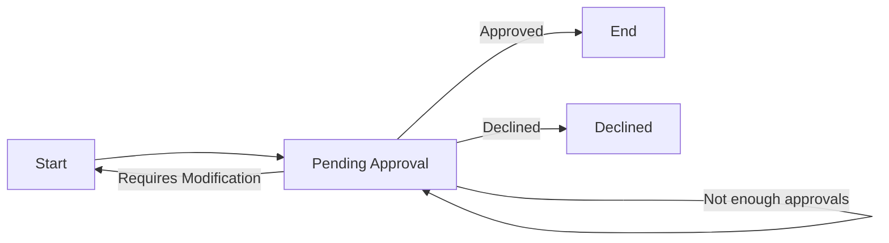

# Overview
This folder contains functionality for running our
workflows via state machines.

Many more docs are coming soon, this doc especially
is very much a work-in-progress as we build out the logic.

## Information

### Approvals

An approval event needs to account for multiple scenarios in how
it should handle responding to the approval based on the approval
response type.
* `Approved` which has two scenarios
  * Has received enough approval events and can go on to the next state
  * Has not received enough approval events and will remain in the current state
* `Declined` - a rejection which will send it to a declined end state
* `Requires Modification` - a soft rejection sending the workflow back to an earlier state, invalidating any approvals that have occurred.

Exactly how we organize these states will be dependent on the workflow, but this
should serve as a rough guideline for how to handle it.


```mermaid
flowchart LR

    A[Start] --> B[Pending Approval]
    B -->|Approved| C[End]
    B -->|Declined| D[Declined]
    B -->|Requires Modification| A
    B -->|Not enough approvals| B
```

# How-to

It is recommended you reference the [python-statemachine](https://python-statemachine.readthedocs.io/en/latest/index.html)
documentation for details on how it works. There are several
different ways to do certain things, but it is recommended that
you follow the same patterns that we are already using for consistency.

## Create a workflow

To create a workflow, you first need to know the following information:
* What is the name / type of the workflow?
* What type of entity (eg. opportunity or application) does the workflow operate against
* What states and transitions do I want in my workflow?
* Does my workflow require any approvals by users (if so, answer these sub-questions)
  * What privilege is required by a user to do the approval?
  * Which event/transitions will that approval be connected to?

See the below steps for more context on how to use this information.

### Creating the states

Create an enum with your states.

```python
from enum import StrEnum

class ExampleState(StrEnum):
    start = "start"
    middle = "middle"
    end = "end"
```

It is recommended that you have a start and end state with those
names for consistency.

### Creating the config

Each workflow has a configuration that is needed for our processing to work.

```python
from src.workflow.workflow_config import ApprovalConfig, WorkflowConfig
example_config = WorkflowConfig(
    # The workflow type needs to be added to the enum
    # This is used as an easy means to find the workflow
    # class and start / reference a workflow of a given type.
    workflow_type=WorkflowType.EXAMPLE,
    # This class handles persisting the entity to the database
    # for you automatically. If the entity type you need isn't
    # defined, see the "Add a new entity type" section below
    persistence_model_cls=OpportunityPersistenceModel,
    entity_type=WorkflowEntityType.OPPORTUNITY,
    approval_mapping={
        # See below for details on adding approvals
        # which need a few pieces of configuration
        # in order to setup.
    }
)
```

### Create the state machine

```python
from statemachine import Event
from statemachine.states import States

from src.workflow.event.state_machine_event import StateMachineEvent

from src.workflow.base_state_machine import BaseStateMachine

# This register_workflow decorator makes it so your
# class is able to be found by the workflow type
# Make sure to add the file you put this in to
# the __init__.py file in the state machine folder.
@WorkflowRegistry.register_workflow(example_config)
class ExampleStateMachine(BaseStateMachine):
    # Define the states - because we used an enum
    # we can simply tell it to look at that and
    # tell it what the initial + end states are
    states = States.from_enum(
        ExampleState,
        initial=ExampleState.START,
        final=[ExampleState.END],
    )

    # Define the transition events
    # There are many ways of configuring these
    # and how they behave, this example keeps them
    # very simple, more advanced techniques are discussed
    # in other how-to sections.

    start_to_middle = Event(
        states.START.to(states.MIDDLE)
    )

    middle_to_end = Event(
        states.MIDDLE.to(states.END)
    )

    ### Handlers
    # Handlers are where we do any logic for a given state transition
    # We recommend using the decorator pattern for readability

    @start_to_middle.on
    def handle_start_to_middle(self, state_machine_event: StateMachineEvent):
        # The state_machine_event contains all information about the
        # event being received including the user, the workflow, and
        # basically anything else you might need for your logic.
        # It will always be set by our event handler wrapper.
        
        # A db_session is available, you can assume it's already in a transaction
        # and SHOULD NOT commit as part of this logic.
        self.db_session.execute(...)

```

## Add an approval to a workflow state machine

In a future ticket we'll document the process to add an approval
to a new workflow. As we're still adjusting and modifying our approach,
want to avoid redoing this down the road.

## Update state machine diagrams

In the future, we'll add this to our CI/CD automation that
generates our database ERD diagrams and API schemas, but
for now we can run this by doing:

```shell
make cmd args="workflow create-workflow-diagrams"
```

This does require that you have installed pydot and graphviz on your system,
we do not have these automatically installed, and you will need to install
them separately.

## Add a new entity type
This section needs to be rewritten. Will be handled in a future ticket.