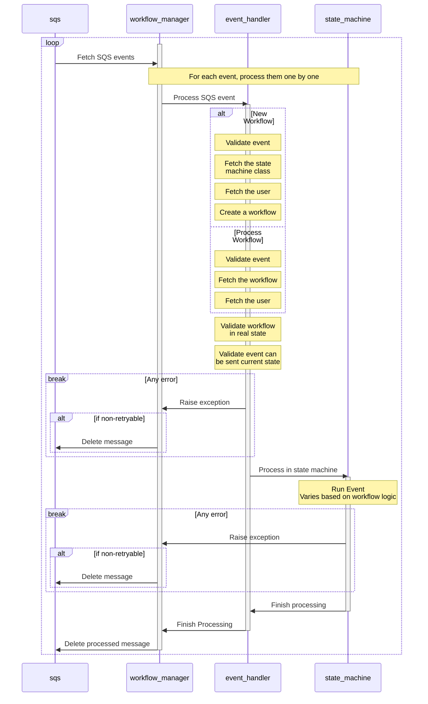
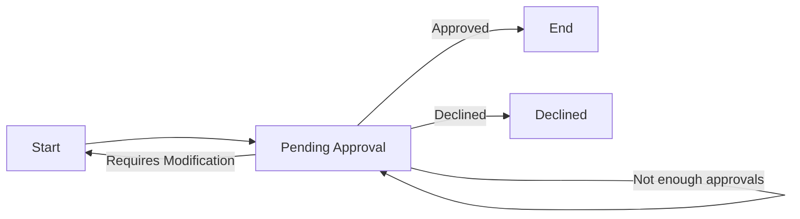

# Overview
This folder contains functionality for running our
workflows via state machines, as well as defining the
state machines.

For details on the architecture of the workflow system
see [these docs](/documentation/api/workflow-service.md).

## General Structure
The workflow service has 3 layers:
* The [workflow manager](./manager/workflow_manager.py) which is the main entrypoint to the looping logic that fetches events from SQS and passes them to the event handler for processing.
* The [event handler](./handler/event_handler.py) which handles processing and validating events from SQS before passing them to the underlying state machines
* Our state machines that have the actual logic and configuration of a given workflow.

Unless you need to change fundamental logic about how we handle events, most workflow work
is likely going to be in the state machines themselves as the higher layers are mostly concerned
with data fetching, and error handling.

Note on this diagram that all of these components talk to the database frequently, excluding
all of those calls, but assume it's happening for nearly every step of the process.


```mermaid
sequenceDiagram
    participant sqs
    participant workflow_manager
    participant event_handler
    participant state_machine
    
    loop
        activate workflow_manager
        sqs->>workflow_manager: Fetch SQS events
        Note over workflow_manager, state_machine: For each event, process them one by one
        workflow_manager->>event_handler: Process SQS event
        
        activate event_handler
        
        alt New Workflow
            Note over event_handler: Validate event
            Note over event_handler: Fetch the state<br>machine class
            Note over event_handler: Fetch the user
            Note over event_handler: Create a workflow
        else Process Workflow
            Note over event_handler: Validate event
            Note over event_handler: Fetch the workflow
            Note over event_handler: Fetch the user
        end

        
        Note over event_handler: Validate workflow<br>in real state
        Note over event_handler: Validate event can<br>be sent current state
        
        break Any error
            event_handler->>workflow_manager: Raise exception
            alt if non-retryable
                workflow_manager->>sqs: Delete message
            end
        end
        event_handler->>state_machine: Process in state machine
        
        activate state_machine
        Note over state_machine: Run Event<br>Varies based on workflow logic
        
        break Any error
            state_machine->>workflow_manager: Raise exception
            alt if non-retryable
                workflow_manager->>sqs: Delete message
            end
        end
        
        state_machine->>event_handler: Finish processing
        deactivate state_machine
        
        event_handler->>workflow_manager: Finish Processing
        deactivate event_handler
        
        workflow_manager->>sqs: Delete processed message
        deactivate workflow_manager
        
    end
```

## Error Handling
Any exceptions thrown in our event handler or state machines will propagate upwards
and prevent us from commiting any pending changes back to the database. Note that handling
an event is all done in a single DB transaction.

Exceptions are grouped into one of three categories:
* Retryable - Exceptions that indicate we should try processing the event again
  in a few minutes. These are generally system bugs (that we'd need to fix before it can be processed)
  OR inconsistencies we expect to resolve like network issues.
* Non-retryable - Exceptions that indicate we shouldn't retry. Generally this will be for
  errors that we do not think can be resolved like a workflow not existing, or an event
  that doesn't exist on the workflow.
* Anything else - Any other exceptions that aren't classified as one of these is by default
  treated as a retryable exception as we want to default to retrying an error.

If an error is non-retryable, we do delete the SQS message from the queue and store
a record in the `WorkflowEventHistory` table, but say that it could not be processed successfully.
All SQS messages will be stored in this table when deleting, whether successful or not.

## Approvals

An approval event needs to account for multiple scenarios in how
it should handle responding to the approval based on the approval
response type.
* `Approved` which has two scenarios
  * Has received enough approval events and can go on to the next state
  * Has not received enough approval events and will remain in the current state
* `Declined` - a rejection which will send it to a declined end state
* `Requires Modification` - a soft rejection sending the workflow back to an earlier state, invalidating any approvals that have occurred.

Exactly how we organize these states will be dependent on the workflow, but this
should serve as a rough guideline for how to handle it.


```mermaid
flowchart LR

    A[Start] --> B[Pending Approval]
    B -->|Approved| C[End]
    B -->|Declined| D[Declined]
    B -->|Requires Modification| A
    B -->|Not enough approvals| B
```

# How-to
It is recommended you reference the [python-statemachine](https://python-statemachine.readthedocs.io/en/latest/index.html)
documentation for details on how it works. There are several
different ways to do certain things, but it is recommended that
you follow the same patterns that we are already using for consistency.

## Create a workflow
To create a workflow, you first need to know the following information:
* What is the name / type of the workflow?
* What type of entity (eg. opportunity or application) does the workflow operate against
* What states and transitions do I want in my workflow?
* Does my workflow require any approvals by users (if so, answer these sub-questions)
  * What privilege is required by a user to do the approval?
  * Which event/transitions will that approval be connected to?

See the below steps for more context on how to use this information.

### Creating the states
Create an enum with your states.

```python
from enum import StrEnum

class ExampleState(StrEnum):
    start = "start"
    middle = "middle"
    end = "end"
```

It is recommended that you have a start and end state with those
names for consistency.

### Creating the config
Each workflow has a configuration that is needed for our processing to work.

```python
from src.workflow.workflow_config import ApprovalConfig, WorkflowConfig

example_config = WorkflowConfig(
    # The workflow type needs to be added to the enum
    # This is used as an easy means to find the workflow
    # class and start / reference a workflow of a given type.
    workflow_type=WorkflowType.EXAMPLE,
    # This class handles persisting the entity to the database
    # for you automatically. If the entity type you need isn't
    # defined, see the "Add a new entity type" section below
    persistence_model_cls=OpportunityPersistenceModel,
    entity_type=WorkflowEntityType.OPPORTUNITY,
    # Whether to allow a given entity to have more than one
    # active version of a workflow at a time. Defaults to True.
    allow_concurrent_workflow_for_entity=False,
    approval_mapping={
        # See below for details on adding approvals
        # which need a few pieces of configuration
        # in order to setup.
    }
)
```

### Create the state machine

```python
from typing import Any
from statemachine import Event
from statemachine.states import States

from src.workflow.state_persistence.opportunity_persistence_model import OpportunityPersistenceModel
from src.workflow.event.state_machine_event import StateMachineEvent
from src.workflow.registry.workflow_registry import WorkflowRegistry
from src.workflow.base_state_machine import BaseStateMachine

# This register_workflow decorator makes it so your
# class is able to be found by the workflow type
# Make sure to add the file you put this in to
# the __init__.py file in the state machine folder.
@WorkflowRegistry.register_workflow(example_config)
class ExampleStateMachine(BaseStateMachine):
    # Define the states - because we used an enum
    # we can simply tell it to look at that and
    # tell it what the initial + end states are
    states = States.from_enum(
        ExampleState,
        initial=ExampleState.START,
        final=[ExampleState.END],
    )

    # Define the transition events
    # There are many ways of configuring these
    # and how they behave, this example keeps them
    # very simple, more advanced techniques are discussed
    # in other how-to sections.

    start_to_middle = Event(
        states.START.to(states.MIDDLE)
    )

    middle_to_end = Event(
        states.MIDDLE.to(states.END)
    )

    ### Handlers
    # Handlers are where we do any logic for a given state transition
    # We recommend using the decorator pattern for readability

    @start_to_middle.on
    def handle_start_to_middle(self, state_machine_event: StateMachineEvent):
        # The state_machine_event contains all information about the
        # event being received including the user, the workflow, and
        # basically anything else you might need for your logic.
        # It will always be set by our event handler wrapper.
        
        # A db_session is available, you can assume it's already in a transaction
        # and SHOULD NOT commit as part of this logic.
        self.db_session.execute(...)

    # If you'll need to interact with the opportunity or other entity
    # associated with the workflow, an easy way to get it is set it in
    # the init function. This isn't mandatory, but a useful pattern
    # to avoid having to dig it out of the state_machine_event
    def __init__(self, model: OpportunityPersistenceModel, **kwargs: Any):
        super().__init__(model=model, **kwargs)
        self.opportunity = model.opportunity

```

## Add an approval to a workflow state machine
To add an approval to a workflow, first determine the following:
* What privilege will a user require to do the approval?
* How should the state machine behave if the user declines/requires modification?

Let's assume we want to support an "Example Approval" which requires the
`example_approval` privilege. After that privilege is added to the privilege
enum + configured to work with the lookup table (see [lookup-values](/documentation/api/lookup-values.md))
and we add whatever approvals to the `ApprovalType` enum in the same manner,
you'll want to do the following.

Add the following to the overall workflow configuration for each approval:
```python

from src.workflow.workflow_config import ApprovalConfig, WorkflowConfig

from src.constants.lookup_constants import ApprovalType, Privilege, WorkflowEntityType, WorkflowType

example_config = WorkflowConfig(
  # ... see above examples for other fields we set
  approval_mapping={
    # The key of this mapping must match the event
    # that you'll add below. Generally we'll name these
    # as "receive_{approval name}"
    "receive_example_approval": ApprovalConfig(
      # The approval type enum is used to help categorize approvals
      # and should be unique for all approvals
      approval_type=ApprovalType.EXAMPLE_APPROVAL,
      # The state that the approval is in is needed for sending out
      # emails when the state is entered
      approval_state=ExampleState.PENDING_EXAMPLE_APPROVAL,
      # The privilege(s) we'll check when a user tries to send
      # this event in the event API. This is the privilege they need
      # in the agency that owns the entity.
      required_privileges=[Privilege.EXAMPLE_APPROVAL],
      # This is optional and defaults to 1, the number of unique
      # users that must do approvals before the state can move
      # on to the next state
      minimum_approvals_required=1
    ),
  }
)
```

In your state machine class, you'll want two events, one for receiving
approvals and one for checking if enough approvals have been received.
It's a bit verbose, but most of this is fairly boilerplate to point at
the utility functions that generally handle approvals for you.

```python
from statemachine import Event
from src.workflow.workflow_constants import WorkflowConstants

class ExampleStateMachine(BaseStateMachine):
    # ... see the above example setup, this is assuming this is being added to that
    states = ...
    
    # For approvals, you need to account for what happens when a user
    # approves, declines, or requires modification.
    # What we're configuring here is mainly telling it how to handle
    # each of the approval response types, and telling it to use
    # utility functions that we've already built for doing this logic
    # in a more general way.
    
    
    # NOTE: Future work will make it so not all of these are required
    # we'll update these docs accordingly.
    
    ## Example approval
    # This is a singular event with several branching paths
    # based on the 
    receive_example_approval = Event(
        # APPROVED case
        # If approved, stay in the same state, the after function
        # might move it if enough approvals have been received.
        states.PENDING_EXAMPLE_APPROVAL.to.itself(
            # These conditional functions as well as the ON
            # handler functions are all defined on the base state machine
            # and are built to generically handle all approvals.
            cond=WorkflowConstants.IS_APPROVAL_EVENT_APPROVED,
            on=WorkflowConstants.ON_AGENCY_APPROVAL_APPROVED,
            # For the approval case, we tell it to run an
            # event afterwards that checks if it has enough approvals
            # We have to do this in two steps as the approval event
            # is added as part of handling this first event
            after="check_example_approval",
        )
        |
        # DECLINED case
        # if declined, move it to the declined state
        states.PENDING_EXAMPLE_APPROVAL.to(
            states.DECLINED,
            cond=WorkflowConstants.IS_APPROVAL_EVENT_DECLINED,
            on=WorkflowConstants.ON_AGENCY_APPROVAL_DECLINED,
        )
        |
        # REQUIRES MODIFICATION case
        # if requires modification, we move it back to an earlier state
        # this earlier state can be whatever makes sense for the workflow
        # NOTE - this also invalidates ALL approvals (even of other types)
        # and assumes the workflow will have to go through all approvals again.
        states.PENDING_EXAMPLE_APPROVAL.to(
            states.START,
            cond=WorkflowConstants.IS_APPROVAL_EVENT_REQUIRES_MODIFICATION,
            on=WorkflowConstants.ON_AGENCY_APPROVAL_REQUIRES_MODIFICATION,
        )
    )

    # This event exists purely as a way to check that enough approvals
    # have been received AFTER applying the approval.
    check_example_approval = Event(
        # If it has enough approvals, go to the end state
        states.PENDING_EXAMPLE_APPROVAL.to(
            states.END, cond=WorkflowConstants.HAS_ENOUGH_APPROVALS
        )
        # If not, stay in this state
        | states.PENDING_EXAMPLE_APPROVAL.to.itself(),
    )
```

## Update state machine diagrams
In the future, we'll add this to our CI/CD automation that
generates our database ERD diagrams and API schemas, but
for now we can run this by doing:

```shell
make cmd args="workflow create-workflow-diagrams"
```

This does require that you have installed pydot and graphviz on your system,
we do not have these automatically installed, and you will need to install
them separately.

## Add a new entity type
If we want to add a new type of entity (ie. table) that can be associated
with a workflow, there are a few changes that you'll need to make.

> [!NOTE]
> This all assumes that the entity is logically owned by an agency for the 
> purposes of authentication, which matters if approvals are needed. If
> your entity does not associate with an agency and has approvals, that
> logic will need to be built out.

### Add to the workflow entity type enum
Update the `WorkflowEntityType` to contain the enum you want to support.

### Add a foreign key from the workflow table to the entity table
In our [workflow table](../db/models/workflow_models.py) we have foreign
keys to each entity, add a foreign key and update the constraint that is defined
on the table. This constraint makes it so exactly 1 of the entities is set.

> [!NOTE]
> The workflow table has details about how to handle this constraint.
> You must manually setup the DB migration yourself as Alembic cannot
> detect it automatically. Follow the instructions carefully.

### Adjust the logic to find a workflow entity
We have a [get_workflow_entity](./service/workflow_service.py) function that finds the workflow entity for new workflows.
Add logic to this to find the table from its primary key in the same pattern.

### Add a persistence handler
Like our [opportunity_persistence_model](./state_persistence/opportunity_persistence_model.py)
add a class that handles persistence for that particular type, following the same pattern.

## Send emails for approvals
Approval emails are automatically handled for you. We have a listener
defined in [workflow_approval_email_listener.py](./listener/workflow_approval_email_listener.py)
that checks if a state being entered is configured as an approval state.
If it is, it looks at the privilege to find who could possibly do the approval
and sends them each an email.

## Chaining events together
When you want to have a single SQS event cause several
different events to occur in sequence (eg. an approval and then several automated steps)
all you need to do for each state is define an `after`
event for each event.

We use this in our approval logic, but it's more generally usable.
If you had 3 states, `start`, `middle`, and `end` and you wanted the
start workflow event that does start->middle to then trigger the event
that moves from middle->end, you can do something like:

```python
from statemachine import Event

from src.workflow.base_state_machine import BaseStateMachine

class ExampleStateMachine(BaseStateMachine):
  states = ...

  start_workflow = Event(
      states.START.to(states.MIDDLE, after="middle_to_end"),
  )
  
  middle_to_end = Event(
    states.MIDDLE.to(states.END)
  )
```

The `after` parameter has to match the name of the event you want
it to run through afterwards.

Doing this will allow you to chain several events together that all
get processed immediately, not having to go through the SQS queue
or any of the higher level processes.

## Testing a state machine
The easiest way to test a state machine is to use the event handler
and a few utilities we've built.

```python
from src.constants.lookup_constants import WorkflowEntityType, WorkflowEventType, WorkflowType, ApprovalResponseType
from tests.src.db.models.factories import OpportunityFactory, UserFactory, WorkflowFactory

from tests.src.workflow.workflow_test_util import (
    build_start_workflow_event,
    send_process_event,
)

def test_example(db_session, enable_factory_create):
  
    user = UserFactory.create()
    opportunity = OpportunityFactory.create()
  
    # Create a workflow using our factories
    # unless you are starting a workflow in which
    # case you can skip this step as the event itself
    # creates the workflow
    workflow = WorkflowFactory.create(
      workflow_type=WorkflowType.EXAMPLE_WORKFLOW,
      current_workflow_state=ExampleWorkflowState.MIDDLE,
      # Or whatever entity you want
      opportunity=opportunity
    )

    # This send_process_event utility handles
    # structuring a valid event + validating
    # the expected state / whether the workflow is still active
    state_machine = send_process_event(
        db_session=db_session,
        event_to_send="middle_to_end",
        workflow_id=workflow.workflow_id,
        user=user,
        expected_state=ExampleWorkflowState.END,
        expected_is_active=False,
        # These fields are optional and pertain
        # to specific scenarios like approvals
        approval_response_type=ApprovalResponseType.APPROVED,
        comment="hello"
    )
```

We have several different utilities for testing in the workflow_test_util
that you should look at that can help simplify the setup and validation
of tests.