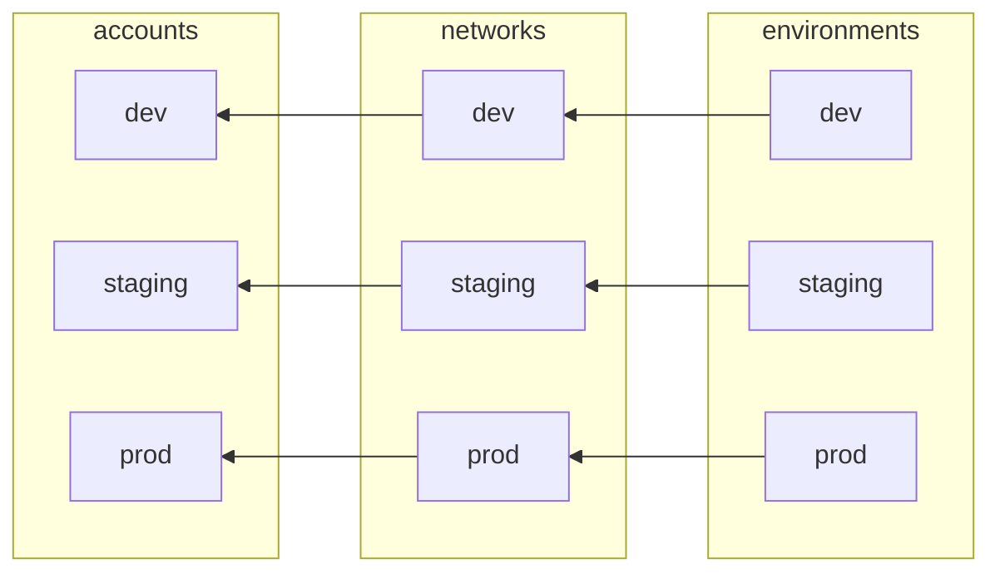
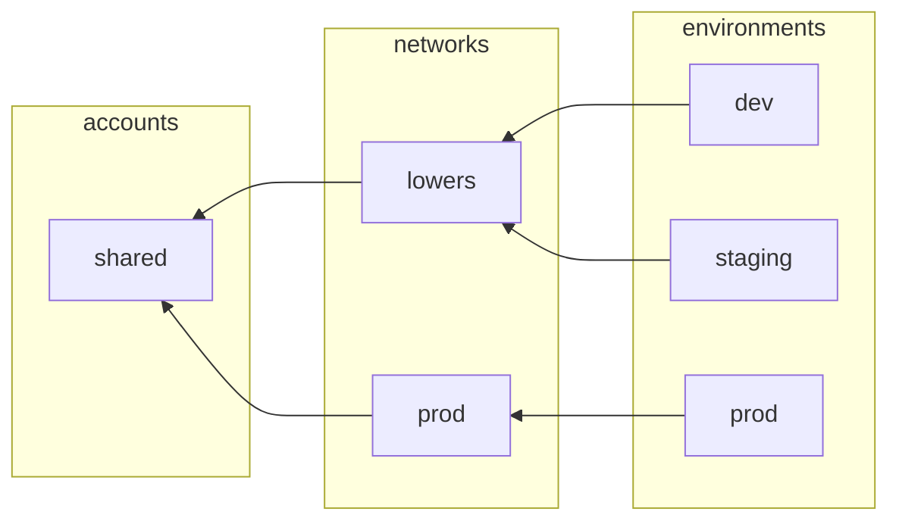

# Design of network layer

* Deciders: @lorenyu @shawnvanderjagt
* Date: 2023-12-01

## Context and Problem Statement

Most projects will need to deploy their applications into custom VPCs. The policies around VPCs can vary. For example, some projects might require each application environment to be in its own VPC, while other projects might have all lower environments share a VPC. Some projects might have all resources live in one AWS account, while others might isolate resources into separate accounts. Some projects might have permission to create and configure the VPCs (according to agency security policies), while other projects might have the VPC created by the agency's shared infrastructure team before it's provided to the project team to use. This technical specification proposes a design of the network layer that accommodates these various configurations in a simple modular manner.

## Requirements

1. The project team can create any number of networks, or VPCs, independently of the number of AWS accounts or the number of applications or application environments.
2. Created VPCs can be mapped arbitrarily to AWS accounts. They can all be created in a single AWS account or separated across multiple AWS accounts.
3. An application environment can map to any of the created VPCs, or to a VPC that is created outside of the project.

We aim to achieve these requirements without adding complexity to the other layers. The network layer should be decoupled from the other layers.

## Approach

### Network configuration

Define the configuration for networks in a new property `network_configs` in the [project-config module](/infra/project-config/main.tf). `network_configs` is a map from the network name to the network configuration. The network name is a name the project team choose to serve as a human-readable identifier to reference the network. To keep network configuration DRY and reuse common configurations between networks, create a sub-module `network-config` under the project-config module, analogous to the [env-config module](/infra/app/app-config/env-config/) under the [app-config module](/infra/app/app-config/). The `project-config` module might look something like this:

```terraform
# project-config/main.tf

network_configs = {
  dev = module.dev_network_config
  ...
  [NETWORK_NAME] = module.[NETWORK_NAME]_network_config
}

# project-config/dev-network.tf

module "dev_network_config" {
  source "./network-config"
  ...
}

...

# project-config/[NETWORK_NAME]-network.tf

module "[NETWORK_NAME]_network_config" {
  source "./network-config"
  ...
}
```

Each network config will have the following properties:

* **account_name** — Name of AWS account that the VPC should be created in. Used to document which AWS account the network lives in and to determine which AWS account to authenticate into when making modifications to the network in scripts such as CI/CD
* Each network will have three subnets, (1) a public subnet, (2) a private subnet for the application layer, and (3) private subnet for the data layer
* The network will also have different properties depending on the applications that are using the network (see [Application-specific network configuration](#application-specific-network-configuration))

### Add network_name tag to VPC

Add a "network_name" name tag to the VPC with the name of the network. The VPC tag will be used by the service layer to identify the VPC in an [aws_vpc data source](https://registry.terraform.io/providers/hashicorp/aws/latest/docs/data-sources/vpc). Tags are used because at this time AWS VPCs do not have any user-provided identifiers such as a VPC name. Generated identifiers like `vpc_id` cannot be used because `vpc_id` is not known statically at configuration time, and we are following the pattern of [using configuration and data sources to manage dependencies between different infrastructure layers](/docs/infra/module-dependencies.md#use-config-modules-and-data-resources-to-manage-dependencies-between-root-modules).

## Application-specific network configuration

In order to determine which VPC to use for each application environment, add a `network_name` property to the [environment config](/infra/app/app-config/env-config/). The network name will be used in database and service layers by the `aws_vpc` data source:

```terraform
data "aws_vpc" "network" {
  tags = {
    network_name = local.environment_config.network_name
  }
}
```

Networks associated with applications using the `network_name` property will have the following properties based on the application configuration.

1. The `has_database` setting determines whether or not to create VPC endpoints needed by the database layer.
2. The `has_external_non_aws_service` setting determines whether or not to create NAT gateways, which allows the service in the private subnet to make requests to the internet.

### Example configurations

Example project with a multi-account setup



Example project with a single account and a shared VPC "lowers" for lower environments


