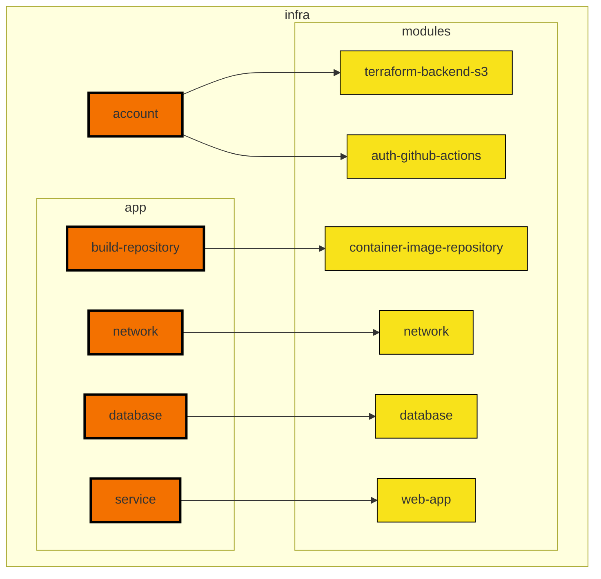
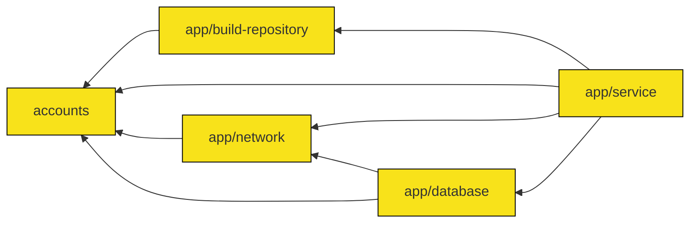

# Terraform module architecture

This doc describes how the Terraform modules are structured. Directory structure and layers are documented in the [infrastructure README](/infra/README.md).

## Approach

The infrastructure code is organized into:

- root modules
- child modules

[Root modules](https://www.terraform.io/language/modules#the-root-module) are modules that are deployed separately from each other, whereas child modules are reusable modules that are called from root modules. To deploy all the resources necessary for a given environment, all the root modules must be deployed independently in the correct order.

For a full list of rationale and factors, see [ADR: Separate app infrastructure into layers](/docs/decisions/infra/0009-separate-app-infrastructure-into-layers.md).

## Module calling structure

The following diagram describes the relationship between modules and their child modules. Arrows go from the caller module to the child module.

## Module dependencies

The following diagram illustrates the dependency structure of the root modules.

1. Account root modules need to be deployed first to create the S3 bucket and DynamoDB tables needed to configure the Terraform backends in the rest of the root modules.
2. The application's build repository needs to be deployed next to create the resources needed to store the built release candidates that are deployed to the application environments.
3. The individual application environment root modules are deployed last once everything else is set up. These root modules are the ones that are deployed regularly as part of application deployments.

### Guidelines for layers

When deciding which layer to put an infrastructure resource in, follow the following guidelines.

* **Default to the service layer** By default, consider putting application resources as part of the service layer. This way the resource is managed together with everything else in the environment, and spinning up new application environments automatically spin up the resource.

* **Consider variations in number and types of environments of each layer:** If the resource does not or might not map one-to-one with application environments, consider putting the resource in a different layer. For example, the number of AWS accounts may or may not match the number of VPCs, which may or may not match the number of application environments. As another example, each application only has one instance of a build repository, which is shared across all environments. As a final example, an application may or may not need a database layer at all, so by putting database related resources in the database layer, and application can skip those resources by skipping the entire layer rather than by needing to change the behavior of an existing layer. Choose the layer for the resource that maps most closely with that resource's purpose.

* **Consider AWS uniqueness constraints on resources:** This is a special case of the previous consideration: resources that AWS requires to be unique should be managed by a layer that creates only one of that resource per instance of that layer. For example, there can only be one OIDC provider for GitHub actions per AWS account (see [Creating OIDC identity providers](https://docs.aws.amazon.com/IAM/latest/UserGuide/id_roles_providers_create_oidc.html)), so the OIDC provider should go in the account layer. As another example, there can only be one VPC endpoint per VPC per AWS service (see [Fix conflicting DNS domain errors for interface VPC endpoints](https://repost.aws/knowledge-center/vpc-interface-endpoint-domain-conflict)). Therefore, if multiple application environments share a VPC, they can't each create a VPC endpoint for the same AWS service. As such, the VPC endpoint logically belongs to the network layer and VPC endpoints should be created and managed per network instance rather than per application environment.

* **Consider policy constraints on what resources the project team is authorized to manage:** Different categories of resources may have different requirements on who is allowed to create and manage those resources. Resources that the project team are not allowed to manage directly should not be mixed with resources that the project team needs to manage directly.

* **Consider out of band dependencies:** Put infrastructure resources that require steps outside of terraform to be completed configured in layers that are upstream to resources that depend on those completed resources. For example, after creating a database cluster, the database schemas, roles, and privileges need to be configured before they can be used by a downstream service. Therefore database resources should be separate from the service layer so that the database can be configured fully before attempting to create the service layer resources.

## Making changes to infrastructure

Now that you understand how the modules are structured, see [making changes to infrastructure](./making-infra-changes.md).
