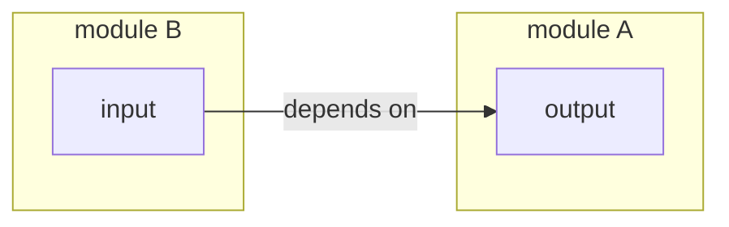
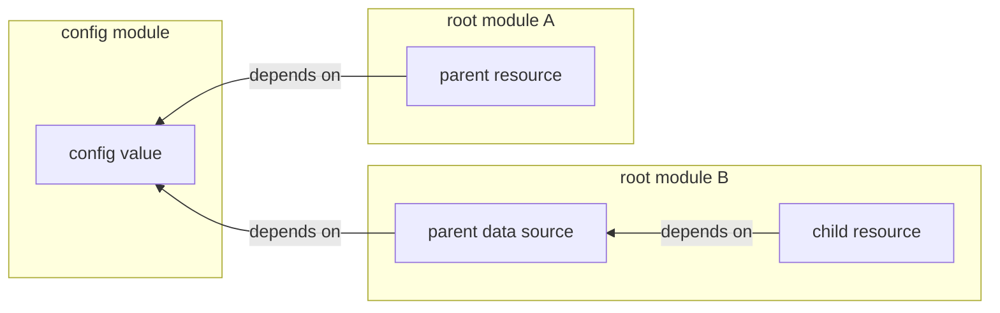
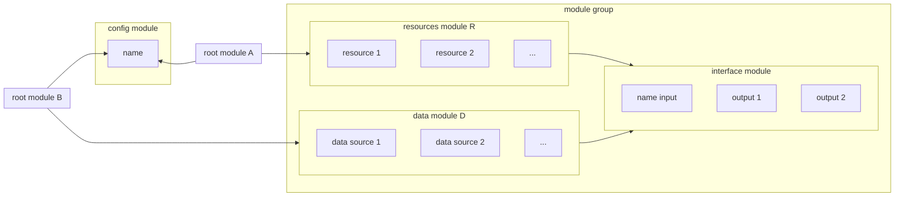

# Managing module dependencies

These are the principles that guide the design of the infrastructure template.

## Use explicit outputs and variables to connect resources across child modules in the same root module

If a resource in module B depends on a resource in module A, and both modules are called from the same root module, then create an output in module A with the information that is needed by module B, and pass that into module B as an input variable.

```terraform
# root-module/main.tf

module "a" {
  ...
}

module "b" {
  input = module.a.output
}
```

This makes the dependencies between the resources explicit:



**Do not** use [data sources](https://developer.hashicorp.com/terraform/language/data-sources) to reference resource dependencies in the same root module. A data source does not represent a dependency in [terraform's dependency graph](https://developer.hashicorp.com/terraform/internals/graph), and therefore there will potentially be a race condition, as Terraform will not know that it needs to create/update the resource in module A before it creates/updates the resource in module B that depends on it.

## Use config modules and data sources to manage dependencies between root modules

If a resource in root module B depends on a resource in root module A, it is not possible to specify the dependency directly since the resources are managed in separate state files. In this situation, use a [data source](https://developer.hashicorp.com/terraform/language/data-sources) in module B to reference the resource in module R, and use a shared configuration module that specifies identifying information that is used both to create the resource in R and to query for the resource in B.

```terraform
# root module A

module "config" {
  ...
}

resource "parent" "p" {
  identifier = module.config.parent_identifier
}
```

```terraform
# root module B

module "config" {
  ...
}

data "parent" "p" {
  identifier = module.config.parent_identifier
}

resource "child" "c" {
  input = data.parent.p.some_attribute
}
```

This makes the dependency explicit, but indirect. Instead of one resource directly depending on the other, both resources depend on a shared config value(s) that uniquely identifies the parent resource. If the parent resource changes, the data source will also change, triggering the appropriate change in the child resource. If identifying information about the parent resource changes, it must be done through the shared configuration module so that the data source's query remains in sync.



### Create "data" modules to reference a group of resources created in another module

Often, a root module B will depend on a group of related resources created in another root module A. Moreover, the resources in A are typically created by calling a reusable module in [infra/modules](/infra/modules/) rather than directly in the root module. In this situation, rather than create a separate config for each dependency, create a data module D that B can call to reference R's resources, and group D and R together in a folder e.g. `/infra/modules/component/resources` and `/infra/modules/component/data`. In order to DRY up how related resources are named, create an static `interface` module that both the `resources` module and `data` module can reference. The `interface` module should typically have only one variable as input, the `name` of the group of resources, and the outputs should be the names of related resources in the group.

```terraform
# root module A

module "config" {
  ...
}

# Create the group of resources that make up "component"
module "component" {
  source = "../modules/component/resources"
  name   = module.config.component_name
}
```

```terraform
# root module B

module "config" {
  ...
}

# Reference the group of resources that make up "component"
module "component" {
  source = "../modules/component/data"
  name   = module.config.component_name
}
```

```terraform
# resources module infra/modules/component/resources

module "interface" {
  source = "../interface"
}

resource "r1" "r1" {
  name = module.interface.r1_name
}

resource "r2" "r2" {
  name = module.interface.r2_name
}
```

```terraform
# data module infra/modules/component/data

module "interface" {
  source = "../interface"
}

data "d1" "d1" {
  name = module.interface.r1_name
}

data "d2" "d2" {
  name = module.interface.r2_name
}
```

```terraform
# interface module infra/modules/component/interface

variable "name" {
  ...
}

output "r1_name" {
  value = "${var.name}-r1"
}

output "r2_name" {
  value = "${var.name}-r2"
}
```

Grouping the data sources into a separate module abstracts away the specific data sources needed by the root module, and allows the root module to reference the group of resources as a single entity. It also reduces the amount of code in the root module itself, making it easier to read and maintain. Note that the `data` module should only contain data sources, not resources.

Generating related resource names via an internal "interface" module ensures that the names of the resources are consistent across the `resources` and `data` modules without exposing them as variables to the modules. This reduces the number of possible configurations and therefore reduces the number of parameters needed in the `project-config` and `app-config` modules. Note that the `interface` module should be static, containing only variables and outputs. It should not contain resources or data sources.


