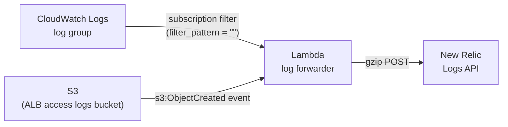

# New Relic log forwarding

We forward logs from AWS to New Relic the **Lambda log
forwarders**. CloudWatch Logs (and, for ALB access logs, S3) invoke a Lambda,
the Lambda reshapes each batch into the New Relic Logs API format, and ships it
to New Relic.

This replaced the previous **Fluent Bit / FireLens sidecar** approach. We used
to run a Fluent Bit container alongside each ECS task to ship
container logs directly to New Relic. That sidecar was removed in
[#10238](https://github.com/HHS/simpler-grants-gov/issues/10238); the
forwarding logic — including the SQL parameter truncation that used to live in
`fluentbit/truncate_logs.lua` — now lives in the Lambda forwarders.

## Why Lambda instead of the Fluent Bit sidecar

- **No per-task overhead.** The sidecar reserved CPU/memory in every ECS task
  (`fluent_bit_cpu`/`fluent_bit_memory`) and added a container to manage,
  build, and patch. The Lambda forwarders run only when there are logs to
  forward.
- **One pattern for every log source.** ECS, API Gateway, ALB, RDS, OpenSearch,
  and ClamAV all forward the same way (CloudWatch subscription filter → Lambda),
  instead of only sidecar-capable services going direct to New Relic.
- **No secrets in task definitions.** The Fluent Bit sidecar needed the New
  Relic license key injected as a container secret. The Lambdas fetch it from
  SSM Parameter Store at runtime instead (see [License key](#license-key)).
- **No custom image to build/publish.** The sidecar required building and
  publishing a custom Fluent Bit image and pinning it via the
  `fluent-bit-commit` SSM parameter on each full deploy.

## Architecture

Each forwarder Lambda:

1. Is invoked by a CloudWatch Logs subscription filter (base64 + gzip payload)
   or, for ALB, an S3 `ObjectCreated` event.
2. Decodes/decompresses the payload and skips CloudWatch `CONTROL_MESSAGE`
   events.
3. Parses each log line. If the message is JSON (structured logging), its
   top-level fields are lifted into New Relic log attributes; otherwise the
   raw message is forwarded as-is.
4. Sanitizes fields — truncates long values (`MAX_FIELD_LENGTH = 3000`),
   collapses long SQL `IN (...)` parameter lists into a marker, and escapes
   control characters.
5. Attaches common attributes (account ID, region, `logtype`, and an
   `entity.guid` so logs bind to the correct New Relic entity).
6. Batches entries (`BATCH_SIZE = 1000`) and POSTs them gzip-compressed to the
   New Relic Logs API (`https://log-api.newrelic.com/log/v1`).

### Retry behavior

`send_to_newrelic` re-raises on connection errors and HTTP `5xx` responses so
the Lambda fails and AWS retries the batch. HTTP `4xx` responses are treated as
non-retryable — the batch is logged and dropped rather than retried forever.

## Log sources and forwarders

There is one forwarder per source type. Each lives in its own Terraform module
next to the resource it serves, with the Lambda source under that module's
`lambda/` directory.

| Source | Trigger | Terraform | Lambda source |
|---|---|---|---|
| ECS application logs + API Gateway access/execution logs | CloudWatch subscription filters | `infra/modules/service/host_log_forwarding.tf` | `infra/modules/service/lambda/newrelic_host_log_forwarder.py` |
| ALB / mTLS ALB access logs | S3 `ObjectCreated` events | `infra/modules/service/alb_log_forwarding.tf` | `infra/modules/service/lambda/newrelic_alb_log_forwarder.py` |
| RDS (Aurora PostgreSQL) logs | CloudWatch subscription filter | `infra/modules/database/log_forwarding.tf` | `infra/modules/database/lambda/newrelic_log_forwarder.py` |
| OpenSearch logs | CloudWatch subscription filter | `infra/modules/search/log_forwarding.tf` | `infra/modules/search/lambda/newrelic_log_forwarder.py` |
| ClamAV scanner + freshclam logs | CloudWatch subscription filters | `infra/modules/clamav/log_forwarding.tf` | `infra/modules/clamav/lambda/newrelic_log_forwarder.py` |

All forwarders run `python3.12` with the `index.handler` entrypoint (the
`.py` file is zipped into `index.py` by an `archive_file` data source). The
service forwarders use `256 MB` / `60s`; the database, search, and ClamAV
forwarders use `128 MB` / `30s`.

## Configuration

Each forwarder Lambda is configured entirely through environment variables set
in its Terraform module:

| Variable | Purpose |
|---|---|
| `NR_LICENSE_KEY_SSM_PATH` | SSM parameter name holding the New Relic license key (`/new-relic-license-key`). Fetched at runtime, not stored in the env. |
| `NR_LOGS_ENDPOINT` | New Relic Logs API endpoint (`https://log-api.newrelic.com/log/v1`). |
| `AWS_ACCOUNT_ID` | Stamped onto every log as `aws.accountId`. |
| `NR_ENTITY_GUID` | Binds forwarded logs to a specific New Relic entity. The ClamAV forwarder reuses the API service's host entity GUID so its logs correlate with the service. |
| Source-specific | e.g. `ECS_SERVICE_NAME`/`ECS_CLUSTER_NAME`, `ALB_NAME`/`MTLS_ALB_NAME` + `NR_MTLS_ENTITY_GUID`, `RDS_CLUSTER_NAME`, `OPENSEARCH_DOMAIN_NAME`. |

### License key

The New Relic license key is stored once per environment in SSM Parameter Store
at `/new-relic-license-key` (a `SecureString`). The Lambdas read it at runtime
with `ssm:GetParameter` (`WithDecryption=true`) and cache it across warm
invocations, so it never appears in the Lambda's environment variables or in a
task definition. Each forwarder's IAM role grants `ssm:GetParameter` scoped to
just that parameter's ARN.

## IAM and encryption

Each forwarder provisions:

- An execution role with the AWS-managed `AWSLambdaBasicExecutionRole` plus an
  inline policy granting `ssm:GetParameter` on the license-key parameter (the
  ALB forwarder also gets `s3:GetObject` on the access-logs bucket).
- A `lambda:InvokeFunction` permission for the invoking principal
  (`logs.amazonaws.com` for CloudWatch subscriptions, `s3.amazonaws.com` for
  ALB).
- Its own CloudWatch log group (`/aws/lambda/<name>`) with 30-day retention.
  These hold only delivery diagnostics — the real application logs live in New
  Relic — so retention is intentionally short.
- For the service forwarders, a KMS key (with rotation) whose policy lets
  CloudWatch Logs encrypt the forwarder's own log group.

The Terraform includes `checkov:skip` annotations explaining why certain
controls (DLQ, VPC access, code signing, reserved concurrency, X-Ray) are
intentionally not applied to these infrastructure Lambdas.

## Field sanitization (replaces the Fluent Bit Lua filter)

The host forwarder reproduces what `fluentbit/truncate_logs.lua` used to do:

- **SQL parameter truncation** — `truncate_sql_params` collapses long
  `IN ((%(param_1)s), (%(param_2)s), ...)` lists into
  `(/* N parameters truncated */ ...)` so a single SQL error can't blow past
  CloudWatch's 256 KB per-event limit or New Relic's per-attribute caps.
- **Length capping** — any field longer than `MAX_FIELD_LENGTH` (3000) is
  truncated with a `... [TRUNCATED - original length: N]` marker.
- **Control-char escaping** — newlines, carriage returns, and tabs are escaped.

These rules are applied to known long-text fields (`exc_text`, `exc_info`,
`message`, `stack_info`, etc.) when lifting structured-log attributes.

## Deploying changes

The forwarders are plain Terraform in their respective modules. Editing a
Lambda's `.py` source changes the `archive_file` hash, so the next
`infra-update-*` apply for the owning component redeploys the function.

- Service forwarders (ECS/API Gateway, ALB): apply via the service module, e.g.
  `make infra-update-app-service APP_NAME=<APP_NAME> ENVIRONMENT=<ENVIRONMENT>`.
- Database / search / ClamAV forwarders: apply via the module that owns each
  (database, search, or the ClamAV-using service).

## Troubleshooting

- **No logs reaching New Relic for a source.** Check the forwarder's own log
  group (`/aws/lambda/<name>`). It prints how many events it forwarded and the
  New Relic HTTP response status.
- **`4xx` from New Relic.** Usually an auth issue — verify
  `/new-relic-license-key` holds a valid **license** key (not a user/API key)
  for the right account, and that the Lambda's IAM role can read it.
- **Logs land in the wrong / no New Relic entity.** Check the `NR_ENTITY_GUID`
  (and `NR_MTLS_ENTITY_GUID` for the mTLS ALB) wired into the module.
- **Truncated SQL or messages.** Expected — see
  [Field sanitization](#field-sanitization-replaces-the-fluent-bit-lua-filter).
