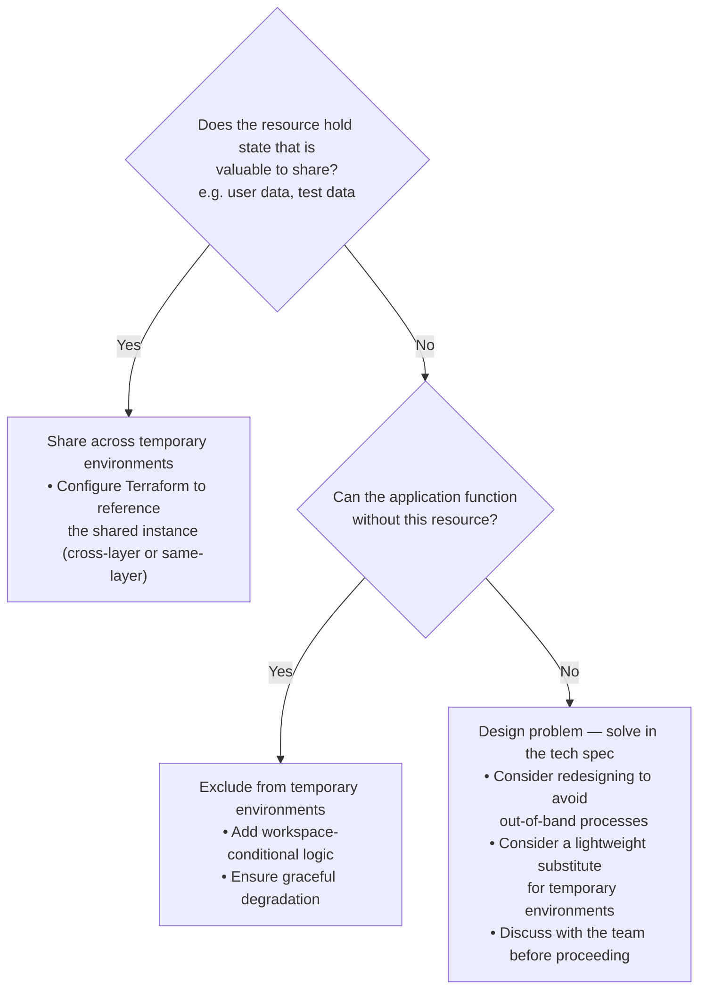

# Temporary Environments and Out-of-Band Resources

This document explains how temporary environments handle resources that require **out-of-band processes** — that is, resources that can't be created or destroyed purely through Terraform.

## Background

Temporary environments are short-lived infrastructure instances used for testing and review. Template-infra supports three types:

- **PR environments** — created automatically when a pull request is opened and destroyed when it's merged or closed. See [Pull Request Environments](./pull-request-environments.md).
- **Workspace-based environments** — created manually using Terraform workspaces for isolated development and testing. See [Develop and Test Infrastructure in Isolation Using Workspaces](./develop-and-test-infrastructure-in-isolation-using-workspaces.md).
- **CI end-to-end environments** — created and torn down by [`template-only-ci-infra.yml`](/.github/workflows/template-only-ci-infra.yml) to test creating a new project from scratch, deploying infrastructure (tests live in `infra/test/`), and tearing it all down.

All three types need to handle the fact that some resources can't simply be `terraform apply`'d into existence and `terraform destroy`'d away.

## What Are Out-of-Band Resources?

An "out-of-band resource" is any resource whose lifecycle involves steps outside of Terraform. Common reasons a resource might require out-of-band processes include:

- **External coordination** — the resource requires manual configuration in an external system (e.g., adding DNS NS records at a domain registrar)
- **Long provisioning times** — creating the resource takes so long that it's impractical for short-lived environments (e.g., database provisioning can take 20–40 minutes)
- **Shared state dependencies** — the resource holds state that is valuable to reuse across environments rather than recreate (e.g., a database with seed data, or an identity provider with test user accounts)
- **Global uniqueness constraints** — the resource has naming or configuration constraints that make it difficult to create multiple instances (e.g., certain DNS configurations)

## How Temporary Environments Handle Out-of-Band Resources

Temporary environments use two strategies for handling out-of-band resources: **sharing** and **exclusion**.

### Strategy 1: Sharing Resources

Some out-of-band resources are shared across temporary environments rather than being provisioned independently for each one. This sharing can take two forms:

- **Cross-layer sharing** — temporary environments in one infrastructure layer (also called a root module — see [Module Architecture](./module-architecture.md)) share resources managed by a different layer (e.g., the service layer's temporary environments share the database provisioned by the database layer)
- **Same-layer sharing** — temporary environments using non-default Terraform workspaces share resources with the default workspace (e.g., a PR environment's service workspace shares resources that only exist in the default workspace)

**Resources that use this strategy:**

| Resource | Why It's Shared | Implications |
| --- | --- | --- |
| Database | Provisioning a new database takes 20–40 minutes, which is impractical for short-lived environments | Cross-layer sharing: service layer temporary environments use the database from the database layer. Database migrations from the PR branch are **not** automatically run. Schema changes should be isolated into separate PRs and merged before application changes that depend on them. |
| Identity provider (Cognito) | Cognito user pools contain test user accounts and configuration that would need to be recreated for each environment | Same-layer sharing: temporary environments in non-default workspaces share the Cognito user pool from the default workspace. Changes to identity provider configuration in a PR will not be reflected until merged. |

**What this means for developers:** If your change introduces a new resource that requires out-of-band processes, and that resource holds shared state (like user data or application data), consider whether temporary environments should share the resource. If so, you'll need to:

1. Ensure the Terraform configuration supports pointing temporary environments at the shared instance of the resource (whether cross-layer or same-layer)

### Strategy 2: Exclusion from Temporary Environments

Some out-of-band resources are simply not created in temporary environments. The Terraform configuration detects when it's running in a non-default workspace and skips these resources entirely.

**Resources that use this strategy:**

| Resource | Why It's Excluded | Implications |
| --- | --- | --- |
| DNS records / custom domains | Requires manual NS record configuration at the domain registrar, and temporary environments don't need custom domain names | Temporary environments are accessed via their default AWS-provided URLs rather than custom domains |
| Resources with external approval workflows | Some resources may require manual approval or configuration steps that can't be automated | The functionality provided by these resources can't be tested in temporary environments |

**What this means for developers:** If your change introduces a new resource that requires out-of-band setup and doesn't hold shared state, consider whether the resource should simply be excluded from temporary environments. If so, you'll need to:

1. Add conditional logic to the Terraform configuration to skip the resource in non-default workspaces
2. Ensure the application can function without the resource (graceful degradation)

## Decision Framework

When introducing a new resource that requires out-of-band processes, use this framework to decide how temporary environments should handle it:

## Cleanup Considerations

Out-of-band resources create cleanup challenges for temporary environments:

- **Shared resources** don't need cleanup (they're managed elsewhere), but be aware that temporary environments may leave artifacts in the shared resource (e.g., database rows, identity provider sessions) that aren't cleaned up automatically
- **Excluded resources** don't need cleanup (they were never created), but if a resource is partially provisioned before an out-of-band step is needed, the Terraform state may contain references to incomplete resources

For more on cleanup of temporary environment resources, see [Pull Request Environments — Cleanup](./pull-request-environments.md) and the CI cleanup workflows.

## Related Documentation

- [Pull Request Environments](./pull-request-environments.md) — how PR environments are created and destroyed
- [Develop and Test Infrastructure in Isolation Using Workspaces](./develop-and-test-infrastructure-in-isolation-using-workspaces.md) — how workspace-based temporary environments work
- [Custom Domains](./custom-domains.md) — an example of a resource requiring out-of-band DNS configuration
- [Identity Provider](./identity-provider.md) — Cognito setup and configuration
- [Set Up Database](./set-up-database.md) — database provisioning
