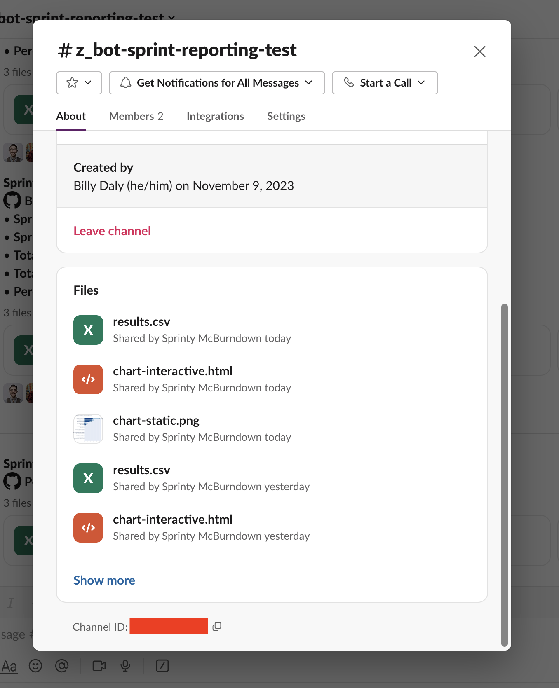
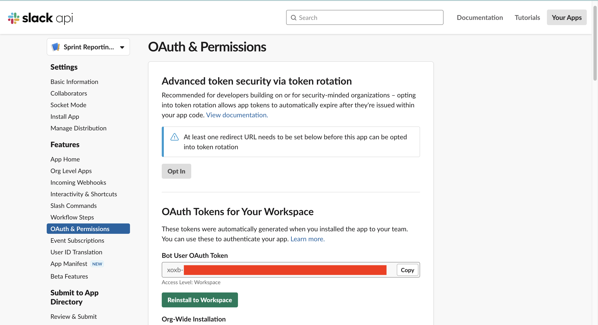

# Development

> [!NOTE]
> All of the steps on this page should be run from the root of the [`analytics/`](../../analytics/) sub-directory

## Setting up the tool locally

The following sections describe how to install and work with the analytics application on your own computer. If you don't need to run the application locally, view the [usage docs](usage.md) for other ways to monitor our operational metrics.

### Prerequisites

- **Python version 3.11:** [pyenv](https://github.com/pyenv/pyenv#installation) is one popular option for installing Python,
   or [asdf](https://asdf-vm.com/).
- **Poetry:** After installing and activating the right version of Python, [install poetry with the official installer](https://python-poetry.org/docs/#installing-with-the-official-installer) or alternatively use [pipx to install](https://python-poetry.org/docs/#installing-with-pipx).
- **GitHub CLI:** [Install the GitHub CLI](https://github.com/cli/cli#installation)

Once you follow the steps above, check that you meet the prerequisites with: `make check-prereqs`

### Installation

1. Set up the project: `make setup` -- This will install the required packages and prompt you to authenticate with GitHub
2. Create a `.secrets.toml` with the following details, see the next section to discover where these values can be found:
   ```toml
   reporting_channel_id = "<REPLACE_WITH_CHANNEL_ID>"
   slack_bot_token = "<REPLACE_WITH_SLACKBOT_TOKEN_ID>"
   ```

### Configuring secrets

#### Prerequisites

In order to correctly set the value of the `slack_bot_token` and `reporting_channel_id` you will need:

1. To be a member of the Simpler.Grants.gov slack workspace
2. To be a collaborator on the Sprint Reporting Bot slack app

If you need to be added to the slack workspace or to the list of collaborators for the app, contact a project maintainer.

#### Finding reporting channel ID

1. Go to the `#z_bot-sprint-reporting` channel in the Simpler.Grants.gov slack workspace.
2. Click on the name of the channel in the top left part of the screen.
3. Scroll down to the bottom of the resulting dialog box until you see where it says `Channel ID`.
4. Copy and paste that ID into your `.secrets.toml` file under the `reporting_channel_id` variable.



#### Finding slackbot token

1. Go to [the dashboard](https://api.slack.com/apps) that displays the slack apps for which you have collaborator access
2. Click on `Sprint Reporting Bot` to go to the settings for our analytics slackbot
3. From the side menu, select `OAuth & Permissions` and scroll down to the "OAuth tokens for your workspace" section
4. Copy the "Bot user OAuth token" which should start with `xoxb` and paste it into your `.secrets.toml` file under the `slack_bot_token` variable.



## Running the tool locally

While the [usage guide](usage.md) describes all of the options for running the `analytics` package locally, the following sections highlight some helpful commands to interact with the tool during development.

### Using the `make` commands

In earlier steps, you'll notice that we've configured a set of `make` commands that help streamline common developer workflows related to the `analytics` package. You can view the [`Makefile`](../../analytics/Makefile) for the full list of commands, but some common ones are also described below:

- `make install` - Checks that you have the prereqs installed, installs new dependencies, and prompts you to authenticate with the GitHub CLI.
- `make unit-test` - Runs the unit tests and prints a coverage report
- `make e2e-test` - Runs integration and end-to-end tests and prints a coverage report
- `make lint` - Runs [linting and formatting checks](formatting-and-linting.md)
- `make sprint-reports-with-latest-data` Runs the full analytics pipeline which includes:
  - Exporting data from GitHub
  - Calculating the following metrics
  - Either printing those metrics to the command line or posting them to slack (if `ACTION=post-results` is passed)

### Using the CLI tool

The `analytics` package comes with a built-in CLI that you can use to discover the reporting features available. Start by simply typing `poetry run analytics --help` which will print out a list of available commands:


Additional guidance on working with the CLI tool can be found in the [usage guide](usage.md#using-the-command-line-interface).

## Common development tasks

### Adding a new metric


### Adding a new dataset
