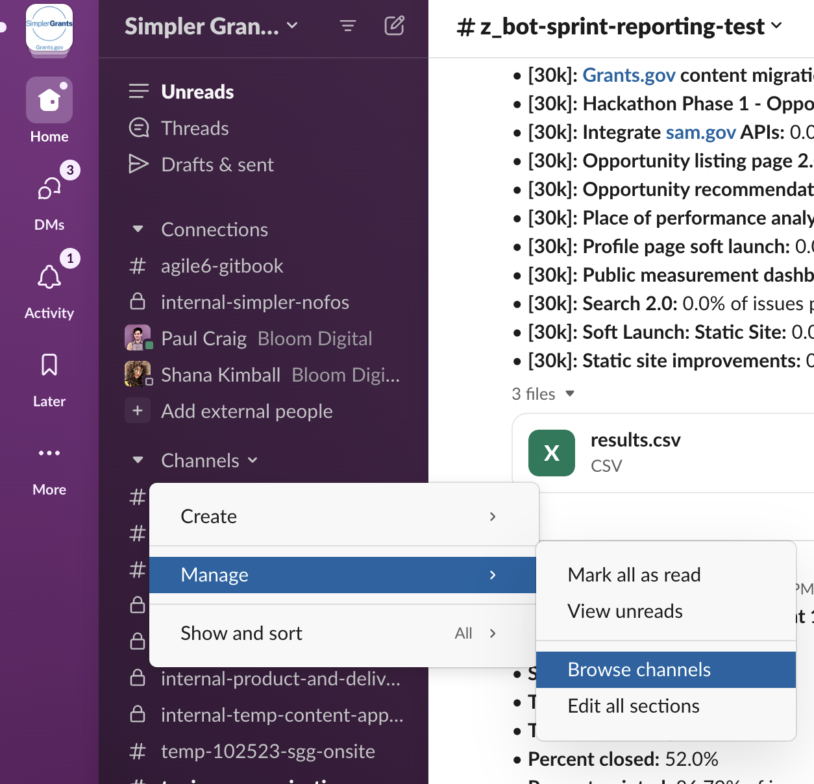
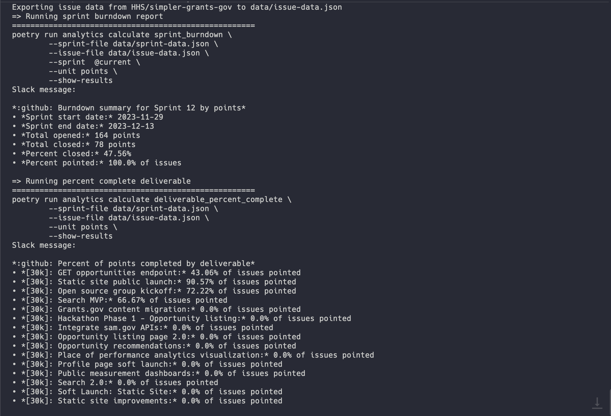
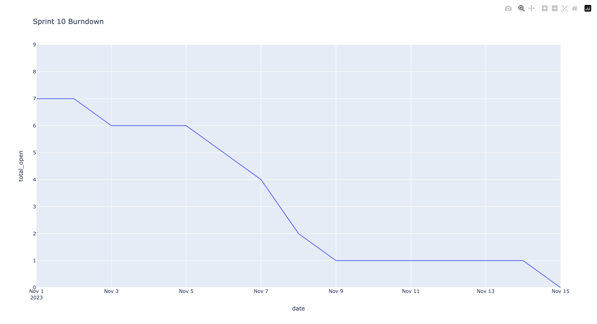
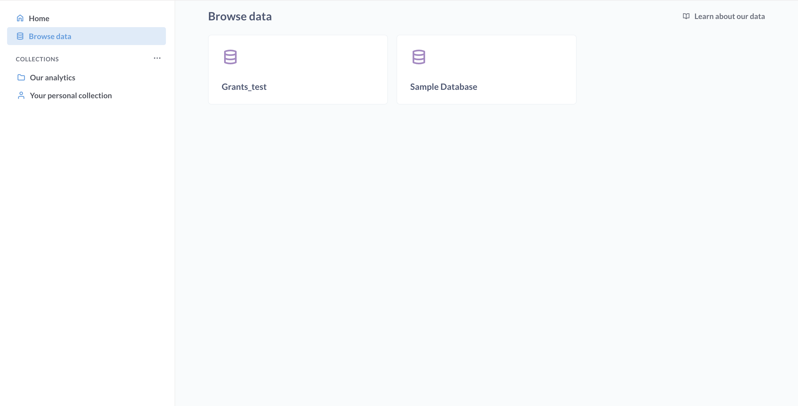
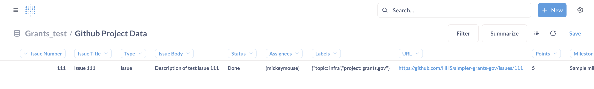

# Common use cases

The following sections describe some common ways to interact with the analytics package and the reports it produces.

## View daily reports in Slack

We have some automation set up in this repository that automatically runs our analytics and posts the results to Slack on a daily basis. To see these results, use the following steps to discover and join the `#z_bot-sprint-reporting` channel for updates.

1. Join our Slack workspace. **Note:** This option will be available for open source contributors shortly.
2. Within Slack, click the "Channels" dropdown menu, then select "Manage > Browse channels".
   
3. On the browse channel page, search for `#z_bot-sprint-reporting` and select it from the list of results.
4. On the channel page, select "Join channel" at the bottom of the page.

## Trigger a report from the command line

> [!NOTE]
> The following sections require you to have the tool running locally. For more information about how to install and run the analytics package, visit our [development guide](development.md).

If you want to have more control over how the reports are run, you can also run the reports locally from the command line. In most cases, the reports you'd like to run are already available as `make` commands, specified in our [`Makefile`](./Makefile)

### Export data and run reports

If want to run reports with the most recent data from GitHub, the easiest way to do it is with the `make sprint-reports-with-latest-data`.

That should result in something like the following being logged to the command line:



It should also open two new browser tabs, each with a separate report:

**Sprint burndown by points for the current sprint**



**Percent of points complete by deliverable**


### Other relevant make commands

- `make issue-data-export` - Exports issue data from HHS/simpler-grants-gov
- `make sprint-data-export` - Exports project data from the [Sprint Planning GitHub project](https://github.com/orgs/HHS/projects/13)
- `make gh-data-export` - Exports both issue and sprint data
- `make sprint-burndown` - Runs the sprint burndown report
- `make percent-complete` - Runs the percent complete by deliverable report
- `make sprint-reports` - Runs both percent complete and sprint burndown (without exporting data first)
- `make gh-db-data-import` - Imports issue and sprint data to the analytics database

## Using the command line interface

> [!NOTE]
> The following sections require you to have the tool running locally. For more information about how to install and run the analytics package, visit our [development guide](development.md).

For a bit more control over the underlying analytics package, you can use the *full* `analytics` command line interface. The following sections describe how to work with the analytics CLI.

### Learning how to use the command line tool

The `analytics` package comes with a built-in CLI that you can use to discover the reporting features available:

Start by simply typing `poetry run analytics --help` which will print out a list of available commands:


Discover the arguments required for a particular command by appending the `--help` flag to that command:

```bash
poetry run analytics export gh_issue_data --help
```


### Exporting GitHub data

After following the installation steps above, you can use the following commands to export data from GitHub for local analysis:

#### Exporting issue data

```bash
poetry run analytics export gh_issue_data --owner HHS --repo simpler-grants-gov --output-file data/issue-data.json
```

Let's break this down piece by piece:

- `poetry run` - Tells poetry to execute a package installed in the virtual environment
- `analytics` - The name of the analytics package installed locally
- `export gh_issue_data` - The specific sub-command in the analytics CLI we want to run
- `--owner HHS` Passing `HHS` to the `--owner` argument for this sub-command, the owner of the repo whose issue data we want to export, in this case `HHS`
- `--repo simpler-grants-gov` We want to export issue data from the `simpler-grants-gov` repo owned by `HHS`
- `--output-file data/issue-data.json` We want to write the exported data to the file with the relative path `data/issue-data.json`

#### Exporting project data

Exporting project data works almost the same way, except it expects a `--project` argument instead of a `--repo` argument. **NOTE:** The project should be the project number as it appears in the URL, not the name of the project.

```bash
poetry run analytics export gh_project_data --owner HHS --project 13 --output-file data/sprint-data.json
```

### Working with the Analytics database

The following sections assume that the steps in our [development guide](development.md) have been completed first. This is especially helpful when seeding the database for local testing and development. Additionally, you will need to have [Docker Desktop](https://www.docker.com/products/docker-desktop/) installed.

#### Importing Github data

You can use the following command to import data to the analytics database.

```bash
poetry run analytics import db_import --sprint-file data/sprint-data.json  --issue-file data/issue-data.json
```

Some notes about this command:
- `--sprint-file` and `--issue-file` refer to the files generated by their respective commands (e.g. `gh_issue_data `). When running the import command via `make` these flags are prepopulated with the relative paths: `data/issue-data.json` and `data/sprint-data.json`.

The data from this command can be found in the `github_project_data` table.

#### Viewing the data in the Terminal

The database can be accessed locally by running the command `docker-compose up -d`. This will start the docker containers for Metabase and the analytics database in a detatched state. 

In Docker desktop, navigate to the analytics database container and sign into the database `psql -U <database-user>`. From here, you can run SQL queries to view data.

When finished, run `docker-compose down` to stop and remove all containers, networks and volumes associated with the analytics application. 

#### Viewing the data in Metabase

[Metabase](https://www.metabase.com/) is a buisness intelligence that lets you query, organize and view data with a friendly UX. In order to view data in Metabase, start the containers and then navigate to http://localhost:3100/.

The first time you access Metabase you will be guided through a small setup process to sync the database to the platform.





### Calculating metrics

#### Calculating sprint burndown

Once you've exported the sprint and issue data from GitHub, you can start calculating metrics. We'll begin with sprint burndown:

```bash
poetry run analytics calculate sprint_burndown --sprint-file data/sprint-data.json --issue-file data/issue-data.json --sprint "@current" --unit points --show-results
```


A couple of important notes about this command:

- `--sprint @current` In order to calculate burndown, you'll need to specify either `"@current"` for the current sprint or the name of another sprint, e.g. `"Sprint 10"`
- `--unit points` In order to calculate burndown based on story points, you pass `points` to the `--unit` option. The other option for unit is `issues`
- `--show-results` In order to the see the output in a browser you'll need to pass this flag.


You can also post the results of this metric to a Slack channel:

```bash
poetry run analytics calculate sprint_burndown --sprint-file data/sprint-data.json --issue-file data/issue-data.json --sprint "Sprint 10" --unit points --post-results
```

> **NOTE:** This requires you to have the `.secrets.toml` configured according to the directions in step 5 of the [installation section](#installation)


### Calculating deliverable percent complete

Another key metric you can report is the percentage of issues or points completed per 30k deliverable.
You can specify the unit you want to use for percent complete (e.g. points or issues) using the `--unit` flag.

For example, here we're calculating percentage completion based on the number of tickets under each deliverable.

```bash
poetry run analytics calculate deliverable_percent_complete --sprint-file data/sprint-data.json --issue-file data/issue-data.json --show-results --unit issues
```


And here we're calculating it based on the total story point value of those tickets.

```bash
poetry run analytics calculate deliverable_percent_complete --sprint-file data/sprint-data.json --issue-file data/issue-data.json --show-results --unit points
```


The `deliverable_pct_complete` sub-command also supports the `--post-results` flag if you want to post this data to slack.


### Experimental features

We also have some flags that enable experimental features for the deliverables. The currently supported flags for `calculate deliverable_percent_complete` are:

- `--roadmap-file` Accepts a path to a file that loads data exported from the Product roadmap GitHub project. This also uses a different join path to associate issues with their parent deliverables.
- `--include-status` Accepts the name of a status to include in the report. Can be passed multiple times to include multiple statuses.

Here's an example of how to use these in practice:

```bash
poetry run analytics calculate deliverable_percent_complete \
  --sprint-file data/sprint-data.json \
  --issue-file data/issue-data.json \
  --roadmap-file data/roadmap-data.json \
  --include-status "In Progress" \
  --include-status "Planning" \
  --show-results \
  --unit points
```
