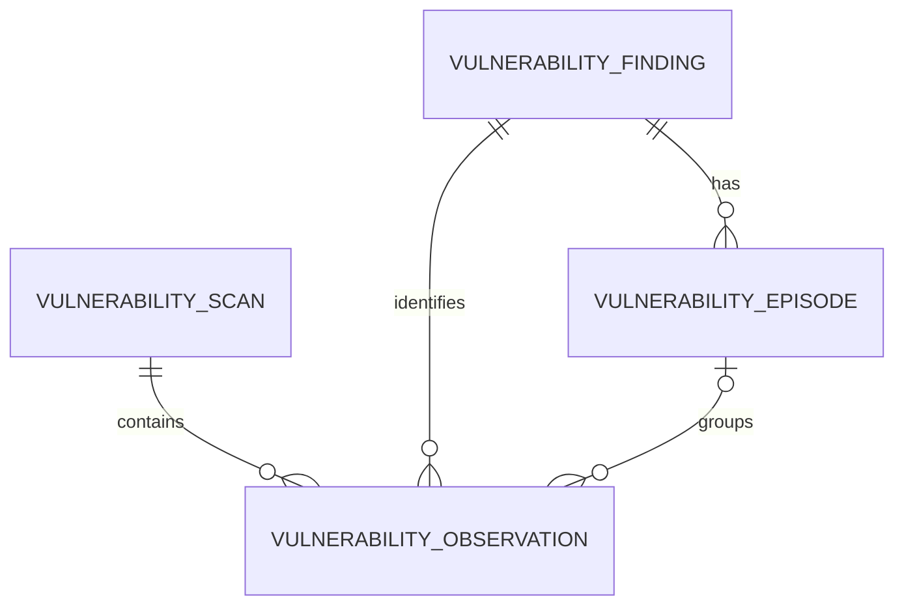

<!-- markdownlint-disable MD013 -->

# Vulnerability finding identity and lifecycle schema proposal

Status: Proposed for [issue #9504][issue-9504].

Approval gate: Brandon Tabaska and/or Matt must approve this proposal before
the implementation tickets proceed.

## Decision

Store one stable finding for each scanner source, logical scan target,
source-native vulnerability advisory, and versionless package coordinate:

```text
(scanner_source, target_key, vulnerability_namespace, vulnerability_id,
 package_type, package_namespace, package_name, package_subpath)
```

For example, these are two findings, not one:

```text
grype | container/api/linux/amd64       | nvd:cpe | CVE-2026-6879 | pkg:generic/python
grype | container/analytics/linux/amd64 | nvd:cpe | CVE-2026-6879 | pkg:generic/python
```

Package version, Syft artifact ID, image tag, image ID, and manifest digest are
properties of an observation. They are intentionally excluded from the stable
identity. A finding has zero or more episodes. An occurrence retained from a
partial or failed scan does not create one. If the same finding is cleared and
later observed again, it starts a new episode rather than reopening or
overwriting the old one.

This grain supports the questions in [epic #9498][issue-9498]: what is open,
when it first appeared, when it disappeared, and how long each exposure lasted.
It also leaves an explicit `scanner_source` seam for a future AWS vulnerability
source.

## Scope

This proposal defines:

- The identity of a vulnerability finding.
- The PostgreSQL tables, columns, types, constraints, and indexes needed to
  retain scan history and derive lifecycle episodes.
- The meanings of `first_seen_at`, `last_seen_at`, `fix_available_at`,
  `ignored_at`, `fixed_at`, and `cleared_at`.
- Reappearance, incomplete scan, retry, and out-of-order ingestion behavior.
- A parser boundary for the current Grype native JSON format.

This proposal does not implement the migration, parser, loader, or dashboard.
Those remain the work of [issues #9505 through #9509](#implementation-handoff).

## Evidence reviewed

### Repository and artifact evidence

The repository state matters to the reproducibility of this spike:

- [Issue #9499][issue-9499] requested committed, representative scan fixtures.
  Its merged implementation, [PR #9567][pr-9567], instead added 90-day GitHub
  Actions artifacts named `anchore-grype-json-<app>-<run_id>` with a file named
  `anchore-grype-<app>.json`.
- As of 2026-08-25, `analytics/fixtures/vulnerability_scans/` is not present on
  `main` or in the repository's Git history. The examples in this proposal use
  retained workflow artifacts downloaded from successful runs. A scrubbed,
  pinned subset still needs to be committed before parser issue #9506 so its
  tests do not depend on expiring artifacts.
- The retained API and analytics reports cover 2026-08-12 through 2026-08-19.
  The retained frontend reports cover 2026-08-19 through 2026-08-25. Every
  report identifies Grype `0.110.0` in `descriptor.version`.
- The repository's [Grype configuration][grype-config] ignores every finding
  whose fix state is `not-fixed`, `wont-fix`, or `unknown`, as well as several
  explicit vulnerability IDs. Ignored findings therefore comprise a material
  part of the observed vulnerability population.

The daily top-level counts in the API and analytics evidence are:

| Scan date | API `matches` | API `ignoredMatches` | Analytics `matches` | Analytics `ignoredMatches` |
| --- | ---: | ---: | ---: | ---: |
| 2026-08-12 | 1 | 8 | 1 | 8 |
| 2026-08-13 | 1 | 8 | 1 | 8 |
| 2026-08-14 | 2 | 8 | 2 | 8 |
| 2026-08-15 | 2 | 8 | 2 | 8 |
| 2026-08-16 | 2 | 8 | 2 | 8 |
| 2026-08-17 | 2 | 8 | 2 | 8 |
| 2026-08-18 | 4 | 8 | 8 | 8 |
| 2026-08-19 | 0 | 2 | 0 | 2 |

Representative report hashes used for the worked examples are included so a
reviewer can confirm that they have the same retained artifacts:

| Logical artifact | `descriptor.timestamp` | SHA-256 of JSON file |
| --- | --- | --- |
| API, 2026-08-12 | `2026-08-12T12:17:42.810896811Z` | `033036273d785b2a5caa916c22cbcd100acc1ec5f872312d509bbba10d0cb493` |
| API, 2026-08-18 | `2026-08-18T12:08:13.758724277Z` | `20b5851647ae10df1ff4b6251d3c49e7db7e268d30e16fcefa65f6e720b75cfa` |
| API, 2026-08-19 | `2026-08-19T12:08:04.952560083Z` | `aa1b8fc2a1bf51f0e428f5924a3645cdbfdeca48b31154c12abbe77ad320105f` |
| Analytics, 2026-08-12 | `2026-08-12T12:17:50.685161250Z` | `51bf9bef061a5a79a8113af09a355998ddc9a51ef082f09c234dfe685dd39331` |
| Analytics, 2026-08-18 | `2026-08-18T12:08:14.160888166Z` | `8a805b40f90fa2255bdf32482d40f574964fd6597ac2c71a5fc669661ca1dc61` |
| Analytics, 2026-08-19 | `2026-08-19T12:08:10.006629776Z` | `c6393fee52c425a6fd499beb1780392163c84c69f88cffba3853eeba60594bb1` |
| Frontend, 2026-08-23 | `2026-08-23T12:07:04.465554127Z` | `15954f5b45ca0a02b411b845697e45cffa13c61cd446a46af4b81fe31f50a0d3` |
| Frontend, 2026-08-24 | `2026-08-24T12:09:01.199915368Z` | `cdd5fcf7267dc544503a3ecbc83ec89fd4457a9ff4d00863214426082eab30c2` |
| Frontend, 2026-08-25 | `2026-08-25T12:10:03.251728552Z` | `527ed652fa889fc3103e923d45dcf46d1fc63705d7dc6618d6c4b7dfb5770c68` |

### Grype source contract

Grype's native JSON scan report does not currently have a formal, versioned
machine-readable JSON Schema. Anchore's [open schema request #2212][grype-2212]
confirms that gap. The schema under `schema/grype/db-search-vuln/json` applies
only to the separate `grype db search vuln` command, as its
[README][db-search-schema-readme] states. It must not be used to validate native
scan reports.

The parser contract for the current evidence is therefore:

1. The exact `descriptor.version`, currently `0.110.0`.
2. Anchore's [native JSON guide][grype-json-guide].
3. The tagged Grype presenter models for the top-level
   [`Document`][grype-document-model], [`Match`][grype-match-model],
   [`Package`][grype-package-model], and [`IgnoredMatch`][grype-ignore-model].
4. Regression tests against the committed representative fixtures requested
   above.

A report contains `matches`, `ignoredMatches`, `source`, `distro`, and
`descriptor`. It is a vulnerability-match report, not a complete installed
package inventory. Each match combines a source-native vulnerability record,
related vulnerability records, match details, and an affected package
artifact.

Several details affect the database design:

- `vulnerability.id` is not necessarily a CVE. The 2026-08-18 analytics report
  contains Amazon advisory `ALAS2023-2026-2047` and four `GHSA-*` advisories for
  `sqlparse`, alongside CVEs. Grype preserves the source-native ID by default;
  [`--by-cve` changes that behavior][grype-vulnerability-ids]. Store
  `vulnerability.namespace` and `vulnerability.id`, and retain related IDs for
  analysis. Do not name the source field `cve_id`.
- `ignoredMatches` embeds the same match data plus `appliedIgnoreRules`.
  Anchore's [filtering documentation][grype-filtering] explicitly says ignored
  findings are moved there in JSON output. The observed set is the union of
  `matches` and `ignoredMatches`.
- A fix state of `fixed` means a fix is available. It does not mean the package
  in the scanned image has been fixed. The matched package is still vulnerable.
- `artifact.id` is generated by Syft from package content and metadata. The
  [tagged Syft source][syft-package-id] includes version and locations among the
  inputs, so this value is useful for a within-scan occurrence but not as a
  longitudinal identity.
- `source.target.imageID` and `manifestDigest` identify the exact scanned image
  snapshot. Tags and `userInput` may move. Anchore recommends digest matching
  when exact product identity matters, but an exact snapshot ID would split a
  longitudinal finding on every rebuild.
- The current reports place vulnerability database provenance under
  `descriptor.db.status`, including `built` and `schemaVersion`. Preserve the
  complete descriptor as JSONB and parse these version-specific fields into
  typed columns.

## Data grain and terminology

| Term | Grain | Purpose |
| --- | --- | --- |
| Scan | One scanner report for one logical target at one instant | Establishes the complete-snapshot boundary and scanner, image, database, and artifact provenance. |
| Finding | One stable identity tuple | Answers whether the target/package/advisory combination has ever been observed and joins all of its history. |
| Occurrence | One scanner-native affected package record within a scan | Preserves concurrent package versions, paths, and raw scanner evidence without changing finding identity. |
| Observation | The stored occurrence attached to a scan and finding, and to an episode for a complete scan | Records the package version, severity, fix data, ignore rules, and exact image where the occurrence was seen. |
| Episode | One uninterrupted run of complete scans in which a finding is present | Supplies lifecycle timestamps and makes reappearance a new measurable exposure interval. |

The finding grain treats multiple installed versions or copies of the same
versionless package coordinate as occurrences of one target-level finding. The
finding remains open until no occurrence of that identity appears in a later
complete scan. This avoids false closure when one of several copies is removed.

## Identity options and tradeoffs

| Candidate | Benefit | Failure mode shown by evidence | Decision |
| --- | --- | --- | --- |
| Vulnerability ID only | Small and easy to query | Frontend `CVE-2026-19542` affects both `libc-bin` and `libc6` on 2026-08-24. It would also merge API and analytics. | Reject. It conflates packages, targets, namespaces, and scanner sources. |
| Vulnerability ID plus package name | Preserves affected packages | `CVE-2026-6879` plus `python` is present in both API and analytics from 2026-08-12 through 2026-08-18. A name alone also does not distinguish package ecosystems. | Reject as incomplete. Add source, logical target, vulnerability namespace, and package ecosystem/namespace. |
| Recommended identity plus package version | Distinguishes installed versions | Explicitly ignored `CVE-2025-15367` remains observed while Python moves from `3.14.6` on 2026-08-18 to `3.14.7` on 2026-08-19. Version in the key would falsely clear one finding and create another. | Reject for longitudinal identity. Store version on each observation. |
| Recommended identity plus Syft artifact ID | Distinguishes package occurrences | Syft's ID can change when version, location, type, license, or metadata changes. | Reject for longitudinal identity. Use it as the Grype occurrence ID. |
| Recommended identity plus image ID or manifest digest | Precisely identifies one image snapshot | API image IDs change five times while `CVE-2026-6879` remains continuously present. The finding would be recreated for each build. | Reject for longitudinal identity. Store exact image provenance on the scan. |
| Recommended identity plus image tag | Human-readable image stream | The frontend `userInput` tag is unchanged on 2026-08-23 and 2026-08-24 while both image ID and manifest digest change. Tags can move. | Reject as an inferred key. Supply an explicit logical target key. |
| Source, logical target, source-native advisory, and versionless package coordinate | Preserves a target/package exposure through image rebuilds and package upgrades while separating services and ecosystems | Requires an explicit target registry and package normalization rules. Cross-source and cross-advisory rollups remain analytical concerns. | **Recommend.** |

## Identity normalization rules

Identity construction must be deterministic and versioned with the parser:

1. Set `scanner_source` from the ingestion adapter, not from a display field in
   an arbitrary report. The current adapter uses `grype`.
2. Require `target_key` as ingestion metadata. For the current workflows, use
   values such as `container/api/linux/amd64`,
   `container/analytics/linux/amd64`, and
   `container/frontend/linux/amd64`. The workflow's stable `app_name` and known
   platform supply this value. Do not derive it from an image tag, commit SHA,
   image ID, or manifest digest. Include environment or account in the key only
   when it represents a separately owned exposure surface.
3. Trim and preserve Grype's source-native `vulnerability.namespace` and
   `vulnerability.id`. Do not automatically replace an ALAS or GHSA advisory
   with a CVE. Alias relationships can be one-to-many, and Grype's primary ID
   can change when `--by-cve` is enabled. Retain `relatedVulnerabilities` on
   observations for later cross-advisory reporting.
4. Parse `artifact.purl` with a Package URL implementation following the
   [official PURL specification][purl-spec]. Use its canonical `type`,
   `namespace`, `name`, and `subpath`, but remove the version and all qualifiers.
   Qualifiers such as `arch`, `distro`, and version-bearing `upstream` describe
   the observed build and remain in the raw PURL on the observation.
5. If PURL is absent or invalid, use normalized `artifact.type` as
   `package_type`, `artifact.language` as `package_namespace`,
   `artifact.name` as `package_name`, and an empty `package_subpath`. Quarantine
   a record that still lacks a type or name instead of placing unrelated
   records under an `unknown` key.
6. Use empty strings, not `NULL`, for an inapplicable package namespace or
   subpath so PostgreSQL uniqueness has the intended semantics.
7. Keep every scanner occurrence. For Grype, `artifact.id` is the
   `source_occurrence_id`. If a future source lacks an occurrence ID, its adapter
   must derive a deterministic ID from the source-native record identity.

The canonical versionless form of the 2026-08-18 `wget` PURL illustrates rule
4:

```text
observed:  pkg:rpm/amzn/wget@1.21.3-1.amzn2023.0.4?arch=x86_64&distro=amzn-2023&upstream=wget-1.21.3-1.amzn2023.0.4.src.rpm
identity:  pkg:rpm/amzn/wget
```

## Proposed PostgreSQL schema

The proposal follows the analytics database's current conventions: sequential
SQL migrations in [`migrations/versions`][analytics-migrations], application-
generated UUIDs, `TIMESTAMP WITH TIME ZONE`, JSONB for source-shaped data, and
explicit indexes. Use `TEXT` plus `CHECK` constraints rather than PostgreSQL
enums so adding a future source or state does not require an enum migration.



### `vulnerability_scan`

One immutable scan envelope. A scan may be retained for audit even when it is
partial or failed, but only `complete` scans participate in lifecycle changes.

| Column | PostgreSQL type and nullability | Rationale |
| --- | --- | --- |
| `scan_id` | `UUID PRIMARY KEY` | Application-generated row identity. |
| `scanner_source` | `TEXT NOT NULL` | Adapter and source boundary, currently `grype`, later possibly `aws_inspector`. |
| `target_key` | `TEXT NOT NULL` | Stable logical target supplied by orchestration. |
| `scanned_at` | `TIMESTAMP WITH TIME ZONE NOT NULL` | Report generation time. For Grype, parse `descriptor.timestamp`; fall back to trusted orchestration metadata only for non-complete audit rows. |
| `scan_status` | `TEXT NOT NULL` | `complete`, `partial`, or `failed`. Only `complete` can update or clear an episode. |
| `scanner_name` | `TEXT NOT NULL` | Grype `descriptor.name` or the equivalent future scanner name. |
| `scanner_version` | `TEXT` | Grype `descriptor.version`; `stub` is not a complete report version. |
| `vulnerability_db_built_at` | `TIMESTAMP WITH TIME ZONE` | Grype `descriptor.db.status.built`; this is database provenance, not scan time. |
| `vulnerability_db_schema_version` | `TEXT` | Grype `descriptor.db.status.schemaVersion`. |
| `source_ref` | `TEXT NOT NULL` | Fully qualified, artifact- or object-specific source reference used for idempotency and audit. A workflow run ID alone is insufficient when one run emits multiple scan artifacts. |
| `raw_report_uri` | `TEXT` | Durable location of the raw report when one was produced. Required for `complete` scans; a 90-day Actions URL alone is not durable enough for production. |
| `raw_report_sha256` | `TEXT` | Detects corruption or a source reference whose bytes unexpectedly changed. Required for `complete` scans. |
| `image_reference` | `TEXT` | Grype `source.target.userInput`; useful display provenance, not identity. |
| `image_id` | `TEXT` | Grype `source.target.imageID`; exact image snapshot provenance. |
| `manifest_digest` | `TEXT` | Grype `source.target.manifestDigest`; exact manifest provenance. |
| `platform_os` | `TEXT` | Grype `source.target.os`; validates the supplied target key. |
| `platform_architecture` | `TEXT` | Grype `source.target.architecture`; validates the supplied target key. |
| `scanner_descriptor` | `JSONB` | Version-specific descriptor for audit and fields not promoted to columns. Required for `complete` scans. |
| `ingested_at` | `TIMESTAMP WITH TIME ZONE NOT NULL DEFAULT CURRENT_TIMESTAMP` | ETL audit timestamp. |

A failed audit row may have no report bytes or descriptor. The adapter still
supplies `scanner_source`, `target_key`, `scanned_at`, `scanner_name`, and an
artifact-specific `source_ref` from trusted orchestration metadata.

PostgreSQL timestamps retain microsecond precision. Exact source timestamps may
carry nanoseconds and remain verbatim in `scanner_descriptor` and the raw report.

### `vulnerability_finding`

One stable identity. `created_at` is an ingestion audit field, not a substitute
for lifecycle `first_seen_at`.

| Column | PostgreSQL type and nullability | Rationale |
| --- | --- | --- |
| `finding_id` | `UUID PRIMARY KEY` | Stable surrogate key referenced by episodes and observations. |
| `scanner_source` | `TEXT NOT NULL` | Prevents accidental lifecycle merging across scanners with different matching semantics. |
| `target_key` | `TEXT NOT NULL` | Separates API, analytics, frontend, environment, and platform exposure surfaces. |
| `vulnerability_namespace` | `TEXT NOT NULL` | Preserves the source database, such as `nvd:cpe`, `github:language:python`, or `amazon:distro:amazonlinux:2023`. |
| `vulnerability_id` | `TEXT NOT NULL` | Preserves CVE, GHSA, ALAS, and other source-native identifiers. |
| `package_type` | `TEXT NOT NULL` | Canonical PURL type, or artifact type fallback. |
| `package_namespace` | `TEXT NOT NULL DEFAULT ''` | Canonical PURL namespace, or language fallback. Empty means not applicable. |
| `package_name` | `TEXT NOT NULL` | Canonical versionless affected package name. |
| `package_subpath` | `TEXT NOT NULL DEFAULT ''` | Canonical PURL subpath when present. Empty means not applicable. |
| `created_at` | `TIMESTAMP WITH TIME ZONE NOT NULL DEFAULT CURRENT_TIMESTAMP` | Ingestion audit timestamp. |
| `updated_at` | `TIMESTAMP WITH TIME ZONE NOT NULL DEFAULT CURRENT_TIMESTAMP` | Audit timestamp for normalization or metadata corrections. |

Do not store an opaque hash as the only enforceable identity. A fingerprint may
be added as a query convenience, but the database must enforce uniqueness on
the full canonical tuple so collisions and normalization defects remain
inspectable.

### `vulnerability_episode`

One uninterrupted presence interval for a finding.

| Column | PostgreSQL type and nullability | Rationale |
| --- | --- | --- |
| `episode_id` | `UUID PRIMARY KEY` | Stable episode identity. |
| `finding_id` | `UUID NOT NULL REFERENCES vulnerability_finding(finding_id)` | Parent stable finding. |
| `episode_number` | `INTEGER NOT NULL` | One-based sequence within a finding; increments on reappearance after clearance. |
| `first_seen_at` | `TIMESTAMP WITH TIME ZONE NOT NULL` | First complete scan in this episode containing at least one occurrence. |
| `last_seen_at` | `TIMESTAMP WITH TIME ZONE NOT NULL` | Latest complete scan containing at least one occurrence. |
| `fix_available_at` | `TIMESTAMP WITH TIME ZONE` | First observation in the episode whose scanner fix state means a fix is available. It is not remediation time. |
| `ignored_at` | `TIMESTAMP WITH TIME ZONE` | First complete scan in the episode where every current occurrence was ignored. |
| `fixed_at` | `TIMESTAMP WITH TIME ZONE` | Confirmed remediation time. Set only from explicit package/SBOM or remediation evidence, never from Grype `fix.state == fixed` or absence alone. |
| `cleared_at` | `TIMESTAMP WITH TIME ZONE` | First later complete scan in which no occurrence of the finding is present. `NULL` means open. |
| `is_currently_ignored` | `BOOLEAN NOT NULL DEFAULT FALSE` | Denormalized latest complete-scan state. Historical transitions remain in observations. |
| `resolution_reason` | `TEXT` | When cleared, one of `not_observed`, `fixed`, `package_removed`, `target_retired`, `advisory_withdrawn`, or `manual`. Default to `not_observed` unless evidence supports a stronger reason. |
| `resolution_evidence` | `JSONB` | Optional source reference, package comparison, ticket, or other evidence supporting `fixed_at` and the resolution reason. |
| `created_at` | `TIMESTAMP WITH TIME ZONE NOT NULL DEFAULT CURRENT_TIMESTAMP` | ETL audit timestamp. |
| `updated_at` | `TIMESTAMP WITH TIME ZONE NOT NULL DEFAULT CURRENT_TIMESTAMP` | ETL audit timestamp. |

### `vulnerability_observation`

One source-native affected package occurrence in one scan. Multiple observation
rows for the same finding and scan preserve multiple installed package versions
or locations. Complete-scan observations receive an episode assignment;
occurrences retained from partial or failed scans do not.

| Column | PostgreSQL type and nullability | Rationale |
| --- | --- | --- |
| `observation_id` | `UUID PRIMARY KEY` | Surrogate row identity. |
| `scan_id` | `UUID NOT NULL REFERENCES vulnerability_scan(scan_id)` | Scan envelope and exact image provenance. |
| `finding_id` | `UUID NOT NULL REFERENCES vulnerability_finding(finding_id)` | Canonical stable identity. |
| `episode_id` | `UUID` | Episode produced by ordered lifecycle evaluation. `NULL` for observations retained from partial or failed scans. |
| `source_occurrence_id` | `TEXT NOT NULL` | Grype `artifact.id`, or a deterministic adapter-specific equivalent. |
| `is_ignored` | `BOOLEAN NOT NULL` | `true` when the source record came from `ignoredMatches`. |
| `package_version` | `TEXT` | Exact installed version in this occurrence. |
| `package_purl` | `TEXT` | Full observed PURL, including version and qualifiers. |
| `severity` | `TEXT` | Source severity as observed on this scan. |
| `risk` | `NUMERIC` | Source risk score when present, without floating-point rounding. |
| `fix_state` | `TEXT` | Source fix state as observed. |
| `fix_versions` | `JSONB NOT NULL DEFAULT '[]'::jsonb` | Source list of candidate fixed versions. It is not proof that one is installed. |
| `fix_available` | `JSONB NOT NULL DEFAULT '[]'::jsonb` | Grype fix availability records, including their source-specific date and kind. |
| `locations` | `JSONB NOT NULL DEFAULT '[]'::jsonb` | All package paths, layers, or equivalent source locations. |
| `match_details` | `JSONB NOT NULL DEFAULT '[]'::jsonb` | Matcher, match type, constraints, and evidence for audit and confidence analysis. |
| `related_vulnerabilities` | `JSONB NOT NULL DEFAULT '[]'::jsonb` | Related source IDs for later alias reporting without changing identity. |
| `applied_ignore_rules` | `JSONB NOT NULL DEFAULT '[]'::jsonb` | Exact rules that caused suppression. Empty for active matches. |
| `raw_record` | `JSONB NOT NULL` | Full match object as a compatibility escape hatch when the scanner schema evolves. |
| `created_at` | `TIMESTAMP WITH TIME ZONE NOT NULL DEFAULT CURRENT_TIMESTAMP` | ETL audit timestamp. |

The source-derived observation columns are immutable. `episode_id` is a derived
lifecycle materialization and may be recomputed during a correction or backfill.

### Constraints and indexes

The migration should create these constraints and supporting indexes. Names may
follow the final migration's naming convention, but their semantics are part of
this proposal:

```sql
ALTER TABLE vulnerability_scan
    ADD CONSTRAINT vulnerability_scan_status_check
    CHECK (scan_status IN ('complete', 'partial', 'failed')),
    ADD CONSTRAINT vulnerability_scan_complete_report_check
    CHECK (
        scan_status <> 'complete' OR (
            scanner_version IS NOT NULL
            AND scanner_version <> 'stub'
            AND raw_report_uri IS NOT NULL
            AND raw_report_sha256 IS NOT NULL
            AND scanner_descriptor IS NOT NULL
        )
    ),
    ADD CONSTRAINT vulnerability_scan_source_ref_unique
    UNIQUE (scanner_source, source_ref);

CREATE INDEX vulnerability_scan_target_time_idx
    ON vulnerability_scan (scanner_source, target_key, scanned_at DESC);

ALTER TABLE vulnerability_finding
    ADD CONSTRAINT vulnerability_finding_identity_unique
    UNIQUE (
        scanner_source,
        target_key,
        vulnerability_namespace,
        vulnerability_id,
        package_type,
        package_namespace,
        package_name,
        package_subpath
    );

CREATE INDEX vulnerability_finding_vulnerability_idx
    ON vulnerability_finding (vulnerability_id, vulnerability_namespace);

CREATE INDEX vulnerability_finding_package_idx
    ON vulnerability_finding (package_type, package_namespace, package_name);

ALTER TABLE vulnerability_episode
    ADD CONSTRAINT vulnerability_episode_number_unique
    UNIQUE (finding_id, episode_number),
    ADD CONSTRAINT vulnerability_episode_id_finding_unique
    UNIQUE (episode_id, finding_id),
    ADD CONSTRAINT vulnerability_episode_number_check
    CHECK (episode_number > 0),
    ADD CONSTRAINT vulnerability_episode_seen_order_check
    CHECK (last_seen_at >= first_seen_at),
    ADD CONSTRAINT vulnerability_episode_cleared_order_check
    CHECK (cleared_at IS NULL OR cleared_at >= last_seen_at),
    ADD CONSTRAINT vulnerability_episode_resolution_reason_check
    CHECK (
        resolution_reason IS NULL OR resolution_reason IN (
            'not_observed',
            'fixed',
            'package_removed',
            'target_retired',
            'advisory_withdrawn',
            'manual'
        )
    );

CREATE UNIQUE INDEX vulnerability_episode_one_open_idx
    ON vulnerability_episode (finding_id)
    WHERE cleared_at IS NULL;

CREATE INDEX vulnerability_episode_first_seen_idx
    ON vulnerability_episode (first_seen_at);

CREATE INDEX vulnerability_episode_cleared_idx
    ON vulnerability_episode (cleared_at)
    WHERE cleared_at IS NOT NULL;

ALTER TABLE vulnerability_observation
    ADD CONSTRAINT vulnerability_observation_episode_finding_fkey
    FOREIGN KEY (episode_id, finding_id)
    REFERENCES vulnerability_episode (episode_id, finding_id),
    ADD CONSTRAINT vulnerability_observation_occurrence_unique
    UNIQUE (scan_id, finding_id, source_occurrence_id);

CREATE INDEX vulnerability_observation_finding_scan_idx
    ON vulnerability_observation (finding_id, scan_id);

CREATE INDEX vulnerability_observation_scan_ignored_idx
    ON vulnerability_observation (scan_id, is_ignored);
```

Do not add broad GIN indexes to all JSONB columns initially. Add a targeted JSONB
index only when a dashboard query and its execution plan demonstrate the need.

## Lifecycle rules

### Field semantics

| Field | Set or updated when | Important distinction |
| --- | --- | --- |
| `first_seen_at` | A complete scan first contains the finding after no prior episode, or after the prior episode was cleared. | It is the start of this episode, not the vulnerability's publication date and not the row creation time. |
| `last_seen_at` | A complete scan contains one or more occurrences in `matches` or `ignoredMatches`. | It remains the last positive observation when a later scan clears the episode. |
| `fix_available_at` | The first observation in the episode reports a fix state that means a fix is available. | Grype's `fixed` state means availability, not completed remediation. |
| `ignored_at` | The first complete scan where all current occurrences of the finding are in `ignoredMatches`. | Ignoring is a policy state, not clearance. If later unignored, retain this timestamp and set `is_currently_ignored` to `false`. |
| `fixed_at` | Separate package inventory, SBOM comparison, deployment, or manually verified evidence proves remediation. | Never infer it solely from `fix.state`, a fixed-version list, or disappearance from a match report. |
| `cleared_at` | The first later complete scan for the same source and target does not contain the finding in either top-level collection. | It means no longer observed. Use `resolution_reason` to distinguish a proven fix from package removal, target retirement, advisory withdrawal, or unknown cause. |

### Complete-scan gate

An empty report is not automatically a clean report. Before a scan can change
lifecycle state, ingestion must verify that:

- The report is valid for the supported adapter and parser version.
- The scanner produced a complete result for the expected logical target.
- The report is not the workflow's `descriptor.version: "stub"` fallback.
- Runtime failure is distinguished from a policy failure caused by detected
  vulnerabilities.
- Both `matches` and `ignoredMatches` were parsed successfully.

A `partial` or `failed` scan is retained for audit but neither advances
`last_seen_at` nor clears an open episode. Any parsed occurrences retained from
such a scan keep `episode_id` `NULL` and are excluded from lifecycle identity
sets. This rule prevents a scanner outage, missing artifact, parse regression,
or stub from clearing every vulnerability.

### Snapshot update algorithm

For each complete scan, ordered by `(scanned_at, scan_id)` within one
`(scanner_source, target_key)`:

1. Parse and canonicalize every record in `matches` and `ignoredMatches`.
2. Upsert each stable finding. The scan's identity set is the set of distinct
   finding IDs across all source occurrences.
3. For a present finding with no open episode, create `episode_number =
   max(previous episode_number) + 1`, with `first_seen_at` and `last_seen_at`
   equal to the scan time.
4. For a present finding with an open episode, advance `last_seen_at` to the
   scan time. Derive current ignored state from all occurrences in this scan:
   the finding is currently ignored only when every occurrence is ignored.
5. Store every source occurrence as an observation assigned to the episode
   created or updated in steps 3 and 4.
6. For every other open finding with the same source and target that is absent
   from the scan's identity set, set `cleared_at` to the scan time and
   `resolution_reason` to `not_observed`, unless stronger evidence exists.

One complete missing snapshot is sufficient to clear an episode in the initial
implementation. If operational evidence later shows transient scanner-database
noise, a confirmation window can be added without changing the identity or
episode schema.

### Reappearance decision

Reappearance creates a new episode under the same stable finding. Do not set the
old episode's `cleared_at` back to `NULL`.

| Ordered complete scan | Finding state | Stored result |
| --- | --- | --- |
| Day 1 | Present | Episode 1 starts; `first_seen_at = last_seen_at = Day 1`. |
| Day 2 | Absent | Episode 1 gets `cleared_at = Day 2`; `last_seen_at` stays Day 1. |
| Day 3 | Present again | Episode 2 starts with `episode_number = 2` and `first_seen_at = Day 3`. |

This decision preserves the duration of each exposure, makes recurrence
countable, and prevents a reappearance from rewriting historical mean time to
clear. The retained evidence set has no confirmed reappearance, so issue #9507
should add this three-scan sequence as a synthetic fixture test.

### Idempotency, corrections, and backfills

- Upsert scans by `(scanner_source, source_ref)`. A retry with the same source
  reference and SHA-256 is a no-op.
- If the same source reference arrives with different bytes, quarantine it as a
  provenance conflict. Do not silently overwrite the original scan.
- The observation uniqueness constraint makes parsing retries idempotent while
  retaining distinct package occurrences.
- Raw scans and source-derived observation fields are immutable facts. Episodes
  and observation `episode_id` values are ordered materializations. When an older
  scan is backfilled or a quarantined scan is corrected, transactionally replay
  complete scans for the affected source and target in time order and recompute
  episode assignments.
- Serialize lifecycle replay per source and target, for example with a
  PostgreSQL advisory lock, so concurrent daily load and backfill cannot create
  two open episodes.

## Worked examples from retained Grype reports

### Stable through rebuilds, separate by logical target

`CVE-2026-6879` in namespace `nvd:cpe` affects package `python` version `3.14.6`
with PURL `pkg:generic/python@3.14.6`. It is present in both API and analytics
from 2026-08-12 through 2026-08-18, although exact image IDs change repeatedly.
It is absent from both `matches` and `ignoredMatches` on 2026-08-19.

| Date | API image ID prefix | API `matches` / ignored | Analytics image ID prefix | Analytics `matches` / ignored | `CVE-2026-6879` |
| --- | --- | ---: | --- | ---: | --- |
| 2026-08-12 | `sha256:c585e1db...` | 1 / 8 | `sha256:fb65ddba...` | 1 / 8 | Present in both. |
| 2026-08-13 | `sha256:5d664df2...` | 1 / 8 | `sha256:8d92edde...` | 1 / 8 | Present in both. |
| 2026-08-14 | `sha256:03e86691...` | 2 / 8 | `sha256:1a410946...` | 2 / 8 | Present in both. |
| 2026-08-15 | `sha256:43a64cb9...` | 2 / 8 | `sha256:28103595...` | 2 / 8 | Present in both. |
| 2026-08-16 | `sha256:43a64cb9...` | 2 / 8 | `sha256:28103595...` | 2 / 8 | Present in both. |
| 2026-08-17 | `sha256:43a64cb9...` | 2 / 8 | `sha256:28103595...` | 2 / 8 | Present in both. |
| 2026-08-18 | `sha256:04eeae8a...` | 4 / 8 | `sha256:ff531ebf...` | 8 / 8 | Present in both. |
| 2026-08-19 | `sha256:048fad11...` | 0 / 2 | `sha256:34538ba6...` | 0 / 2 | Absent from both collections. |

The proposal produces two findings because the logical targets differ. Their
first episodes, based on the retained backfill window, are shown below.
`first_seen_at` is the earliest retained observation and is a lower bound on the
true exposure age when earlier scan history is unavailable:

| Target | Versionless finding suffix | `first_seen_at` | `last_seen_at` | `fix_available_at` | `ignored_at` | `fixed_at` | `cleared_at` / reason |
| --- | --- | --- | --- | --- | --- | --- | --- |
| `container/api/linux/amd64` | `nvd:cpe:CVE-2026-6879:pkg:generic/python` | `2026-08-12T12:17:42.810896811Z` | `2026-08-18T12:08:13.758724277Z` | 2026-08-12 | `NULL` | `NULL` | `2026-08-19T12:08:04.952560083Z` / `not_observed` |
| `container/analytics/linux/amd64` | `nvd:cpe:CVE-2026-6879:pkg:generic/python` | `2026-08-12T12:17:50.685161250Z` | `2026-08-18T12:08:14.160888166Z` | 2026-08-12 | `NULL` | `NULL` | `2026-08-19T12:08:10.006629776Z` / `not_observed` |

The reports list `3.14.7` among candidate fixed versions. That explains why a
fix is available, but it does not by itself prove why the finding disappeared.
The 2026-08-19 vulnerability report contains no complete package inventory.
Therefore `cleared_at` is populated while `fixed_at` remains `NULL` unless a
separate SBOM or deployment record proves the upgrade.

The same two-target separation is visible on 2026-08-18 for
`ALAS2023-2026-2047` and RPM package `wget` version
`1.21.3-1.amzn2023.0.4`. It appears once in each target and lists
`1.21.3-1.amzn2023.0.5` as an available fixed version.

### Ignored findings remain observed through an upgrade

`CVE-2025-15367` is explicitly ignored by the repository's Grype policy. It is
in `ignoredMatches`, not `matches`, for both API and analytics throughout the
retained period:

| Target and date | Collection | Package version | Grype fix state | Applied ignore rule | Lifecycle effect |
| --- | --- | --- | --- | --- | --- |
| API, 2026-08-18 | `ignoredMatches` | `3.14.6` | `fixed` | `vulnerability: CVE-2025-15367` | Episode remains present and ignored. |
| API, 2026-08-19 | `ignoredMatches` | `3.14.7` | `fixed` | `vulnerability: CVE-2025-15367` | Same episode; advance `last_seen_at`. |
| Analytics, 2026-08-18 | `ignoredMatches` | `3.14.6` | `fixed` | `vulnerability: CVE-2025-15367` | Episode remains present and ignored. |
| Analytics, 2026-08-19 | `ignoredMatches` | `3.14.7` | `fixed` | `vulnerability: CVE-2025-15367` | Same episode; advance `last_seen_at`. |

This example proves three rules at once:

- A `matches`-only loader would falsely clear the finding.
- Package version cannot be part of the stable finding key.
- Grype fix state `fixed` cannot populate `fixed_at`, because the finding is
  still present after the version change.

### One vulnerability ID can affect multiple packages

The frontend report for 2026-08-23 does not contain `CVE-2026-19542`. The
2026-08-24 and 2026-08-25 reports each contain two ignored occurrences in
namespace `debian:distro:debian:12`:

| Versionless package identity | Observed version | First retained observation | Ignore reason |
| --- | --- | --- | --- |
| `pkg:deb/debian/libc-bin` | `2.36-9+deb12u14` | 2026-08-24 | `fix-state: not-fixed` |
| `pkg:deb/debian/libc6` | `2.36-9+deb12u14` | 2026-08-24 | `fix-state: not-fixed` |

These must be two findings, even though both packages have upstream `glibc` and
the same vulnerability ID. A vulnerability-only key would collapse separately
installed and remediated binary packages.

The frontend `userInput` tag is identical on 2026-08-23 and 2026-08-24, but its
image ID changes from `sha256:947d95ca...` to `sha256:44b0bfac...` and its
manifest digest also changes. This confirms that the tag is not an exact image
identity, while either exact digest would be too narrow for the logical
frontend lifecycle.

## Query semantics for the dashboard

The schema supports the initial dashboard without discarding source detail:

- Current open findings: episodes where `cleared_at IS NULL`.
- Current actionable findings: current open findings where
  `is_currently_ignored = FALSE`.
- Current age: `current_timestamp - first_seen_at` for an open episode.
- Time to clear: `cleared_at - first_seen_at` for a cleared episode.
- Confirmed time to remediate: `fixed_at - first_seen_at`, only where
  `fixed_at IS NOT NULL`.
- Recurrence count: number of episodes after the first for a finding.
- Exact latest package and image state: observations joined to the latest
  complete scan, never fields copied onto the stable finding.

Do not label `cleared_at - first_seen_at` as mean time to remediate. It is mean
time to no longer observed unless `resolution_reason = 'fixed'` and evidence
supports `fixed_at`.

## Risks and explicit follow-ups

| Risk | Mitigation or decision needed |
| --- | --- |
| Retained workflow artifacts expire after 90 days and the promised fixture directory is absent. | Commit scrubbed, pinned API, analytics, and frontend examples before issue #9506. Include active, ignored, zero-active, source-native non-CVE, package-version transition, and synthetic reappearance cases. |
| Native Grype scan JSON has no formal versioned schema. | Gate adapters by `descriptor.version`, test tagged shapes, parse defensively, retain raw JSON and descriptor metadata, and quarantine unsupported versions. |
| The workflow can upload a valid-looking empty stub after scanner failure. | Store `scan_status`; reject `descriptor.version == "stub"` from lifecycle processing; never infer completeness from an empty array alone. |
| A scanner database update can add, remove, or rename advisories without an image change. | Preserve scanner database provenance and use `not_observed` rather than `fixed` unless separate evidence proves remediation. |
| Source-native advisories and their CVE/GHSA aliases can be many-to-many. | Keep namespace and primary ID in identity, retain related IDs, and design any later alias rollup as an explicit, versioned analytical layer. |
| Logical target names can drift if inferred from tags or repositories. | Maintain adapter-owned target keys and test the workflow `app_name` mapping. Treat image metadata only as scan provenance. |
| Versionless package identity can group multiple installed copies. | Retain one observation per source occurrence. Keep the episode open until every occurrence disappears. Add occurrence-level dashboard drill-down where useful. |
| Out-of-order artifacts can change episode boundaries. | Preserve immutable source-derived observation fields and replay episode and assignment materializations for the affected source/target under a transaction and lock. |
| Issue #9505 asks for rollback while the infrastructure ADR defaults to rolling forward. | The migration PR should document an explicit drop script or roll-forward recovery plan and reconcile it with the [database migration ADR][migration-adr]. |

## Implementation handoff

Once approved, the next tickets should use this proposal as follows:

1. [Issue #9505][issue-9505]: create these four tables and constraints in the
   next free sequential analytics migration. At the time of this proposal,
   `0017` is next, but the implementer must recheck `main` before naming it.
2. [Issue #9506][issue-9506]: implement the versioned Grype adapter,
   canonicalization rules, union of both match collections, completeness gate,
   and representative committed fixtures.
3. [Issue #9507][issue-9507]: implement ordered episode materialization and
   tests for persistence, clearance, ignored transitions, version changes,
   reappearance, stubs, and backfills.
4. [Issue #9508][issue-9508]: implement durable raw-report storage, scan and
   occurrence idempotency, provenance conflicts, and source/target locking.
5. [Issue #9509][issue-9509]: build Metabase queries that distinguish open,
   ignored, cleared, and confirmed fixed findings.

## Acceptance checklist

- [x] Identity candidates, tradeoffs, and a single recommendation are
  documented.
- [x] PostgreSQL tables, field types, nullability, constraints, indexes, and
  rationale are proposed.
- [x] Worked examples use exact retained Grype reports across multiple days and
  targets.
- [x] `first_seen_at`, `last_seen_at`, `fix_available_at`, `ignored_at`,
  `fixed_at`, `cleared_at`, incomplete scans, and reappearance are defined.
- [ ] Approval from Brandon Tabaska and/or Matt is recorded.

Do not begin the dependent implementation tickets until this approval is
recorded through PR review.

[analytics-migrations]: ../../analytics/src/analytics/integrations/etldb/migrations/versions/
[db-search-schema-readme]: https://github.com/anchore/grype/blob/v0.110.0/schema/grype/db-search-vuln/json/README.md
[grype-config]: ../../.grype.yml
[grype-document-model]: https://github.com/anchore/grype/blob/v0.110.0/grype/presenter/models/document.go#L16-L24
[grype-filtering]: https://oss.anchore.com/docs/guides/vulnerability/filter-results/
[grype-2212]: https://github.com/anchore/grype/issues/2212
[grype-ignore-model]: https://github.com/anchore/grype/blob/v0.110.0/grype/presenter/models/ignore.go#L5-L27
[grype-json-guide]: https://oss.anchore.com/docs/guides/vulnerability/json/
[grype-match-model]: https://github.com/anchore/grype/blob/v0.110.0/grype/presenter/models/match.go#L14-L34
[grype-package-model]: https://github.com/anchore/grype/blob/v0.110.0/grype/presenter/models/package.go#L10-L29
[grype-vulnerability-ids]: https://oss.anchore.com/docs/guides/vulnerability/interpreting-results/#understanding-vulnerability-ids
[issue-9498]: https://github.com/HHS/simpler-grants-gov/issues/9498
[issue-9499]: https://github.com/HHS/simpler-grants-gov/issues/9499
[issue-9504]: https://github.com/HHS/simpler-grants-gov/issues/9504
[issue-9505]: https://github.com/HHS/simpler-grants-gov/issues/9505
[issue-9506]: https://github.com/HHS/simpler-grants-gov/issues/9506
[issue-9507]: https://github.com/HHS/simpler-grants-gov/issues/9507
[issue-9508]: https://github.com/HHS/simpler-grants-gov/issues/9508
[issue-9509]: https://github.com/HHS/simpler-grants-gov/issues/9509
[migration-adr]: ../wiki/product/decisions/infra/0007-database-migration-architecture.md
[pr-9567]: https://github.com/HHS/simpler-grants-gov/pull/9567
[purl-spec]: https://github.com/package-url/purl-spec
[syft-package-id]: https://github.com/anchore/syft/blob/v1.42.3/syft/pkg/package.go#L15-L69
