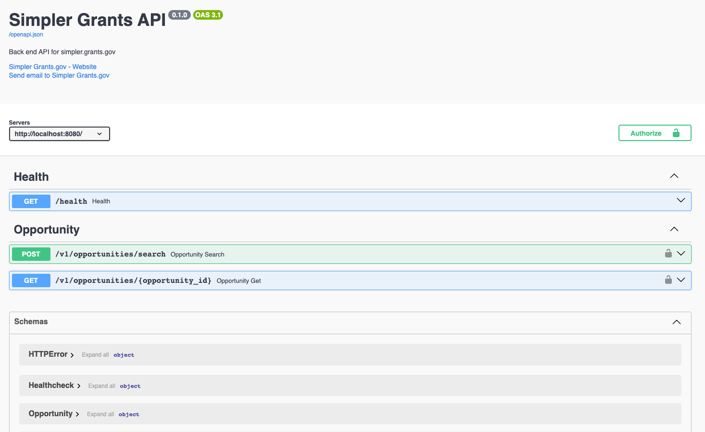
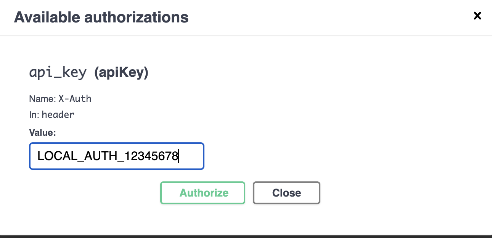

# API Details

See [Technical Overview](./technical-overview.md) for details on the technologies used.

Each endpoint is defined as a function using an APIFlask blueprint where we define the schema of the
request and response objects, attach authentication, and otherwise configure the endpoint based on
several decorators attached to the endpoint function.

An OpenAPI file is generated from this which can be found at [openapi.generated.yml](../../api/openapi.generated.yml).

# Routes
Routes and Marshmallow schema are defined in the [api/src/api](../../api/src/api) folder.

A route should only contain what is necessary to configure the inputs/outputs, and setup the DB session.
A route should generally:
* Define any request/response schemas
* Define any additional schemas (ie. headers or path params)
* Define the authentication for the route
* Define any DB sessions that the route will require
* Call the handler
* Return the response

## Defining a schema

We define schemas using [Marshmallow](https://marshmallow.readthedocs.io/en/stable/), but use our own derived version
of the schemas, fields, and validators to be able to produce errors in the format we want. See [error-handling.md](./error-handling.md) for more details.

These schemas will be used to generate  the OpenAPI schema, setup validations that will run, and make it possible to have a Swagger endpoint available for use

For example, if we wanted to define an endpoint with a request like:
```json
{
  "name": {
      "first_name": "Bob",
      "last_name": "Smith",
      "suffix": "SR"
  },
  "birth_date": "1990-01-01"
}
```
We would define the Marshmallow schema in-python like so:
```py
from enum import StrEnum
from src.api.schemas.extension import Schema, fields, validators
from src.api.schemas.response_schema import AbstractResponseSchema

class Suffix(StrEnum):
    SENIOR = "SR"
    JUNIOR = "JR"

class NameSchema(Schema):
    first_name = fields.String(
        metadata={"description": "First name", "example": "Jane"},
        validate=[validators.Length(max=28)],
        required=True,
    )
    last_name = fields.String(
        metadata={"description": "Last name", "example": "Doe"},
        validate=[validators.Length(max=28)],
        required=True,
    )
    suffix = fields.Enum(
        Suffix, metadata={"description": "Suffix"}
    )

class ExampleSchema(Schema):
    name = fields.Nested(NameSchema())
    birth_date = fields.Date(metadata={"description": "Their birth date"})

class ExampleResponseSchema(AbstractResponseSchema):
    # Note that AbstractResponseSchema defines a message and status_code field as well
    data = fields.Nested(ExampleSchema())
```

Anything specified in the metadata field is passed to the OpenAPI file that backs the swagger endpoint. The values
that can be passed through are defined in the [APIFlask docs](https://apiflask.com/openapi/#response-and-request-schema)
but it's recommended you try to populate the following:
- description
- example - if you want a specific default in the swagger docs
- type - only necessary if the default can't be determined by APIFlask

You can specify validators that will be run when the request is being serialized by APIFlask

Defining a response works the exact same way however field validation does not occur on response, only formatting.
To keep our response schema following a consistent pattern, we have a few base schema classes like [AbstractResponseSchema](../../api/src/api/schemas/response_schema.py)
that you can derive from for shared values like the message.

### Schema tips

`required=True` does not mean a field isn't nullable, it means the field must be set to something.
If you have a field named `my_field` that is required then 
- `{"my_field": null}` is perfectly valid
- `{}` would fail validation

If the value we need to have in the request, and what we want to call it in-code are different, you can specify a
`data_key` for the request value and Marshmallow will map it for you.

When providing an example for a value, consider what is a reasonable test default. Ideally it should pass any validations
and be representative of real data. For example, we often specify zip codes as several components use those zip codes.

Nested fields:
- If you define a field as `my_field = fields.Nested(AnotherSchema())`, don't provide a metadata as in some cases it seems to cause an issue with openapi generation

## Defining an endpoint

To define an endpoint, you need to attach a route definition to a function.

For example, if we wanted to use the above schema and create a `POST /example-route/<uuid:example_id>` we would
define it like so:


```py
from src.auth.api_key_auth import api_key_auth
from apiflask import APIBlueprint
import src.api.response as response

example_blueprint = APIBlueprint("Example", __name__, tag="Example")

@example_blueprint.post("/example-route/<string:example_id>")
@example_blueprint.input(ExampleSchema, arg_name="body") # As defined above, arg_name is used to map to the field in the function below
@example_blueprint.output(ExampleResponseSchema)
@example_blueprint.auth_required(api_key_auth) # The HTTPTokenAuth object that has a registered authentication function
def post_example_route(example_id: str, body: dict) -> response.ApiResponse:
    # Implement API logic

    return response.ApiResponse("Example success message", data={"example_id": "abcd1234"})
```

The API itself is defined first, including any route parameters. We then specify the schema that will define
the input and output of the request. Finally we define any authentication + specifically specify the auth used
so that OpenAPI will give you an authentication pop-up to fill out for specific endpoints.

When you define a blueprint like this, it needs to be registered with the APIFlask app, which we do in [app.py](../../api/src/app.py)
by calling `app.register_blueprints(example_blueprint)`.

# Swagger

The Swagger UI  can be reached locally at [http://localhost:8080/docs](http://localhost:8080/docs) when running the API.


The actual openapi spec generated that backs this swagger UI can be seen at [http://localhost:8080/openapi.json](http://localhost:8080/openapi.json)

Each of the endpoints you've described in API blueprints will appear here, organized based on their defined tags. For any endpoints with authentication added, you can add your authentication information by selecting `Authorize` in the top right.


All model schemas defined can be found at the bottom of the UI.