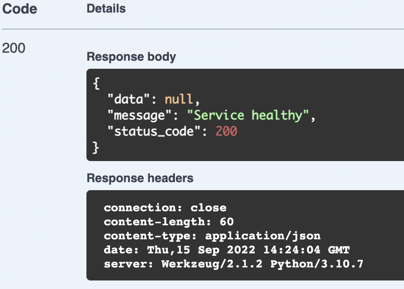

# API Details

See [Technical Overview](./technical-overview.md) for details on the technologies used.

Each endpoint is configured in the [openapi.generated.yml](../../api/openapi.generated.yml) file which provides basic request validation. Each endpoint specifies an `operationId` that maps to a function defined in the code that will handle the request.

# Swagger

The Swagger UI  can be reached locally at [http://localhost:8080/docs](http://localhost:8080/docs) when running the API. The UI is based on the [openapi.generated.yml](../../api/openapi.generated.yml) file.

Each of the endpoints you've described in your openapi.generated.yml file will appear here, organized based on their defined tags. For any endpoints with authentication added, you can add your authentication information by selecting `Authorize` in the top right.

All model schemas defined can be found at the bottom of the UI.

# Routes

## Health Check
[GET /v1/healthcheck](../../api/src/api/healthcheck.py) is an endpoint for checking the health of the service. It verifies that the database is reachable, and that the API service itself is up and running.

Note this endpoint explicitly does not require authorization so it can be integrated with any automated monitoring you may build.

### Example Response

