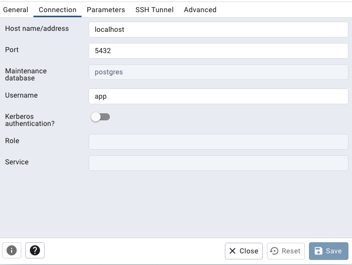
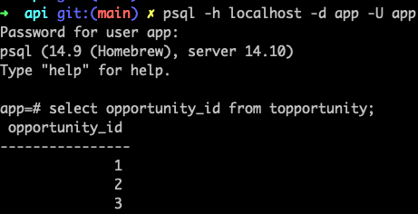

# Overview

This document describes how you can access and use your local DB.

## Connecting to the DB

### UI

There are many different programs you can use to connect to your DB, for example: [pgAdmin](https://www.pgadmin.org/).

Steps:
1. Make sure your local DB is running, you can start it up by doing `make init-db` which will handle starting + running initial DB migrations
2. Open your program for connecting to the DB, and add the connection parameters as shown below

Connection parameters for the database can be found in [local.env](../../api/local.env) including the password.

### CLI

If you have `psql` installed locally, you can also access the DB by running `psql -h localhost -d app -U app` which will require you enter the password afterwards.

For example:

## Seeding the DB

You can populate our opportunity data by running: `make db-seed-local` when you have the DB running.

This script currently creates 25 new opportunities each time you run it. In the future, as we expand the amount of data we support, we'll
add more options and data to the DB, but this should give a rough set of data to work with.
