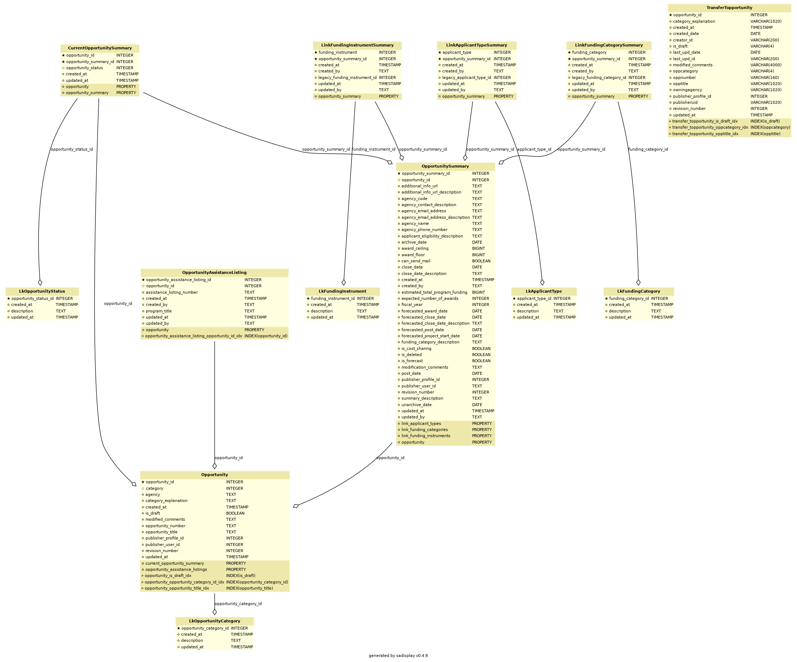

# Overview
This folder contains ERD diagrams representing our database schema for both our postgres DB

Diagrams can be manually generated by running `make create-erds` from the api folder.

# Dependencies
If running outside of Docker, you must install `graphviz` (`brew install graphviz`) for this to work, this should be automatically installed as part of the Dockerfile inside Docker.

# Caveats
The diagrams generated are based on our SQLAlchemy models, and not the database itself, so there are a few differences.

* Fields that we name different in-code will have a different name
* The table names use the class name
* Property fields are SQLAlchemy only and generally represent relationships (ie. values fetched via a foreign key `join`)

# Files
