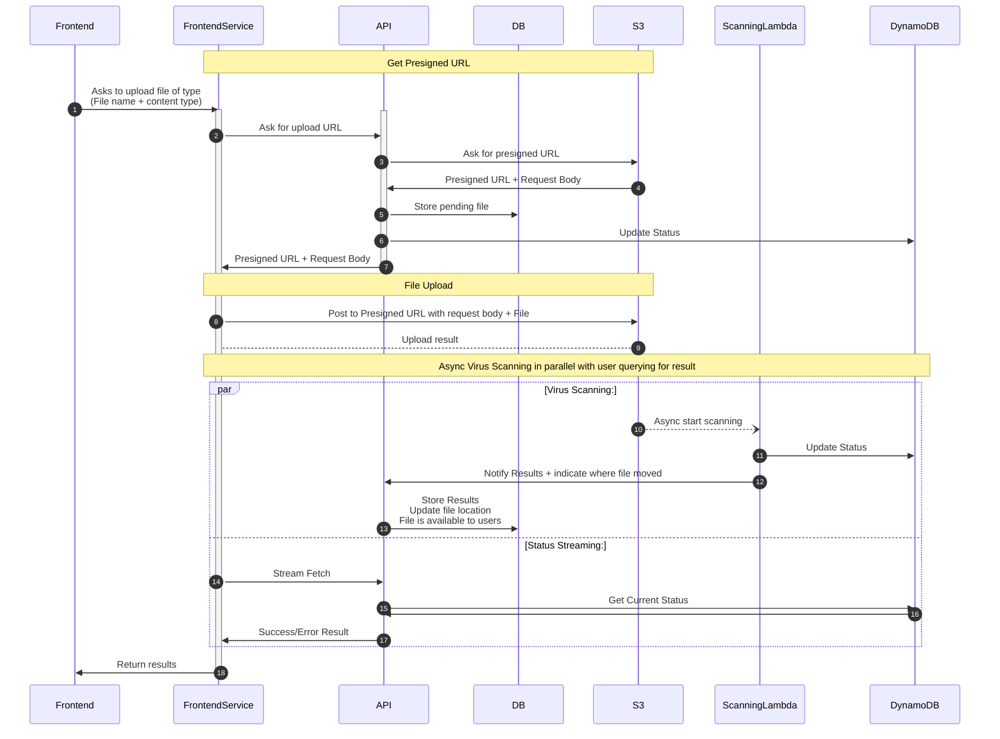
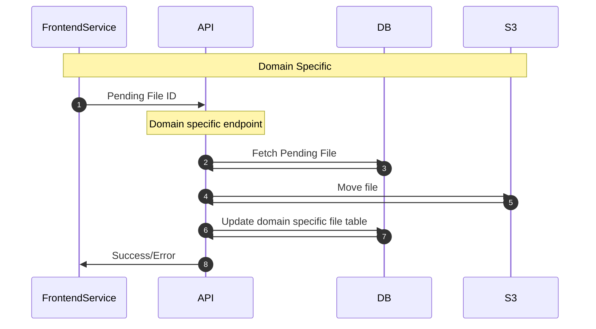

# Overview

We have several different parts of our system that need to allow
for file upload. This document lays out how our file upload logic
works, and how to extend it to add your own file upload endpoints.

* All uploaded files are scanned for viruses before being available to any user
* We support uploading files up to 2gb generally, although specific approaches can restrict this

# How it works

At a high-level, file uploads have the following steps:
* A user requests a presigned s3 URL, providing us the file name + content type (Importantly - no context on what the file will be for)
* The user uploads their file to s3 at the presigned URL provided
* Simultaneously:
  * The file being uploaded kicks off a lambda that scans the file and reports the result to DynamoDB + The API
  * The user can stream the current status of the scan back from the API which gets the result from DynamoDB
* If the file is successfully scanned, the file can now be converted into a specific domain file type (eg. application attachment, opportunity attachment)

Until that very last step, a file is not connected to any entity/resource in our system
except the user themselves. That last step is what makes it into a specific kind of file
in our system, and is the only portion that needs to differ between implementations on the backend.

The below diagram and sections go into this in much more technical detail.

## File Scan Status

We have the following file scan statuses that represent states of the file scan status:
* `pending` - The presigned URL for the file has been requested, but no file has been uploaded yet
* `in_progress` - File upload has happened, and file scanning is happening
* `complete` - A file has been successfully scanned, and is ready for domain specific logic
* `infected` - A file was rejected by our scanning process, and cannot be used by domain specific logic
* `processed` - A file has been converted to a domain specific file, and is no longer available

## Data Flow General

This is the general flow of the file upload logic that all approaches share.



## Domain Specific Flow

Each domain will need to define their own specific flow to connect
a file to their specific domain context (eg. application attachment).

See [Domain File Endpoints](#domain-file-endpoints) for further detail.



## Getting a Presigned URL
We have an endpoint `POST /v1/files` which takes in a
file name and content type and returns a presigned URL
that the user can upload the file at.

A user is only able to request 100 presigned URLs per hour (configurable by env if needed).
We will return a 429 if they exceed this quota.

For this, we use AWS's [Boto3 library to generate a presigned POST url](https://docs.aws.amazon.com/boto3/latest/reference/services/s3/client/generate_presigned_post.html).
Importantly, we are not using presigned PUT, which while similar, doesn't
allow you to specify conditions on the file being uploaded as well. The conditions
that we include are:
* Content length, must be between 1b and 2gb
* Content type, must match what the user passed in
* File ID in the metadata must match the one we generate -> Note that this file ID in the metadata is used by the scanning logic to update the status later
* User ID in the metadata must match the one we generate

Most of these validations are just verifying that the user did not modify
what we generated or what they passed in initially before uploading the file.

The presigned url we generate is in our file scan bucket under `/unscanned/{pending_file_id}/{file_name}`.

We create a record in the `pending_file` table about the record, and connect it to only the user.
A file is not connected to any entity like an opportunity or application until the very end.

We also create a record in the DynamoDB table and set the status to `pending`.

In our response we return two key values:
* The URL that they need to upload to which will look like `https://s3.amazonaws.com/{the bucket name}`
* The body of the request to call the presigned URL endpoint with which includes:

```python
{
  'Content-Type': 'application/pdf',
  'key': 'unscanned/51197c9e-a8ec-4771-bd04-7b0d161d1ee2/example.pdf',
  'policy': '<VERY LONG STRING>',
  'x-amz-algorithm': 'AWS4-HMAC-SHA256',
  'x-amz-credential': 'ABC/20260630/us-east-1/s3/aws4_request',
  'x-amz-date': '20260630T143004Z',
  'x-amz-meta-file-id': '51197c9e-a8ec-4771-bd04-7b0d161d1ee2',
  'x-amz-meta-user-id': 'ad3f4ca7-5534-4cde-9be3-cd61592b000c',
  'x-amz-security-token': '<VERY LONG STRING>',
  'x-amz-signature': '123abc'
}
```
Actual strings have been adjusted from real values, but this includes all actual fields.
The conditions we set are defined in the policy, and validated with the signature, similar to our JWT auth,
so any attempt at modifying them by the user would cause them to not match up.

## Caller uploads file to s3

The caller then needs to do a POST against the URL returned and set the form data to contain:
* The `body` passed back from the first endpoint
* Additionally attach the file to the form as `file`

Some examples can be found in the [AWS docs](https://docs.aws.amazon.com/boto3/latest/guide/s3-presigned-urls.html#generating-a-presigned-url-to-upload-a-file)
or in the [Example Script](#example-script) section below.

It is strongly recommended that you use a request framework as the
request this makes ends up quite complex, and not terribly viable for curl commands.
If you still want to try that, or at least want some additional context, here's
a rough example of what this looks like via curl as a multipart upload (with some values trimmed):

```shell
curl --request POST 'https://s3.amazonaws.com/EXAMPLE_BUCKET' --header 'User-Agent: python-requests/2.34.2' --header 'Accept-Encoding: gzip, deflate' --header 'Accept: */*' --header 'Connection: keep-alive' --header 'Content-Type: multipart/form-data' --data '--73c870505d6da9fab43a04e13e6a9b8b
Content-Disposition: form-data; name="Content-Type"

text/plain
--73c870505d6da9fab43a04e13e6a9b8b
Content-Disposition: form-data; name="key"

unscanned/481baf06-57e3-4d21-af10-e2a4e1415f56/example.txt
--73c870505d6da9fab43a04e13e6a9b8b
Content-Disposition: form-data; name="policy"

POLICY_STRING_GOES_HERE
--73c870505d6da9fab43a04e13e6a9b8b
Content-Disposition: form-data; name="x-amz-algorithm"

AWS4-HMAC-SHA256
--73c870505d6da9fab43a04e13e6a9b8b
Content-Disposition: form-data; name="x-amz-credential"

ABC/20260630/us-east-1/s3/aws4_request
--73c870505d6da9fab43a04e13e6a9b8b
Content-Disposition: form-data; name="x-amz-date"

20260630T185208Z
--73c870505d6da9fab43a04e13e6a9b8b
Content-Disposition: form-data; name="x-amz-meta-file-id"

481baf06-57e3-4d21-af10-e2a4e1415f56
--73c870505d6da9fab43a04e13e6a9b8b
Content-Disposition: form-data; name="x-amz-meta-user-id"

be553f81-1c6f-44de-b906-aa1113866ee6
--73c870505d6da9fab43a04e13e6a9b8b
Content-Disposition: form-data; name="x-amz-security-token"

SECURITY_TOKEN_GOES_HERE
--73c870505d6da9fab43a04e13e6a9b8b
Content-Disposition: form-data; name="x-amz-signature"

SIGNATURE_GOES_HERE
--73c870505d6da9fab43a04e13e6a9b8b
Content-Disposition: form-data; name="file"; filename="example.txt"

This is a file

--73c870505d6da9fab43a04e13e6a9b8b--
'
```

## Virus Scanning Lambda

When a file gets uploaded to the virus scanning bucket under the `/unscanned` prefix, it triggers
a lambda to run that handles virus scanning, and updating dynamoDB + the API with the status.

This code can be found at [scan.py](../../infra/modules/clamav/src/scan.py)

The scanner does the following:
* Grabs the pending_file_id of the file from the `x-amz-meta-file-id` metadata of the s3 file
* Updates the status of the pending file in DynamoDB to `in_progress`
* Downloads the file from s3 locally
* Runs the file through [clamAV](https://docs.clamav.net/) to scan the file
* Moves the file from the `/unscanned` path to either `/scanned` or `/infected` on s3, maintaining the rest of the path/file names.
* Calls the API with the status of the file scanning + new file location, see the [Scan Callback](#scan-callback) section for details on behavior.
* Updates DynamoDB with the status of the record.

### Scanning DB Management

The database for clamAV is updated every 6 hours by a separate lambda [update_definitions.py](../../infra/modules/clamav/src/update_definitions.py).


## Status Streaming
We have a `GET /v1/files/{pending_file_id}/results` endpoint that streams results
back to the user with the current status of the file. This endpoint checks DynamoDB
for the status, which gets updated by the virus scanning lambda and periodically returns
a chunk of results, stopping when the file's status is `complete`/`infected` OR it reaches
the maximum configured time.

When the status is `complete`, we'll grab some metadata about the file to return to the user
as a convenience including the file size, file name, and a download path, although it's assumed
that the next step will be to update the pending file and change it to a specific type of file.

This endpoint will return its results as `\n` separated chunks like so:
```
{"data": {"status": "pending", "file_metadata": null}}\n
{"data": {"status": "in_progress", "file_metadata": null}}\n
{"data": {"status": "complete", "file_metadata": {"file_size_bytes": 15, "file_name": "example.txt", "download_path": "https://s3.amazonaws.com/..."}}}
```

## Scan Callback
We have a `POST /v1/files/{pending_file_id}` endpoint which the file scanning
lambda calls to update the files status in our pending_file table.

It fetches the pending file with the provided ID, and updates the file scan status & file location
of the pending file as provided by the calling lambda.

## Domain File Endpoint(s)
Each of our domain specific endpoints will need to build an endpoint that does the following:

* Take in the `pending_file_id` of the file a user wants to make into a domain specific file
* Authorize that a user is able to do the action that they want to do (eg. attaching an application attachment)
* Use our [pending_file_handling_domain_specific.py](../../api/src/services/files/pending_file_handling_domain_specific.py) utility to fetch the pending file record.
  * The `fetch_and_validate_scan_complete_file` function will grab the pending file, verify it exists and it's `complete` and not `infected`
* Add any logic specifically needed for your file logic, including calculating a place on s3 that the file should go.
* Using the utility, call `move_pending_file_to_destination` which will handle moving the file to the appropriate place on s3 & set the status as `processed`

Note that setting the file as `processed` will prevent it from being used again,
a pending file at this time can't be used for multiple different domain purposes.

# Local Setup Differences
Locally we don't have actual virus scanning implemented, instead
we have a background thread running in our API service which watches
the file system where s3 files are stored and the behavior is dictated
based on the name of the file. It checks if any of the following appear
in the file name and behave accordingly:

* `scenario-infected` -> Will set the status as `infected`
* `scenario-wait10s` -> Will first set the status to `in_progress` and then 10 seconds later set it to `complete`
* Anything else, as soon as the file change is detected, will immediately change the status to `complete` - should be nearly instant.

Statuses are updated in both the DB & DynamoDB, so the stream logic
should behave the same.

# Q&A

## Why did we choose this async approach?

There were two major drivers that dictated how we would build this:
* API Gateway, which we use for rate limiting, has a 20mb request size (ie. file size) limit. File uploads can't go through the API, so we have to instead point them to s3.
* Preventing potentially infected files from ever being in our API by isolating the scanning to a lambda.

## What happens if a user requests an upload URL but never uploads anything?

The pending file will sit in `pending` status forever. The presigned URL will expire after a
brief period of time, so nothing will be able to be uploaded to it.

The only impact on our system at this state will be that we've generated a row in the `pending_file` table.

## How do I test with an infected file?

> [!CAUTION]
> Although this file is not actually infected, it will trigger
> all virus scanners. It is probable that you can trigger virus scanners
> on your own machine, or that are administered by your IT department.

Our virus scanner will trigger for [EICAR](https://www.eicar.org/download-anti-malware-testfile/) files
which are standard files that will trip the virus scanner.

> [!CAUTION]
> Reiterating the warning above, you will probably trigger any virus scanners that your IT department has setup.
> Speaking from experience, it might be a good idea to give them a heads up to avoid any concerned emails.

# Example Script

This is an example python script that can go through the following steps:
* Get a presigned URL from our API
* Upload a file to that presigned URL
* Stream the results back from the results endpoint until completed

It does not handle any errors, and does not handle making the file into
the corresponding kind of file.

Pre-requisites
* Python 3 (tested with 3.14, but anything fairly recent should work)
* The requests library installed (`pip install requests`)
* Whichever environment/API you are running this against, you first need an API key which you can get by logging in and going to the correspond [developers](https://simpler.grants.gov/developers) page (adjust the URL accordingly for the environment).
* A file to upload, assumed to be in the same directory as the script

```python
import requests
import json

FILE_NAME = "example.pdf"
MIME_TYPE = "application/pdf"

API_KEY = "INSERT KEY HERE"
HEADERS = {"Content-Type": "application/json", "X-API-Key": API_KEY}
URL_BASE = "https://api.staging.simpler.grants.gov/v1/files"

def get_presigned_url():
        print("=" * 25)
        print("Getting presigned URL")
        print()

        body = {"file_name": FILE_NAME, "mime_type": MIME_TYPE}

        result = requests.post(URL_BASE, json=body, headers=HEADERS)

        raw_data = result.json()
        return raw_data["data"]["body"], raw_data["data"]["url"], raw_data["data"]["pending_file_id"]


def do_file_upload(url, data):
        print("=" * 25)
        print("Doing file upload")
        print()
        print(f"POSTing to {url}")
        print()
        print(data)
        print()

        with open(FILE_NAME, "rb") as infile:
                response = requests.post(url, data=data, files={"file": (FILE_NAME, infile)})
                print(response.__dict__)

def stream_response(pending_file_id):
        print("=" * 25)
        print(f"Starting response stream for {pending_file_id}")
        print()

        with requests.get(f"{URL_BASE}/{pending_file_id}/results", headers=HEADERS, stream=True) as r:
                for line in r.iter_lines():
                        print(line)

# Call all of the above
data, url, pending_file_id = get_presigned_url()
do_file_upload(url, data)
stream_response(pending_file_id)
print("done")
```