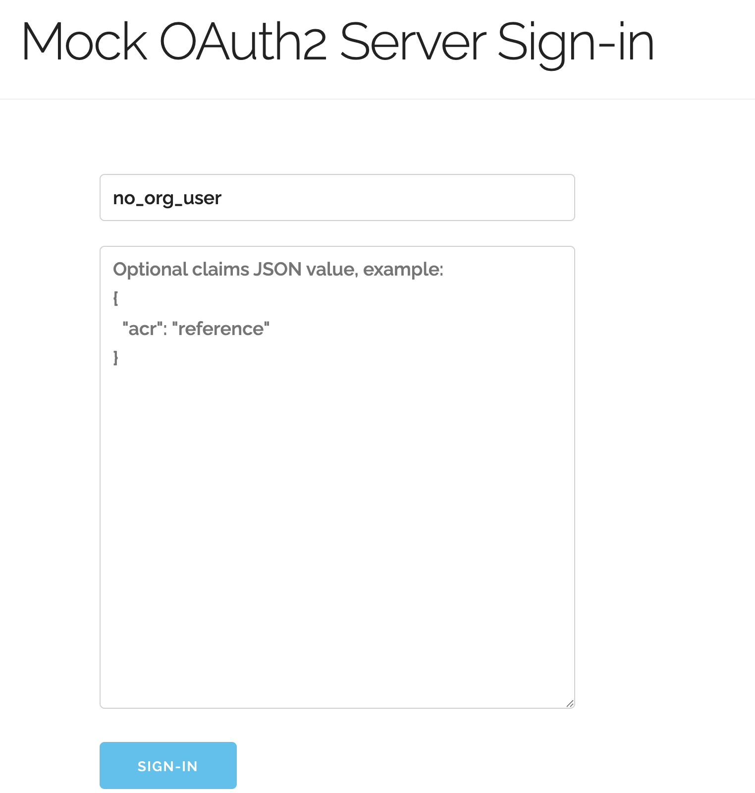

# Overview
We have a [local seed script](/api/tests/lib/seed_local_db.py) which loads data into our database for local development.

If you want to run the script and load all possible data, simply running `make db-seed-local`
will load all data into the database.

As this script can take several seconds to run, and you may only care about updating
parts of the data, you can also tell it to run specific steps of the seed script by
doing `make db-seed-local args="-s users -s agencies"`. You can run `make db-seed-local args="--help"`
to get a full list of possible parameters to the script.

# Opportunities
Every time the seed script runs we create opportunities in various states including
different opportunity statuses and variance on fields that are relevant to testing features
like long opportunity summaries.

Rerunning the seed script will continue to add more and more opportunities to the database,
but remember if you want them viewable in search to run `make populate-search-opportunities`
afterward.

# Agencies
We setup a subset of real agencies locally which are defined in [seed_agencies.py](/api/tests/lib/seed_agencies.py).

These agencies have top-level and child agencies.

Rerunning the script will not modify any existing agencies.

# Forms & Competitions

## Forms
We setup all of our forms to be loaded into the database.

The forms will be refreshed whenever the seed script is run, so changes
to the classes we have defined will get synced to the database.

## Competitions
Additionally, we setup a few competitions on opportunities to use these forms.
When the opportunities are created, we log a message with a convenient link
to the opportunity assuming you have a local frontend running.

Every time we run the seed script, new competitions are created, but the prior
ones should still work. If you ever get a competition into a weird state locally,
you just need to rerun the script to make a new one.

# Users & Organizations

## Organizations
We currently create two organizations that we can associate with users.

These organizations are statically defined, and will only be updated when running the seed script.

## Users
We currently have the following users automatically created when running our seed script.

---
`no_org_user`
* A user without any organizations
* Has several saved opportunities
* Has several saved searches

Each time you run the seed script, it will add a few more saved opportunities and searches.

---
`one_org_user`
* A user that is the owner of one organization

---
`two_org_user`
* A user that is the owner of two different organizations

## How to use a pre-created user
Our local mock OAuth server will pass whatever you put in the "login" screen
as the external ID that we store in our DB and use to fetch a user during login.

For example, if we pass in `no_org_user` then we'll be logged in as that user.

If what you put into that box doesn't correspond to a user we have, our system
will make a brand new user. Logging out and relogging in with that same text will
log you back in as that user.
