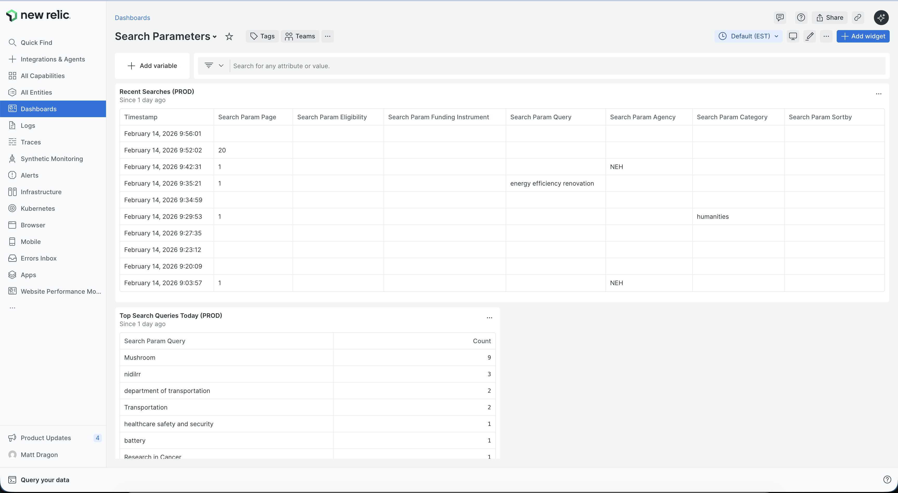
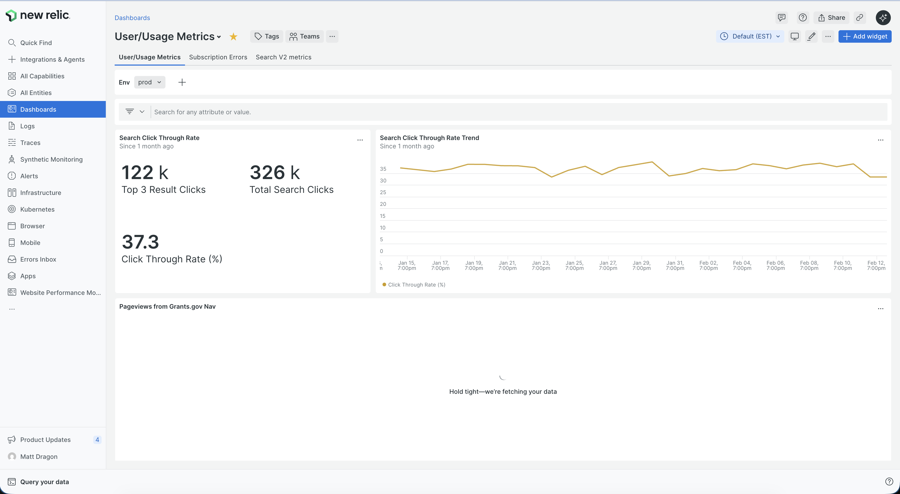
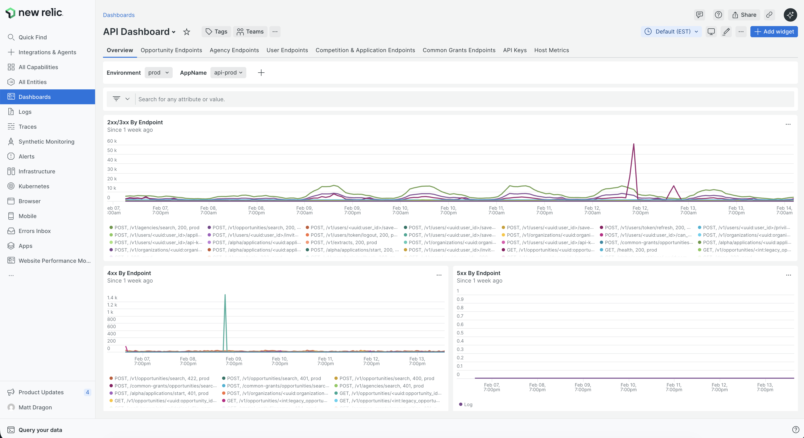
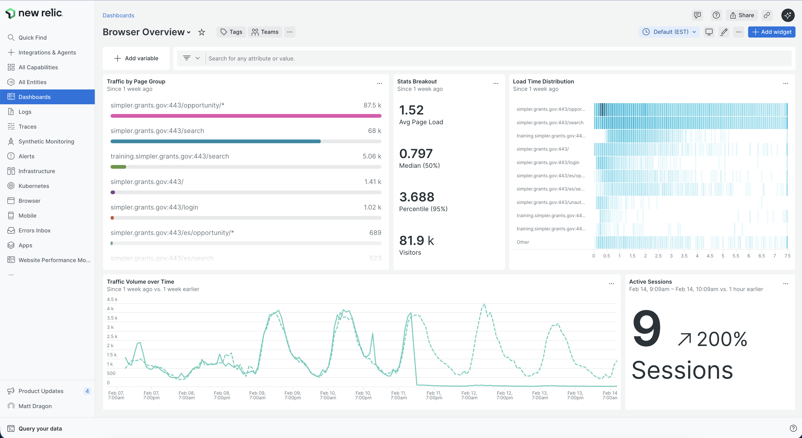
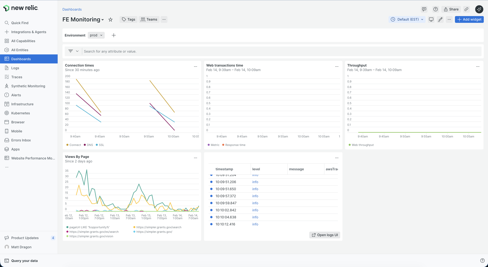
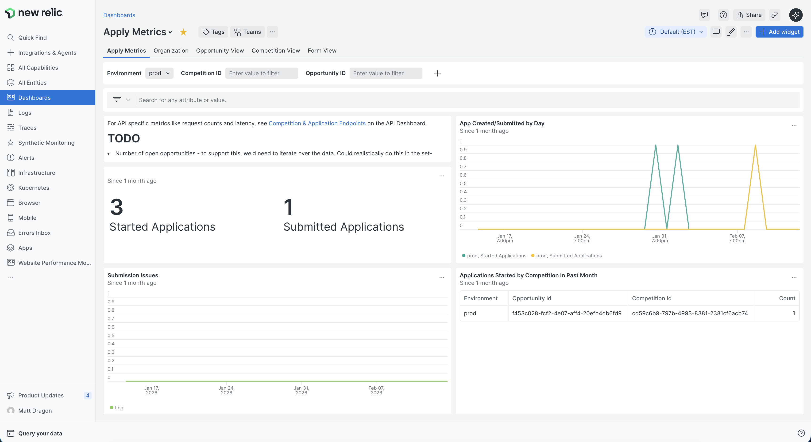
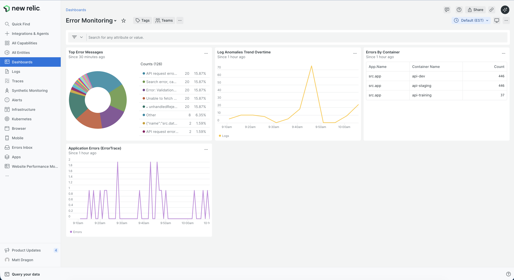
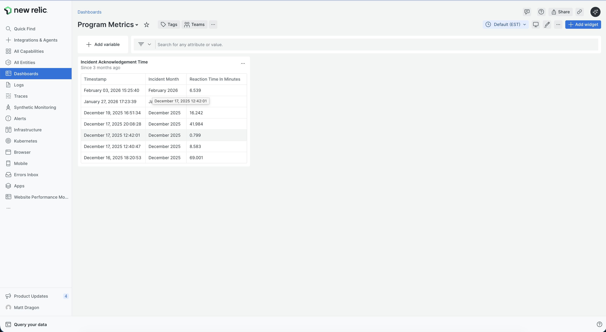

# Find Observability Audit: Dashboards and Business Metrics

> **Scope:** Search endpoints, OpenSearch performance, opportunity view endpoints, saved opportunity endpoints, saved search endpoints, organization endpoints (all Find-related APIs)

---

## Table of Contents

1. [Existing New Relic Dashboards](#1-existing-new-relic-dashboards)
2. [Default APM Monitoring (Auto-Instrumented)](#2-default-apm-monitoring-auto-instrumented)
3. [Existing Custom Instrumentation](#3-existing-custom-instrumentation)
4. [Existing Business Metrics](#4-existing-business-metrics)
5. [Existing Metabase Dashboards](#5-existing-metabase-dashboards)
6. [Gaps Identified](#6-gaps-identified)
7. [Recommendations](#7-recommendations)
8. [Next Steps](#8-next-steps)

---

## 1. Existing New Relic Dashboards

> **Note:** All dashboards below are manually configured in the NR UI — none are defined as code (no Terraform NR provider, no dashboard JSON/HCL in `infra/`).

### 1.1 Search Parameters — Find-Specific

**Purpose:** Dedicated search intent analysis dashboard.

**Widgets:**
- **Most Frequent Search Terms** — table of top queries (e.g., "Transportation", "Robotics", "Healthcare safety")
- **Recent Searches (Dev/Staging)** — live stream of recent search queries for debugging
- **Search Parameter Breakdown** — query param usage patterns

**Screenshot:**



---

### 1.2 User/Usage Metrics — Find-Specific

**Purpose:** Business engagement metrics including search and user activity.

**Screenshot (User/Usage Metrics tab):**



---

### 1.3 API Dashboard — Find-Relevant

**Purpose:** Technical health monitoring for all API endpoints, with dedicated tabs for opportunity and user endpoints.

**Screenshot:**



---

### 1.4 Browser Overview — Find-Relevant

**Purpose:** Frontend performance and traffic analysis across all pages.

**Screenshot:**



---

### 1.5 FE Monitoring

**Purpose:** Frontend performance diagnostics.

**Screenshot:**



---

### 1.6 Apply Metrics

**Purpose:** Tracks the downstream application funnel after users find an opportunity.

**Tabs:** Opportunity View, Competition View, Form View

**Key widgets:** Application starts/submissions, submission issues, attachment counts.

**Relevance:** Monitors the primary conversion action (applying) that follows a successful Find experience. This dashboard serves as the model for the recommended Find product metrics dashboard (see [Section 7](#7-recommendations)).

**Screenshot:**



---

### 1.7 Error Monitoring

**Purpose:** Health regression identification and error triage.

**Key widgets:**
- **Top Error Messages:** pie chart of error types including "Not Found" errors for opportunities and search validation errors
- **Log Anomalies Trend:** error spike detection over time
- **Errors By Container:** distribution across api-dev (446), api-staging (446), api-training (37)
- **Application Errors (ErrorTrace):** per-minute error rate timeseries

**Relevance:** Helps diagnose issues where search or opportunity pages fail for users.

**Screenshot:**



---

### 1.8 Program Metrics

**Purpose:** Operational incident response tracking.

**Key widgets:** Incident acknowledgement times, reaction times in minutes.

**Relevance:** Indirect — focused on operational support rather than user-facing Find functionality.

**Screenshot:**



---

## 2. Default APM Monitoring (Auto-Instrumented)

New Relic APM is enabled for all non-local environments and automatically provides transaction-level data for all Find endpoints. The following is available out-of-the-box without any custom instrumentation:

### What NR APM Provides for Find Endpoints

| Metric | Description |
|--------|-------------|
| Transaction throughput | Requests/min per endpoint |
| Response time (avg, p95, p99) | Latency distribution per endpoint |
| Error rate | Errors per endpoint |
| Apdex score | User satisfaction index |
| Database query time | PostgreSQL query performance |
| External service calls | OpenSearch query latency |
| Transaction traces | Detailed traces for slow requests (>apdex_f) |
| Distributed tracing | Cross-service request flow (API only) |
| SQL explain plans | For queries >0.5s |

### Configuration Details

Source: [`api/newrelic.ini`](../../../api/newrelic.ini)

Key settings:
- `transaction_tracer.enabled = true`
- `transaction_tracer.transaction_threshold = apdex_f`
- `transaction_tracer.record_sql = obfuscated`
- `transaction_tracer.stack_trace_threshold = 0.5`
- `transaction_tracer.explain_enabled = true`
- `error_collector.enabled = true`
- `error_collector.ignore_status_codes = 401 402 403 404 405 406 415 416 422`
- `distributed_tracing.enabled = true`
- `strip_exception_messages.enabled = true` (PII protection)
- `application_logging.enabled = false` (logs forwarded via FluentBit sidecar)

### Find-Related Endpoints Covered by APM

| Endpoint | Route | Method |
|----------|-------|--------|
| Search opportunities | `/v1/opportunities/search` | POST |
| Get opportunity | `/v1/opportunities/{opportunity_id}` | GET |
| Get opportunity (legacy) | `/v1/opportunities/legacy/{legacy_opportunity_id}` | GET |
| Save opportunity | `/v1/users/{user_id}/saved-opportunities` | POST |
| Delete saved opportunity | `/v1/users/{user_id}/saved-opportunities/{opportunity_id}` | DELETE |
| List saved opportunities | `/v1/users/{user_id}/saved-opportunities` | GET |
| Save search | `/v1/users/{user_id}/saved-searches` | POST |
| Delete saved search | `/v1/users/{user_id}/saved-searches/{saved_search_id}` | DELETE |
| List saved searches | `/v1/users/{user_id}/saved-searches` | GET |
| Update saved search | `/v1/users/{user_id}/saved-searches/{saved_search_id}` | PUT |
| Search organizations | `/v1/organizations/search` | POST |
| Search agencies | `/v1/agencies` | POST |

---

## 3. Existing Custom Instrumentation

### 3.1 Backend: Structured Logging in Routes

The search route ([`api/src/api/opportunities_v1/opportunity_routes.py`](../../../api/src/api/opportunities_v1/opportunity_routes.py)) uses `add_extra_data_to_current_request_logs` to attach structured data to every request log, providing meaningful backend observability:

**On every search request:**
```python
add_extra_data_to_current_request_logs(flatten_dict(search_params, prefix="request.body"))
```
This logs all search parameters (query text, filters, pagination) as structured attributes on the request log.

**On every search response:**
```python
add_extra_data_to_current_request_logs({
    "response.pagination.total_pages": pagination_info.total_pages,
    "response.pagination.total_records": pagination_info.total_records,
})
```
This logs result counts on every search response, enabling queries like:

```sql
-- Result count distribution (zero-result searches, high-result searches, etc.)
SELECT count(*) FROM Log
WHERE request.url_rule = '/v1/opportunities/search'
  AND environment = 'prod'
  AND response.status_code = 200
FACET buckets(response.pagination.total_records, 1000, 10)
SINCE 1 day ago
```

Similarly, opportunity GET routes log `opportunity_id` and `legacy_opportunity_id` as structured attributes on each request.

All of these logs are forwarded to New Relic Logs and CloudWatch via the FluentBit sidecar and are queryable via NRQL.

### 3.2 Frontend: New Relic Browser Custom Attributes

[`SearchAnalytics.tsx`](../../../frontend/src/components/search/SearchAnalytics.tsx) sets NR browser custom attributes for search parameters on every search page load:

```typescript
// For each search query parameter:
setNewRelicCustomAttribute(key, value || "");
// Results in NR attributes like: search_param_query, search_param_status, etc.
```

This allows querying NR Browser for which search parameters users are using, but:
- Does not track result counts or response times
- Does not track individual search sessions
- Has a known cleanup timing issue (attributes may persist during route transitions)
- Only covers search pages, not opportunity views or saved items

### 3.3 Frontend: Google Analytics Events

The frontend sends two GA events related to Find:

| Event | Location | Data Sent |
|-------|----------|-----------|
| `search_attempt` | `SearchAnalytics.tsx` | Filters (JSON, excludes query text and page) |
| `search_term` | `useSearchParamUpdater.ts` | Search query value |

### 3.4 Log Forwarding Pipeline

[`fluentbit/fluentbit.yml`](../../../fluentbit/fluentbit.yml) configures a FluentBit sidecar that:

1. Receives logs via TCP/forward protocol
2. Parses JSON log fields and merges them to the record level
3. Truncates large SQL parameter lists via Lua script
4. Forwards to **three destinations**: New Relic Logs, CloudWatch, and stdout

All structured log attributes (from `add_extra_data_to_current_request_logs` and Python `extra={}` kwargs) are queryable in NR Logs via NRQL.

---

## 4. Existing Business Metrics

### What Is Currently Tracked

The backend already logs meaningful search metrics via `add_extra_data_to_current_request_logs` in the route layer. Combined with NR APM and frontend instrumentation, the following is available:

| Metric Category | Tracked? | Source |
|-----------------|----------|--------|
| Search volume (total searches) | Yes | NR APM transaction counts + NR Logs |
| Search query text | Yes | `request.body.query` in NR Logs |
| Search filters used | Yes | `request.body.filters.*` in NR Logs |
| Search result counts | Yes | `response.pagination.total_records` in NR Logs |
| Zero-result searches | Derivable | Query NR Logs for `total_records = 0` |
| Search filters usage (frontend) | Partial | NR Browser custom attributes, GA events |
| Opportunity view counts | Yes | NR APM transaction counts + NR Logs (`opportunity_id`) |
| Save opportunity rates | Partial | Auto-logged: URL rule, duration, `auth.user_id`. Not attached: opportunity ID (would need explicit instrumentation; not available from response code) |
| Saved search usage | Partial | Auto-logged: URL rule, duration, `auth.user_id`. Not attached: search request params (could follow same pattern as search endpoint) |
| Search-to-view conversion | No | No funnel tracking exists |
| OpenSearch performance metrics | Partial | Available as external service calls in NR APM; OpenSearch-native metrics not yet imported |

### Existing Data Sources That Could Power Metrics

| Source | What It Contains | Accessibility |
|--------|-----------------|---------------|
| NR APM Transactions | Per-endpoint throughput, latency, errors | NRQL queries |
| NR Logs (via FluentBit) | Search params, result counts, opportunity IDs per request | NRQL queries on Log type |
| NR Browser | Page views, search param custom attributes | NRQL queries |
| Google Analytics | `search_attempt` and `search_term` events | GA Dashboard |
| API Database | Saved opportunities, saved searches tables | Direct SQL |
| OpenSearch | Search index data, query logs | OpenSearch Dashboards (if enabled) |

### External Reference

An API Metrics Google Sheet exists: [API Metrics by Sprint](https://docs.google.com/spreadsheets/d/19dftxSepvjVz_sil-eEL92FTMApRWJJ7Pq74JQh96Kg/edit#gid=1208306053) (referenced in `documentation/wiki/product/simpler-grants.gov-analytics/api-metrics.md`). This should be reviewed for any Find-related metrics it may contain.

---

## 5. Existing Metabase Dashboards

Metabase was selected as the BI tool per [ADR 2024-04-10](../../wiki/product/decisions/adr/2024-04-10-dashboard-tool.md), with Postgres as the analytics data store per [ADR 2024-03-19](../../wiki/product/decisions/adr/2024-03-19-dashboard-storage.md).

> **Note:** The current Metabase integration is brittle and poorly maintained. Any Find-specific Metabase work would require first building a proper data pipeline as a prerequisite.

No Metabase dashboards exist for Find functionality. All existing queries focus on delivery, sprint, ETL, and project management operations.

---

## 6. Gaps Identified

### Critical Gaps

1. **No dedicated Find product metrics dashboard** — No NR dashboard equivalent to the Apply Metrics dashboard exists for Find. Search and opportunity view metrics are spread across multiple dashboards rather than consolidated into a single product view.
2. **No search-to-view-to-save funnel** — While the User/Usage Metrics dashboard tracks search CTR, there is no connected funnel showing: search → click result → view opportunity → save opportunity → apply.
3. **No Find-specific alerts** — Basic system alerts exist, but no alerts are configured specifically for Find functionality (e.g., search error rate spike, zero-result rate increase, search latency degradation).

### Moderate Gaps

4. **Save/unsave and saved search endpoints lack structured business attributes** — Unlike search and opportunity view routes, these endpoints don't attach key business attributes: save endpoints omit the opportunity ID, and saved search endpoints omit the search request. Adding this instrumentation would enable save rate and usage pattern analysis.
5. **Frontend analytics split across two systems** — Search data is split between NR Browser (custom attributes) and Google Analytics (`search_attempt`, `search_term` events), making holistic analysis difficult.
6. **No dashboard backups** — All 8 NR dashboards are manually created in the UI with no backup or version history. Changes are at risk of being accidentally lost.
7. **OpenSearch-native metrics not imported** — OpenSearch has its own metrics (index health, query performance, shard stats) that are not yet imported into New Relic.

### Existing Coverage

8. **Backend search logging** — Search route logs all request params and result counts as structured attributes, queryable via NRQL.
9. **Search Parameters dashboard** — Tracks top search terms and recent queries across environments.
10. **User/Usage Metrics dashboard** — Search CTR (37.3%), filter usage, device distribution, search bar usage (211k), top keywords.
11. **API Dashboard** — Covers all Find endpoints with throughput, success rates, and error patterns.
12. **Browser Overview** — `/opportunity/*` (92.5k) and `/search` (72.5k) are the top two traffic page groups.

---

## 7. Recommendations

### 7.1 Build a Dedicated Find Product Metrics Dashboard

Model a new NR dashboard after the existing Apply Metrics dashboard, consolidating Find-specific metrics into a single product view. Suggested panels:

- Search volume over time (from NR Logs: `request.url_rule = '/v1/opportunities/search'`)
- Zero-result search rate (from NR Logs: `response.pagination.total_records = 0`)
- Search result count distribution (bucketed)
- Top search queries and filters (from NR Logs: `request.body.*`)
- Opportunity view counts over time
- Search latency percentiles (p50, p95, p99) from NR APM

**Example NRQL for zero-result searches:**
```sql
SELECT count(*) FROM Log
WHERE request.url_rule = '/v1/opportunities/search'
  AND environment = 'prod'
  AND response.pagination.total_records = 0
TIMESERIES AUTO
```

**Example NRQL for search latency percentiles:**
```sql
SELECT percentile(duration, 50, 95, 99) FROM Transaction
WHERE name LIKE '%opportunity_search%' TIMESERIES AUTO
```

### 7.2 Add Find-Specific Alerts

Basic system alerts exist but none are Find-specific. Alerts should be managed as code (unlike dashboards, where editing in the UI is preferred). Recommended alerts:

| Alert | Condition | Priority |
|-------|-----------|----------|
| Search error rate | >5% 5xx errors on `/v1/opportunities/search` for 5 min | High |
| Search latency | p95 > 3s for 10 min | Medium |
| Zero-result rate spike | >50% of searches return 0 results for 15 min | Medium |
| Opportunity view errors | >5% 5xx on opportunity GET endpoints for 5 min | High |

### 7.3 Add Logging to Save/Unsave and Saved Search Endpoints

Extend the existing `add_extra_data_to_current_request_logs` pattern (already used in opportunity routes) to the saved opportunities and saved search routes. This would enable tracking save rates and saved search usage without any new infrastructure.

### 7.4 Dashboard Backups

Export NR dashboard JSON periodically and store in the repository for backup and diff purposes. This is lower overhead than full Terraform management (which would make dashboard editing cumbersome) while still providing a history of changes.

### 7.5 OpenSearch Metrics (Future)

OpenSearch has its own metrics (index health, query performance, shard stats) that could eventually be imported into New Relic for a complete picture of search infrastructure performance. See [#8250](https://github.com/HHS/simpler-grants-gov/issues/8250) for ongoing investigation.

---
## 8. Next Steps

### Existing Companion Tickets

1. **[#8231 — Define Find Funnel Metrics and User Events](https://github.com/HHS/simpler-grants-gov/issues/8231)** — Use the gaps from Section 6 to define exactly which metrics to surface in the new Find dashboard.
2. **[#8247 — Event Instrumentation](https://github.com/HHS/simpler-grants-gov/issues/8247)** — Coordinate with this ticket on any new instrumentation needed to power the Find dashboard.

### Recommended New Tickets

3. **Build Find Product Metrics Dashboard** — Create a dedicated NR dashboard modeled after Apply Metrics, using existing NR Logs data (search params, result counts) and APM data. No new instrumentation required for the initial version.
4. **Add Find-Specific Alerts as Code** — Define and deploy NR alerts for search error rate, latency, zero-result rate, and opportunity view errors via the NR Terraform provider (alerts, unlike dashboards, are well-suited to code management).
5. **Add Logging to Saved Opportunities/Searches Routes** — Extend `add_extra_data_to_current_request_logs` to save/unsave and saved search endpoints, following the existing pattern in `opportunity_routes.py`.
6. **Dashboard Backups** — Script a periodic export of NR dashboard JSON to the repository for backup and diff history.

## 9. Find Metrics Dashboard

**[Open in New Relic](https://onenr.io/0ERP1nyBPjW)**

**Default time range**: Last 30 days (all "over time" panels reflect the past month)

This section documents the panels on each page of the **Find Metrics** dashboard: what they measure, which NR attributes they use, and any caveats. Attributes on `Log` events are logged via `add_extra_data_to_current_request_logs` in the API layer and forwarded to New Relic Logs via the FluentBit sidecar.

---

### Consolidated Attributes Reference

| Attribute                        | Event type                | Description |
|----------------------------------|---------------------------|-------------|
| `search.index`                   | `Log`                     | Name of the OpenSearch index being queried |
| `search.took_ms`                 | `Log`                     | Time OpenSearch spent executing the query (the `took` field, in milliseconds) |
| `search.timed_out`               | `Log`                     | Whether the query timed out in OpenSearch (partial results possible) |
| `search.shards_failed`           | `Log`                     | Number of shards that failed during query execution |
| `search.total_records`           | `Log`                     | Total number of hits returned (`total_records`) |
| `search.is_zero_result`          | `Log`                     | Boolean flag: `true` if the search returned zero results |
| `search.max_score`               | `Log`                     | Relevancy score of the top result (`0` for browse-mode / no query text) |
| `search.total_relation`          | `Log`                     | Relation of the hit count: `'eq'` (exact) or `'gte'` (approximate lower bound) |
| `search.agg_overflow.*`          | `Log`                     | Dynamic attributes for aggregation overflows (e.g. `search.agg_overflow.agency` = `sum_other_doc_count`) |
| `search.score_min`               | `Log`                     | Minimum relevancy score among returned results |
| `search.score_max`               | `Log`                     | Maximum relevancy score among returned results |
| `search.score_mean`              | `Log`                     | Mean relevancy score among returned results |
| `search.score_stdev`             | `Log`                     | Standard deviation of relevancy scores (only when >1 result) |
| `field_score.<field>`            | `SearchResultExplanation` | BM25 score contribution from a specific field (e.g. `field_score.agency_code`, `field_score.opportunity_title`) |
| `position`                       | `SearchResultExplanation` | 1-based rank of the result (1–10) |
| `scoring_rule`                   | `SearchResultExplanation` | Active scoring profile used for this result (`default`, `expanded`, or `agency`) |

## 9.1 Landing Page – High-Level Funnel Overview

### Purpose & Philosophy

This is the main entry point for the Find Metrics dashboard. It gives **Product, Engineering, and Leadership** a single consolidated view of Search health and funnel volume over the last 30 days.

Use this page **first**, before going deeper into specialized dashboards.  

It answers the high-level questions that matter most:

- Is our search experience healthy and growing?
- Is the top of the funnel (search → opportunity discovery) performing as expected?
- Are there any early warning signs of degradation in volume, engagement, or reliability?


### Panel-by-Panel Guidance

#### 1. Key Metrics (Top Cards)

**Panels**: Monthly Visitors, Monthly Search Users, Total Searches Performed

These cards provide a high-level snapshot of traffic and engagement over the last 30 days. Watch for sudden drops in any metric (immediate investigation needed), Search Users growing while Total Searches stay flat or decline (possible UX or relevance issue), or Visitors growing faster than Search Users (search not capturing new traffic effectively). If something looks off, start with traffic sources (especially if Visitors drop), then check deeper quality or engagement metrics.

#### 2. Volume Trends

**Panels**: Search volume over time, Opportunity view volume over time, Search vs Opportunity Sessions over time (unique sessions hitting search vs opportunity pages)

This section shows how volume flows through the top and middle of the funnel over the last month. Look for divergence between search volume and opportunity views/sessions. Watch for searches stable or increasing while opportunity views flatten or drop (users searching but not finding valuable results) or a large/widening gap in Search vs Opportunity Sessions (funnel leakage at discovery). If something looks off, investigate search quality or engagement metrics.

#### 3. Save Activity

**Panels**: User Saves Activity (Saved / Deleted / Net), Organization Saves Activity (Saved / Deleted / Net), User Saved Opportunities Trend, Organization Saved Opportunities Trend

This section tracks bottom-of-funnel engagement and real user value, with saves as the strongest intent signal. Net Saves (Saved minus Deleted) is the cleanest measure of value delivered. Compare User vs Organization trends to distinguish individual from account-level behavior. Watch for rising search volume but flat/declining net saves (users look but don’t find value), high delete rate relative to saves (relevance or quality issues), or divergence between user and organization saves (possible B2B issues). If something looks off, check deeper engagement or save behavior metrics.

#### 4. Health

**Panels**: Zero-result search rate, Top-level error rates for search/view/save endpoints, Search p95 latency over time

This section monitors technical reliability and core experience quality. Zero-result rate is a leading indicator of relevance failure (even small increases hurt trust). Error rates should stay very low, and p95 latency shows how responsive search feels. Watch for increasing zero-result rate (relevance/ranking/data issue), spiking error rates (recent deploy or dependency problem), or p95 latency trending up (performance regression). If something looks off, investigate quality, errors, or latency metrics.

## 9.2 Search Quality and Relevance

### Purpose & Philosophy

This page assesses how relevant and useful search results are by combining click-through rates, zero-result metrics, result counts, and OpenSearch scoring signals.

Use this page when CTR drops, zero-result rate rises, or users report poor/irrelevant results even when volume looks healthy.

### Panel-by-Panel Guidance

#### 1. Click-Through Rate

**Panels**: Search Click Through Rate (Total Search Clicks, CTR %), Search Click Through Rate Trend, Top 3 CTR by Sort Order, CTR With Filters vs Without Filters, Saved Search CTR vs Manual Search CTR

Measures how well results drive engagement. Higher CTR indicates better relevance. Watch for declining CTR trend, large gaps between filtered vs unfiltered searches, or lower CTR on default/manual searches. If CTR drops, investigate ranking, result relevance, or recent sorting/scoring changes.

#### 2. Result Quality

**Panels**: Zero-Result Rate, Result Count Distribution, Top Queries Returning Zero Results

Evaluates result coverage and quality. Zero-Result Rate is a key indicator of relevance or data gaps. Watch for rising zero-result rates or frequent zero-result queries (especially common terms). If zero results increase, examine query understanding, synonyms, data freshness, or missing content.

#### 3. OpenSearch Scoring

**Panels**: OpenSearch Query Latency, Score Distribution Trends, Score Distribution by Scoring Rule, Top Contributing Fields by Position, Average Field Score Contribution by Scoring Rule

Provides insight into scoring behavior and latency. Watch for sudden latency spikes, declining or unstable score distributions, or unexpected field dominance in results. If scoring looks off, review scoring profiles, field mappings, or enable explain mode.

## 9.3 Search Engagement and Usage

### Purpose & Philosophy

This page shows how deeply users engage with search beyond raw volume — session intensity, feature adoption, saved search behavior, and usage patterns.

Use this page when search volume is healthy but opportunity views or saves are lagging, or to evaluate adoption of filters and saved searches.

### Panel-by-Panel Guidance

#### 1. Session Behavior

**Panels**: Search Usage per Session (Median, Avg, Max, Min), Search Usage per Session Trend, Search Sessions by Device Type

Shows how many searches users perform per session and breakdown by device. Watch for declining median/average searches per session (possible frustration or reduced need) or heavy skew to one device type.

#### 2. Search Tools & Terms

**Panels**: Tools Usage Distribution, Most Frequent Search Terms, Sessions Using Search Filters (Last 30 Days), Saved Search Stickiness

Reveals adoption of search tools, common queries, filter usage, and how often users return to saved searches. Watch for low filter adoption, dominance of short/generic queries, or low saved search stickiness.

#### 3. Saved Search Metrics

**Panels**: Active Saved Searches per Day, Activation Rate — Created, Saved Search Creation Volume

Tracks creation and activity of saved searches. Watch for declining creation volume or drops in active saved searches per day (may indicate users see limited long-term value).

#### 4. Activity Patterns

**Panels**: Unique Users Saving Searches, Search Activity by Day of Week, Search Activity by Hour of Day, Sort Usage Frequency, Query Length Distribution

Highlights when and how users search and save. Watch for drops in unique savers, unusual time-based spikes/drops, heavy use of specific sorts, or many very short/empty queries.

## 9.4 Open Search Health

### Purpose & Philosophy

This page monitors the technical health and performance of OpenSearch — including latency, reliability, and scoring behavior.

Use this page when investigating slow search, incomplete results, rising zero-result or error rates, or after deployments/index changes.

### Panel-by-Panel Guidance

#### 1. Performance

**Panels**: Search Latency (ms) — p50 / p95 / p99, Timeout Rate, Shard Failure Rate

Tracks OpenSearch execution time, timeouts, and shard failures. Watch for upward trends in p95/p99 latency, any non-zero timeout rate, or spikes in shard failures. If issues appear, investigate query patterns and cluster health.

#### 2. Scoring

**Panels**: Max Score Trend, Max Score by Scoring Rule, Total Relation Accuracy

Monitors relevancy scoring over time. Watch for declining max scores or divergence between scoring rules. Total Relation Accuracy should always be 0% — any non-zero value needs immediate investigation.

#### 3. Deep Dive

**Panels**: Agency Aggregation Truncation, Top Contributing Fields by Position, Average Field Score Contribution by Scoring Rule

Provides advanced diagnostics. Watch for non-zero agency aggregation truncation or unexpected field dominance in scoring. If anomalies appear, review aggregations, scoring profiles, or enable explain mode.
