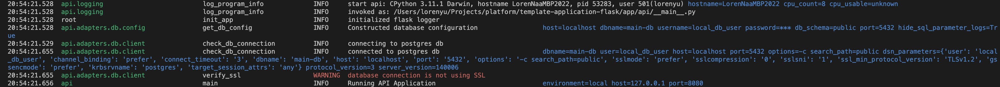

# Logging Configuration

## Overview

This document describes how logging is configured in the application. The logging functionality is defined in the [src.logging](../../../api/src/logging/) package and leverages Python's built-in [logging](https://docs.python.org/3/library/logging.html) framework.

## Formatting

We have two separate ways of formatting the logs which are controlled by the `LOG_FORMAT` environment variable.

`json` (default) -> Produces JSON formatted logs which are machine-readable.

```json
{
    "name": "src.api.healthcheck",
    "levelname": "INFO",
    "funcName": "healthcheck_get",
    "created": "1663261542.0465896",
    "thread": "275144058624",
    "threadName": "Thread-2 (process_request_thread)",
    "process": "16",
    "message": "GET /v1/healthcheck",
    "request.method": "GET",
    "request.path": "/v1/healthcheck",
    "request.url_rule": "/v1/healthcheck",
    "request_id": ""
}
```

`human-readable` (set by default in `local.env`) -> Produces color coded logs for local development or for troubleshooting.



## Logging Extra Data in a Request

The [src.logging.flask_logger](../../../api/src/logging/flask_logger.py) module adds logging functionality to Flask applications. It automatically adds useful data from the Flask request object to logs, logs the start and end of requests, and provides a mechanism for developers to dynamically add extra data to all subsequent logs for the current request.

## PII Masking

The [src.logging.pii](../../../api/src/logging/pii.py) module defines a filter that applies to all logs that automatically masks data fields that look like social security numbers.

## Audit Logging

* The [src.logging.audit](../../../api/src/logging/audit.py) module defines a low level audit hook that logs events that may be of interest from a security point of view, such as dynamic code execution and network requests.

## Additional Reading

* [Python's Logging HOWTO](https://docs.python.org/3/howto/logging.html#logging-basic-tutorial)
* [Python's logging module API docs](https://docs.python.org/3/library/logging.html)
* [Formatter objects](https://docs.python.org/3/library/logging.html#formatter-objects)
