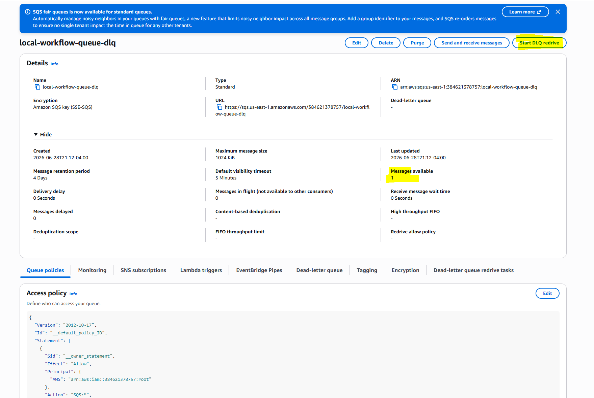
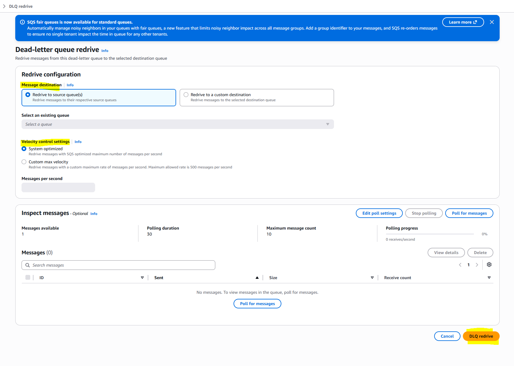
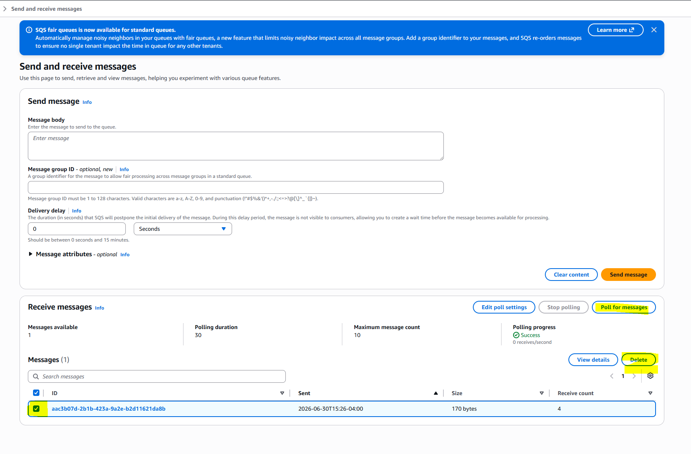
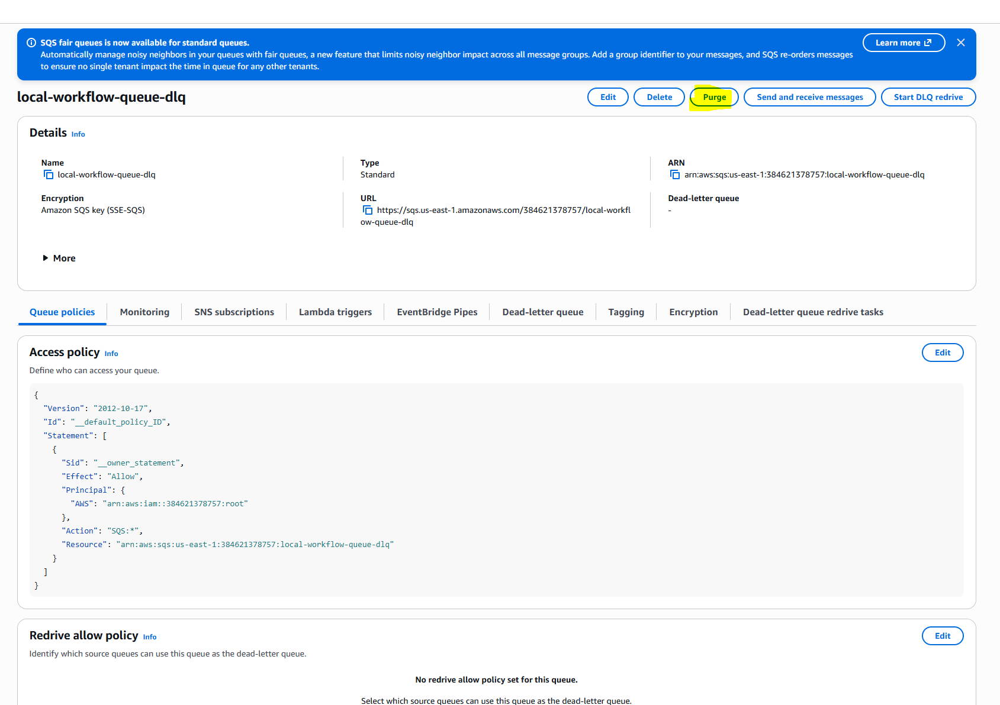

# Dead Letter Queue Redrive and Management

## Overview
This guide explains how to manage messages in the Dead Letter Queue (DLQ), including understanding why messages end up in the DLQ, when to redrive vs delete, and step-by-step procedures for both operations.

## What is a Dead Letter Queue?
A Dead Letter Queue (DLQ) is a special SQS queue that receives messages that cannot be successfully processed after multiple attempts. It prevents problematic messages from blocking the processing of valid messages.

## When do messages go to the DLQ?
Messages move to the DLQ after exceeding the **maximum receive count** (default: 3 attempts) without being successfully deleted. This happens with:
- Retryable errors (database timeouts, network issues)
- General/unexpected errors
- Processing timeouts
- Validation errors (malformed messages)

## Investigating DLQ Messages

Before taking action on DLQ messages, investigate the root cause:

### What to check:
- **Message content** - Is it partially missing or malformed?
- **Workflow data** - Check related workflow status, entity state
- **System logs** - Look for errors, timeouts, or infrastructure issues

### How to view message details:
1. Go to AWS Console → SQS → "the DLQ"
2. Click "Send and receive messages"
3. Click "Poll for messages"
4. Review message body and attributes

## DLQ message redrive
**Critical**: Always resolve the underlying issue before redriving messages, otherwise they will fail again and return to the DLQ after 3 more attempts.

### Steps
1. Confirm the DLQ message availability, then click the "Start DLQ redrive" button on top-right corner.

2. Make selection for "Message destination" and "Velocity control settings", then click "DLQ redrive" to proceed. It may take a few seconds for the message to move out.

### What happens after redrive:
- Messages are moved back to the main queue (`local-workflow-queue`)
- Workflow service picks them up and processes them
- If processing succeeds → messages are deleted
- If processing fails again → messages return to DLQ after 3 more attempts

## DLQ message delete
The DLQ messages can be deleted when reprocess is not needed.
**⚠️ Warning**: Deletion is permanent. Messages cannot be recovered after deletion.
One can either delete specific message(s) or purge all messages at a time.

### Steps for deleting specific message(s)
1. Click "Send and receive messages" 
2. From next page, poll for the messages
3. Make selections, then click "Delete"

### Steps for deleting all message(s) (purge)
1. Click **Purge** on top-right corner
2. Type "purge" to confirm, then click **Purge**

