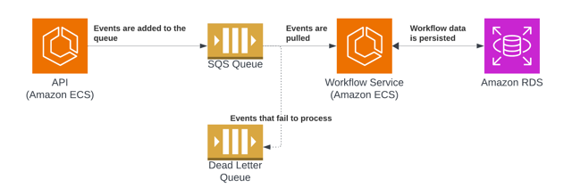
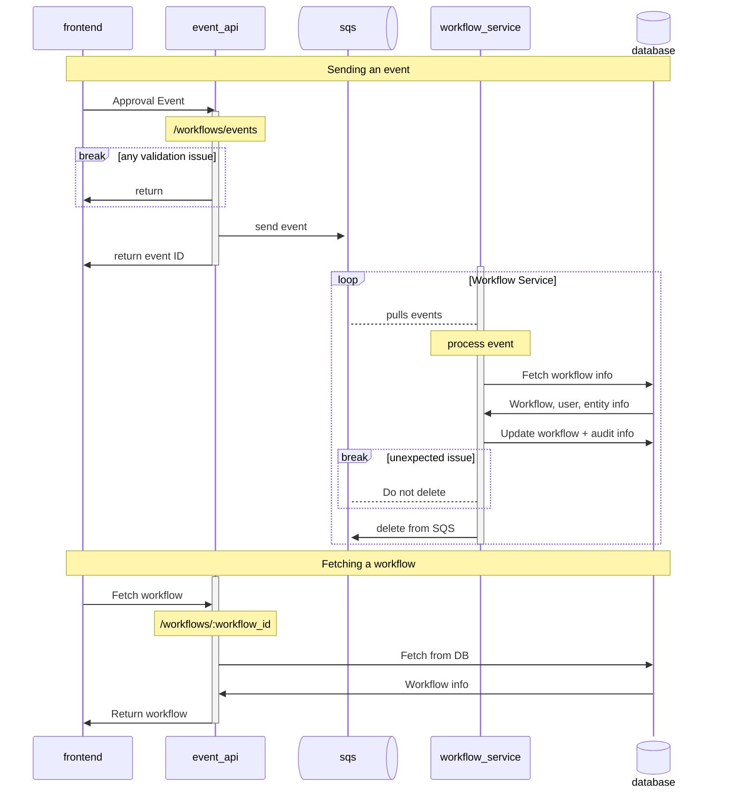
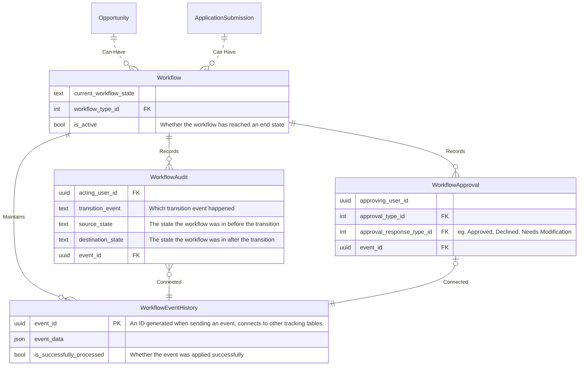
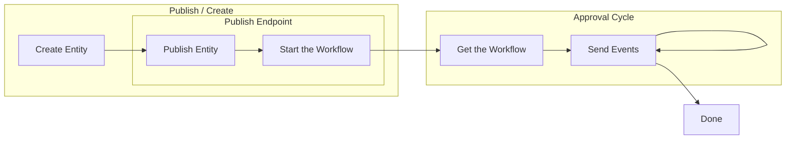

# Overview
Workflows are state machines that we can process asynchronously
against a given entity.

Features include:
* Approval chains - an entity can receive multiple approvals of different kinds in a defined order, typically from grantors
* Asynchronous processing
* Auditability
* Workflow / state machine diagrams

Workflows are built on the [python-statemachine](https://python-statemachine.readthedocs.io/en/latest/index.html) library.

For more information on what led us to use this technology, see [the ADR](/documentation/wiki/product/decisions/adr/2026-02-03-workflow_management.md)

For more information on building workflows, see [the workflow README.md](/api/src/workflow/README.md).

## Terminology

* Workflow / State Machine - often used interchangeably. Our workflows
  are backed by state machines. The workflow often refers to the entire
  setup including our events logic, while the state machine is the underlying
  state and transitions.
* Entities - A workflow is associated with an entity, that is something that
  it acts on and is used for authentication and other logic. Entities can be
  opportunities, application submissions, or other records that can be setup
  and associated with the workflow class.
* Approval - Certain events we will receive are for approvals from specific
  user types. For example, a budget officer might approve a set of submissions
  for payment. Each approval event has configuration associated with it to say what
  privilege is required to approve it.
* Event - An event represents the set of information we send to a workflow to process
  it. Every event maps 1:1 with SQS events that we send, and all events get processed
  although some error scenarios may cause an event to be processed without changing a workflow.
* Transition - The arrows on the state machine linking states together. Transitions
  are caused by events, but a given event can cause multiple transitions to occur in sequence.


# Architecture


Our architecture consists of a few components:
* API Endpoints (part of our existing)
  * `PUT /v1/workflows/events` - Send an event against a workflow, will write to SQS if valid
  * `GET /v1/workflow/:workflow_id` - Get a workflow
* An SQS queue for storing the events
* An SQS dead-letter-queue for storing events that fail to process multiple times
* Workflow Service - An always running service that processes events async
  * Fetches events from the SQS queue
  * Processes them, running them against the workflow + state machine configuration
  * If the event was successfully processed, deletes the message from the queue
* Database - our existing one, same as used by the API

Importantly, this approach separates event sending from processing.
If we receive a surge in events, the queue will fill up, but the service
can work through processing it.

Our SQS queue uses the most general configuration, the order we receive
events, and whether we may receive a duplicate event is not defined. It
is expected that any work on our handler logic needs to be aware of and account
for this. As we go forward and add multi-threading support and scale the service
up we will account for this.

## Auth
Authentication is handled purely in the APIs, the backend service
assumes that the users doing the action were validated by our API.

### AuthN
User API key and JWTs are supported on all of our workflow endpoints.

### AuthZ

#### PUT /v1/workflows/events
For the event API we only allow users to send events related to approvals.
A user can only send an event if they have whatever privilege is associated with
that approval event. Non-approval events cannot be sent via this API with one
exception detailed below.

Start workflow events are expected to be sent as part of other endpoints and will
implicitly rely on their auth.
For example - the publish opportunity workflow will be started at the end of the
publish opportunity endpoint.

> [!NOTE]
> A separate `internal_workflow_access` privilege exists for testing and debugging
> that allows you to send events of any kind. This requires a special internal role
> in order to do.

#### Other endpoints
Our other endpoints like `GET /v1/workflows/:workflow_id` use the agency of the opportunity
associated with the entity of the workflow to find the agency that owns it. The exact privilege
required depends on the entity, but corresponds with what privilege you'd need as a grantor
to view that entity (eg. the same privilege needed to view a draft opportunity or award recommendation).

## Request Diagram
This diagram shows how an event may flow through our system.

Not all events originate in our frontend, users could call this directly.
This focuses on a common case like approvals, but is generally applicable.




## Data Model
Here is a high level diagram of the workflow
data model. Note that this does not include every
specific detail that we track. See the actual table
definitions for more specifics.



Workflows are connected to exactly ONE entity. A workflow cannot
be associated with both an opportunity and application submission, nor
could it be associated with nothing. This is enforced as a hard requirement
in the database.

Workflow audit, workflow approval, and event history are all
history tables, but serve different purposes.

WorkflowEventHistory tracks every event put into the SQS queue.
If an event fails to process because it's not valid for the current
state of the workflow (e.g. the event doesn't exist for the workflow type),
we still remove it from the queue, and record it in the database.

WorkflowAudit tracks every transition. Because we can make one
event cause multiple transitions in the state machine, this may
include more rows than the event history table. Think of this as
tracking every time we follow a line on the state machine diagrams,
even if those transitions keep a state machine in the same state.

Approvals only get populated when we receive approval events, which
only some transitions within a workflow will be. Importantly, an
approval says whether it is still valid, in certain cases we may invalidate
an approval (a later approver kicking it back to an earlier step). We
want to keep a history of approvals, but mark them as no longer valid.

# Working with the API
For those that need to interact with our workflow APIs, here is the
general pattern we would expect.
* A workflow is created as part of another endpoint (a submit, publish, or ready-for-review endpoint)
* You fetch the workflow ID via some GET endpoint for the particular entity
* You send events against the `PUT /v1/workflows/events` API
* You can get information about the workflow from `GET /v1/workflows/:workflow_id`



## Example
Let's assume a workflow exists for publishing your example entity. That workflow
has a few approval steps, and a few automated steps after the approvals complete
like setting a few fields on the entity like a `published_at` timestamp.

You would need to first build out whatever experience is needed for creating and populating
all of the values within your entity. Presumably at the end of that, you'd want to publish it
and have a publish-entity endpoint. This publish endpoint would validate everything is in a good
state, and as a final measure, it would send a message to the workflow service SQS queue. This
message would contain information like:
* What workflow
* What entity ID
* What type of entity
* Who did it (the person who called the endpoint)

This event would be processed asynchronously, and a workflow would be created. It's recommended
that if you want to be able to easily find this workflow, you could have the workflow state machine
you created set a workflow ID foreign key in the entity table. That way your `GET /entity/:entity_id`
endpoint could easily return the ID.

Once you have the workflow ID, you can get information about the workflow from the `GET /v1/workflows/:workflow_id`
endpoint. Importantly this returns the following information:
* What is the current state
* What approvals are needed
* What users can do approvals

Importantly, once you have the workflow ID and information about the workflow, you can send
events against the workflow with the `PUT /v1/workflows/events` endpoint. To send an approval event
you can send an event like the following:

```json
{
  "event_type": "process_workflow",
  "metadata": {
    "approval_response_type": "approved",
    "comment": "example comment - optional"
  },
  "process_workflow_context": {
    "event_to_send": "receive_example_approval",
    "workflow_id": "123e4567-e89b-12d3-a456-426614174000"
  }
}
```

For each of these fields:
* `event_type` - Can be one of `process_workflow` or `start_workflow` although for an existing workflow it will always be `process_workflow`
* `approval_response_type` - Can be one of `approved`, `declined` or `requires_modification` - required for approval events
* `comment` - Optional, will be attached to a workflow approval if provided
* `event_to_send` - The event you want to send
* `workflow_id` - The ID of the workflow

The user calling the endpoint will be used to authorize on whether they can
send the event. A user needs to have whatever privilege is configured for the
event against the agency that owns the entity associated with the workflow.
The GET workflow endpoint returns exactly which users can do that for each approval event.

