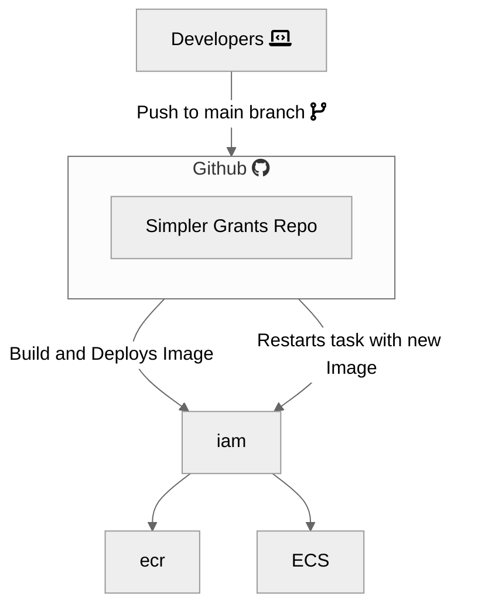
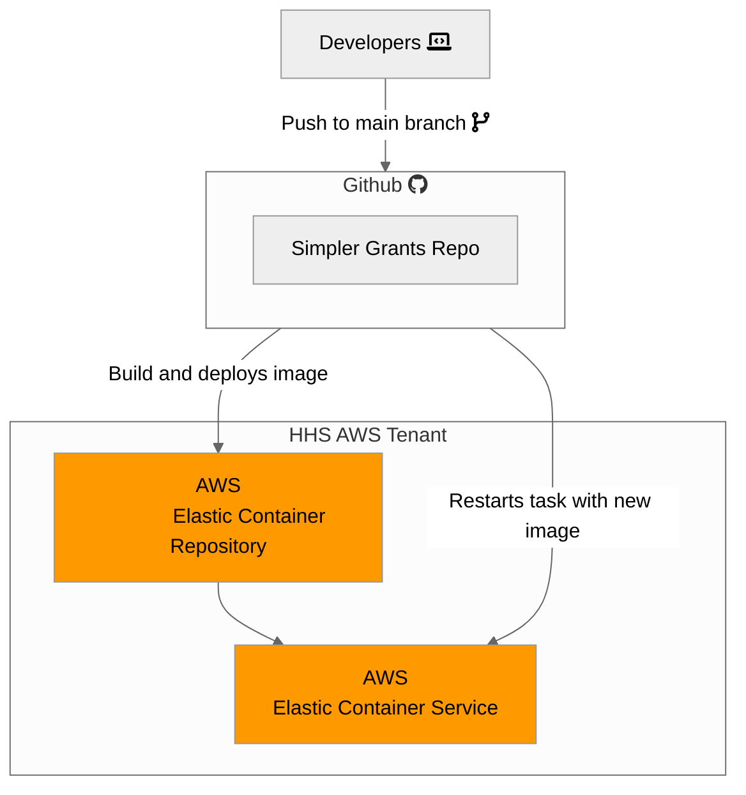

# Simpler.Grants.Gov Architecture

This document is meant to be a living record of the architecture for the simpler.grants.gov system. This includes the application, network, and infrastructure architecture, as well as the CI/CD pipeline, and other services and integrations used to support the applications.

At a high level, this system uses Github to maintain the codebase repository and run the CI/CD pipeline, and AWS to host the applications and its supporting services.

## Architecture

This is a general architecture diagram of the simpler.grants.gov system.

## AWS Hosted Infrastructure

This is an architecture diagram focusing on the AWS shared infrastructure managed by simpler.grants.gov. There's a [write up of the same information](#architecture-description) later in the document.

Source: The Nava LucidChart by viewing "Shared With Me" > "Nava" > "Grants.gov". You can also find it at [this shareable link](https://lucid.app/lucidchart/8d0fb4b2-fe85-4460-8df9-1255a506c5b6/edit?viewport_loc=-622%2C-233%2C5673%2C3098%2C0_0&invitationId=inv_a5fd77d9-d546-4b02-925a-6c3e254ccce7), if you already have access.

The infrastructure is documented as a [write up later in this document](#architecture-description).

## AWS Shared Services

The simpler.grants.gov is using the following non infrastructure shared services in AWS:

- [ECS: Elastic Container Service](https://aws.amazon.com/ecs/)
- [ECR: Elastic Container Registry](https://aws.amazon.com/ecr/)
- [System Manager - Parameter Store](https://docs.aws.amazon.com/systems-manager/latest/userguide/what-is-systems-manager.html)
  - Used to provide secrets and other run-time configuration options to the various services running in ECS
  - Allows those inputs to be changed by re-deploying without any code changes, CI/CD etc
- [Secrets Manager](https://docs.aws.amazon.com/secretsmanager/latest/userguide/intro.html)
  - Used for database connections
- [IAM: Identity and Access Management](https://aws.amazon.com/iam/)
- [Cloudwatch](https://aws.amazon.com/cloudwatch/)
- [Key Management Service](https://aws.amazon.com/kms/)
  - Managed keys for our encryption at rest on S3 and other places

## CI/CD Pipeline

This is a diagram focusing on the CI/CD pipeline

## Analytics Architecture

The "analytics" component of the application is the parts composed of the analytics service, the analytics PostgreSQL database, and Metabase. The analytics service is an ELT service that runs on AWS Step Functions via a cron trigger. At time of writing (May 2024), it collects its analytics data from GitHub. The analytics service is entirely composed of one-off tasks and does not deploy a load balancer. The analytics service extracts its data and loads it into the analytics database. The analytics database its an AWS RDS PostgreSQL database that is similar to, but distinct from, the main database that we use for our application. Metabase is a Business Intelligence dashboarding solution that we deploy. We deploy it behind a load balancer. That load balancer connects to the Metabase container. That Metabase container then connects to the analytics database, the same analytics database where the analytics ELT service is storing its data. Metabase is then configured to display charts and graphs of the data inside of the analytics database.

## Relevant ADRs

- [CI/CD Task Runner](../wiki/decisions/adr/2023-06-29-ci-cd-task-runner.md)
- [Database Choices](../wiki/decisions/adr/2023-07-05-db-choices.md)
- [Front-End Language](../wiki/decisions/adr/2023-07-10-front-end-language.md)
- [Front-end Framework](../wiki/decisions/adr/2023-07-14-front-end-framework.md)
- [Back-end Language](../wiki/decisions/adr/2023-06-30-api-language.md)
- [Back-End Framework](../wiki/decisions/adr/2023-07-07-api-framework.md)
- [Application Infrastructure Service](../wiki/decisions/adr/2023-07-20-deployment-strategy.md)
- [Analytics Data Storage](../wiki/decisions/adr/2024-03-19-dashboard-storage.md)
- [Analytics Dashboard Tool](../wiki/decisions/adr/2024-04-10-dashboard-tool.md)

## Architecture Description

Currently a single AWS Project houses all of the environments.

### Layers

AWS Cloudfront and API Gateway are deployed in front of public facing HTTPs services including the Front End and Back End services.

Services, including FE NextJS service, BE Python API service, Metabase service, Python Analytics Service, and Simpler NOFOs Python service are all hosted as containers running on ECS clusters. These services are set to auto scale as needed to handle increases in traffic. AWS Parameter Store is used to adjust Environment Variables being passed to the services to control behavior by environment and to support feature flags defaults for the NextJS and Python API services.

Managed AWS Services are used for our data storage layer, including AWS RDS for PostgreSQL, Manged OpenSearch for search index, and AWS S3 for file storage.

### Traffic Flow

#### Front End Requests

The public face of the project allows HTTPS traffic from the Internet to reach the AWS Cloudfront Content Delivery Network (CDN) configured for [simpler.grants.gov](https://simpler.grants.gov), [training.simpler.grants.gov](https://training.simpler.grants.gov), etc. The CDN routes those requests to AWS Application Load Balancers (ALBs). Those ALBs route the requests to the Elastic Container Service (ECS) Clusters and Services that host the Front End code, written in NextJS.

That NextJS code can serve our static pages directly, or by making requests through to the API layer. Front End traffic from the NextJS server side code connects to the API as indicated below, even though it is hosted side-by-side the traffic flows through the publicly exposed API Gateway.

#### API Requests

Public exposure of the API enters via the AWS API Gateway, publicly exposed on [api.simpler.grants.gov](https://api.simpler.grants.gov/docs), [api.training.simpler.grants.gov](https://api.training.simpler.grants.gov/docs) and is routed to the ECS services that serve the API.

#### File Requests

Publicly available files such as files attached to Opportunities, Application Instructions, etc. are accessed via a separate Cloudfront CDN which provides access to the S3 bucket where those files are stored.
