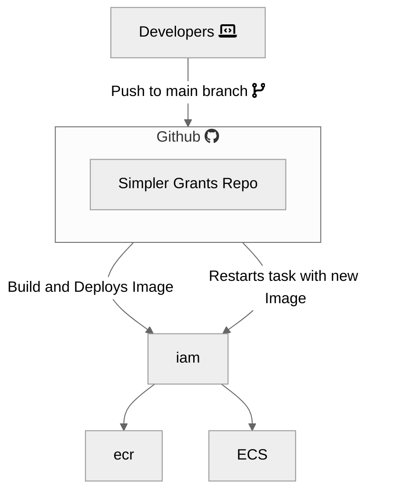
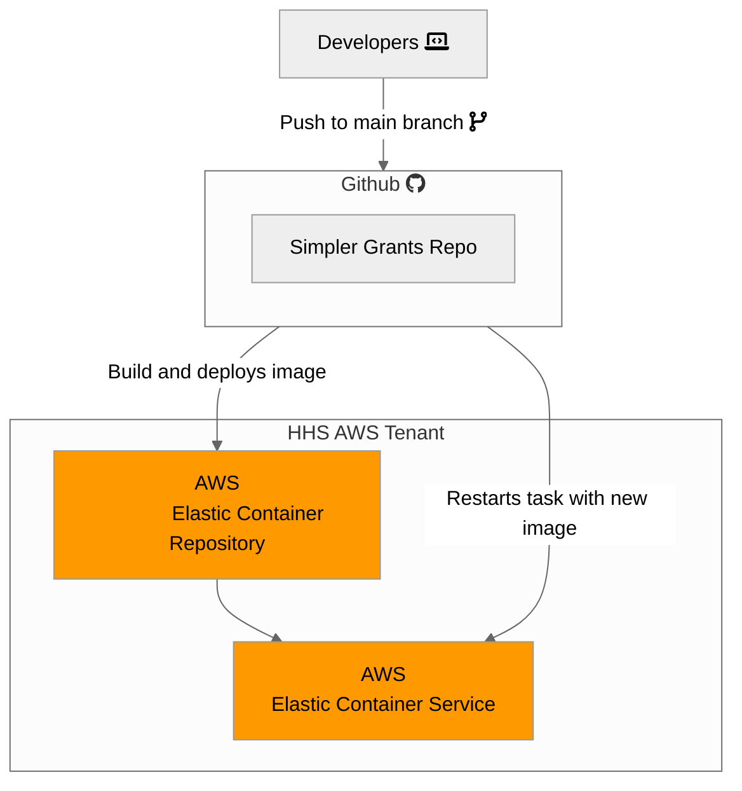

# Simpler.Grants.Gov Architecture

This document is meant to be a living record of the architecture for the simpler.grants.gov system. This includes the application, network, and infrastructure architecture, as well as the CI/CD pipeline, and other services and integrations used to support the applications.

At a high level, this system uses Github to maintain the codebase repository and run the CI/CD pipeline, and AWS to host the applications and its supporting services.

## Architecture

This is a general architecture diagram of the simpler.grants.gov system.

## AWS Hosted Infrastructure

This is an architecture diagram focusing on the AWS shared infrastructure managed by simpler.grants.gov

It was generated via the LucidChart. You can find it inside the Nava LucidChart by viewing "Shared With Me" > "Nava" > "Grants.gov". You can also find it at [this shareable link](https://lucid.app/lucidchart/8d0fb4b2-fe85-4460-8df9-1255a506c5b6/edit?viewport_loc=-622%2C-233%2C5673%2C3098%2C0_0&invitationId=inv_a5fd77d9-d546-4b02-925a-6c3e254ccce7), if you already have access.

## AWS Shared Services

The simpler.grants.gov is using the following non infrastructure shared services in AWS:

- [ECS: Elastic Container Service](https://aws.amazon.com/ecs/)
- [ECR: Elastic Container Registry](https://aws.amazon.com/ecr/)
- [SSM: System Manager](https://docs.aws.amazon.com/systems-manager/latest/userguide/what-is-systems-manager.html)
- [IAM: Identity and Access Management](https://aws.amazon.com/iam/)
- [Cloudwatch](https://aws.amazon.com/cloudwatch/)
- [Key Management Service](https://aws.amazon.com/kms/)

## CI/CD Pipeline

This is a diagram focusing on the CI/CD pipeline

## Analytics Architecture

The "analytics" component of the application is the parts composed of the analytics service, the analytics PostgreSQL database, and Metabase. The analytics service is an ELT service that runs on AWS Step Functions via a cron trigger. At time of writing (May 2024), it collects its analytics data from GitHub. The analytics service is entirely composed of one-off tasks and does not deploy a load balancer. The analytics service extracts its data and loads it into the analytics database. The analytics database its an AWS RDS PostgreSQL database that is similar to, but distinct from, the main database that we use for our application. Metabase is a Business Intelligence dashboarding solution that we deploy. We deploy it behind a load balancer. That load balancer connects to the Metabase container. That Metabase container then connects to the analytics database, the same analytics database where the analytics ELT service is storing its data. Metabase is then configured to display charts and graphs of the data inside of the analytics database.

## Relevant ADRs

- [CI/CD Task Runner](../wiki/decisions/adr/2023-06-29-ci-cd-task-runner.md)
- [Database Choices](../wiki/decisions/adr/2023-07-05-db-choices.md)
- [Front-End Language](../wiki/decisions/adr/2023-07-10-front-end-language.md)
- [Front-end Framework](../wiki/decisions/adr/2023-07-14-front-end-framework.md)
- [Back-end Language](../wiki/decisions/adr/2023-06-30-api-language.md)
- [Back-End Framework](../wiki/decisions/adr/2023-07-07-api-framework.md)
- [Application Infrastructure Service](../wiki/decisions//adr/2023-07-20-deployment-strategy.md)
