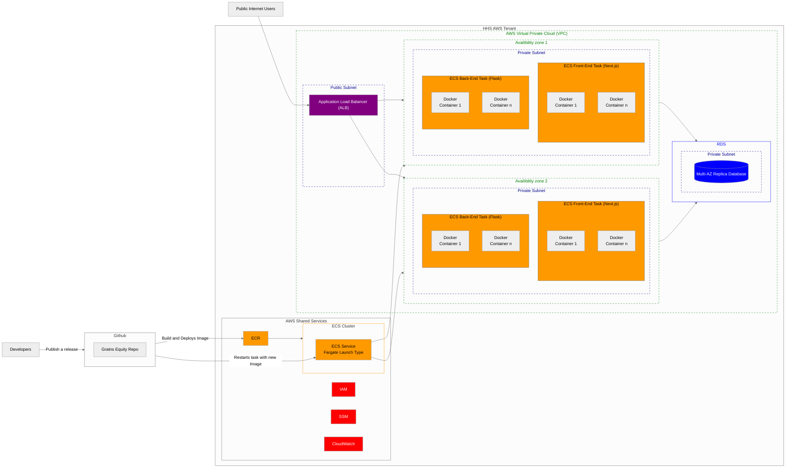

```mermaid
%%{init: {'theme': 'neutral' } }%%
flowchart LR

    %% AWS Tenant
    subgraph AWS [HHS AWS Tenant]
        shared
        VPC:::az
    end

    %% AWS Shared Services
    subgraph shared [AWS Shared Services]
        ECSC
        IAM:::sec
        SSM:::sec
        CloudWatch:::sec
        ECR:::ecs
    end

    subgraph ECSC [ECS Cluster]
        ECSS["`ECS Service
        Fargate Launch Type`"]:::ecs
    end
    style ECSC stroke:#FF9900


    %% AWS Services Within VPC
    subgraph VPC ["AWS Virtual Private Cloud (VPC)"]
        direction LR
        AZ1:::az
        AZ2:::az
        public-subnet1:::subnet
        RDS
        AZ1 & AZ2 --> RDS
    end

    subgraph public-subnet1 [Public Subnet]
        ALB["Application Load Balancer (ALB)"]:::lb --> AZ1 & AZ2
    end

    subgraph AZ1 [Availibility zone 1]
        direction TB
        private-subnet1:::subnet
        subgraph private-subnet1 [Private Subnet]
            ECS1:::ecs
            ECS2:::ecs
        end

    end
    subgraph AZ2 [Availibility zone 2]
        direction TB
        private-subnet2:::subnet
        subgraph private-subnet2 [Private Subnet]
            ECS3:::ecs
            ECS4:::ecs
        end

    end
    subgraph ECS1 ["ECS Front-End Task (Next.js)"]
        c1["` Docker
        Container 1`"]
        c2["` Docker
        Container n`"]
    end
    subgraph ECS2 ["ECS Back-End Task (Flask)"]
        c3["` Docker
        Container 1`"]
        c4["` Docker
        Container n`"]
    end
    subgraph ECS3["ECS Front-End Task (Next.js)"]
        c5["` Docker
        Container 1`"]
        c6["` Docker
        Container n`"]
    end
    subgraph ECS4 ["ECS Back-End Task (Flask)"]
        c7["` Docker
        Container 1`"]
        c8["` Docker
        Container n`"]
    end

    subgraph RDS
        subgraph private-subnet3 [Private Subnet]
            DB[(Multi-AZ Replica Database)]:::db
        end
    end
    style RDS stroke:blue,color:blue
    private-subnet3:::subnet

    ECR --> ECSC
    ECSS --> AZ1 & AZ2
    public[Public Internet Users] --> ALB

    %% Build/Deploy Pipeline
    eng[Developers] --Publish a release--> GH
    subgraph GH [Github]
        repo[Gratns Equity Repo]
    end
    GH --Build and Deploys Image--> ECR
    GH --Restarts task with new Image--> ECSS

    %% Styles
    classDef ecs fill:#FF9900,color:black
    classDef db fill:blue,color:white
    classDef az color:green,stroke:green,stroke-dasharray: 5 5
    classDef subnet color:darkblue, stroke:darkblue, stroke-dasharray: 5 5
    classDef lb fill:purple, color:white
    classDef sec fill:red,color:white
```
