# Deliverable dependencies

This document tracks the dependencies amongst deliverables in our [product roadmap](https://github.com/orgs/HHS/projects/12).

## Dependency diagram

Here are the dependencies amongst deliverables:

```mermaid

flowchart LR

  %% ─────────────────────────────
  %% Styles
  %% ─────────────────────────────
  classDef default fill:#fff,stroke:#333,stroke-width:1px,color:#000,rx:5,ry:5
  classDef InProgress fill:#e1f3f8,stroke:#07648d,stroke-width:2px,color:#000
  classDef Done fill:#8DE28D,stroke:#204e34,stroke-width:3px,color:#000
  style Canvas fill:transparent,stroke:#171716
  style Legend fill:#F7F7F4,stroke:#171716
  style simplerfind fill:#F7F7F4,stroke:#171716
  style simplerengagement fill:#F7F7F4,stroke:#171716
  style simplerapply fill:#F7F7F4,stroke:#171716
  style simplerplatform fill:#F7F7F4,stroke:#171716
  style simplerreporting fill:#F7F7F4,stroke:#171716
  style simplernofos fill:#F7F7F4,stroke:#171716
  style todo fill:#F7F7F4,stroke:#171716
  style simplerdelivery fill:#F7F7F4,stroke:#171716
  style commongrants fill:#F7F7F4,stroke:#171716

  %% ─────────────────────────────
  %% Legend
  %% ─────────────────────────────
  subgraph Legend["Key"]
    direction LR
    k1["Todo"]
    k2["In progress 🛠️ "]:::InProgress
    k3["Done ✔️"]:::Done

    k1 -.-> k2 -.-> k3
  end

  %% ─────────────────────────────
  %% Main canvas
  %% ─────────────────────────────
  subgraph Canvas["Dependencies"]
    direction LR


    subgraph simplerfind["🔎 SimplerFind"]
    direction LR
        HHS/simpler-grants-gov#2200["Search * ✔️"]:::Done
        HHS/simpler-grants-gov#2203["Opportunity Listing * ✔️"]:::Done
        HHS/simpler-grants-gov#2875["Search/Opportunity Listing v2 * ✔️"]:::Done
        HHS/simpler-grants-gov#3045["Full Support for Opportunity Attachments (NOFOs) * ✔️"]:::Done
        HHS/simpler-grants-gov#3525["Opportunity Email Notifications ✔️"]:::Done
        HHS/simpler-grants-gov#4571["Promote Simpler Search * ✔️"]:::Done
        HHS/simpler-grants-gov#4576["Permissions & Workflow Research ✔️"]:::Done
        HHS/simpler-grants-gov#5964["User Profile & Permissions * 🛠️"]:::InProgress
        HHS/simpler-grants-gov#5969["Simpler Search as Default"]
    end


    subgraph simplerengagement["💬 SimplerEngagement"]
    direction LR
        HHS/simpler-grants-gov#2204["Engagement Sessions * ✔️"]:::Done
        HHS/simpler-grants-gov#2215["Quad 1 Big Demo ✔️"]:::Done
        HHS/simpler-grants-gov#2348["Cross-program collaboration tools 🛠️"]:::InProgress
        HHS/simpler-grants-gov#3314["Open Source Community Growth ✔️"]:::Done
        HHS/simpler-grants-gov#3654["Co-Design Quad 2 ✔️"]:::Done
        HHS/simpler-grants-gov#4526["Participatory budgeting tools ✔️"]:::Done
        HHS/simpler-grants-gov#4574["Communications Content Strategy ✔️"]:::Done
        HHS/simpler-grants-gov#4577["Open Source Community Growth Quad 3 ✔️"]:::Done
        HHS/simpler-grants-gov#4578["Co-Design Quad 3 ✔️"]:::Done
        HHS/simpler-grants-gov#5966["Open Source Developer Experience"]
        HHS/simpler-grants-gov#5968["Co-design Group Quad 4"]
        HHS/simpler-grants-gov#5971["Site Content Transition & Management 🛠️"]:::InProgress
        HHS/simpler-grants-gov#5972["Public communications"]
    end


    subgraph simplerapply["📋 SimplerApply"]
    direction LR
        HHS/simpler-grants-gov#2213["Account creation workflow (design) ✔️"]:::Done
        HHS/simpler-grants-gov#2640["Authenticate via Login.gov ✔️"]:::Done
        HHS/simpler-grants-gov#3348["Simpler Application Workflow * ✔️"]:::Done
        HHS/simpler-grants-gov#3526["Simpler User Registration ✔️"]:::Done
        HHS/simpler-grants-gov#4572["Simpler Application Workflow Pilot * ✔️"]:::Done
        HHS/simpler-grants-gov#4575["SOAP Proxy/Router for Apply APIs * ✔️"]:::Done
        HHS/simpler-grants-gov#5961["Scale Apply User Workflow * 🛠️"]:::InProgress
        HHS/simpler-grants-gov#5965["Scale Apply Pilot Form Repository & Generation * 🛠️"]:::InProgress
        HHS/simpler-grants-gov#5970["Enable Grantor Agencies to Fetch Applications"]
    end


    subgraph simplerplatform["⚙ SimplerPlatform"]
    direction LR
        HHS/simpler-grants-gov#2214["Simpler.Grants.gov brand launch ✔️"]:::Done
        HHS/simpler-grants-gov#2224["Load testing for scale ✔️"]:::Done
        HHS/simpler-grants-gov#2226["Translation of a static site page ✔️"]:::Done
        HHS/simpler-grants-gov#3755["Simpler SOAP Proxy/Router ✔️"]:::Done
        HHS/simpler-grants-gov#4573["Tech Scaling ✔️"]:::Done
        HHS/simpler-grants-gov#4579["Automated API Key Management for External Users ✔️"]:::Done
    end


    subgraph simplerreporting["📊 SimplerReporting"]
    direction LR
        HHS/simpler-grants-gov#2225["Public Metabase Dashboard ✔️"]:::Done
        HHS/simpler-grants-gov#2347["Cross-program delivery metrics ✔️"]:::Done
        HHS/simpler-grants-gov#2902["Program-level KPIs"]
        HHS/simpler-grants-gov#3377["Delivery Metrics 2.0 ✔️"]:::Done
        HHS/simpler-grants-gov#3763["Public Product Analytics"]
        HHS/simpler-grants-gov#4354["Dashboard version control"]
    end


    subgraph simplernofos["📣 SimplerNOFOs"]
    direction LR
        HHS/simpler-grants-gov#2227["NOFO builder migration"]
        HHS/simpler-grants-gov#5688["SNOFO - User Research & Eval Quad 3 ✔️"]:::Done
        HHS/simpler-grants-gov#5689["SNOFO - User Research & Eval Quad 4"]
        HHS/simpler-grants-gov#5690["SNOFO - User Research & Eval Quad 5"]
    end


    subgraph todo["Todo"]
    direction LR
        HHS/simpler-grants-gov#2228["Quad 1 user research"]
        HHS/simpler-grants-gov#3109["Simpler.Grants.gov Program Work Catch-all"]
        HHS/simpler-grants-gov#3688["P&D Work Catch All - Quad 3 ✔️"]:::Done
        HHS/simpler-grants-gov#4501["Gail's Test Deliverable 1"]
        HHS/simpler-grants-gov#4502["Gail's Test Deliverable 2"]
        HHS/simpler-grants-gov#6139["TEST DELIVERABLE 1"]
    end


    subgraph simplerdelivery["SimplerDelivery"]
    direction LR
        HHS/simpler-grants-gov#2356["Cross-program product strategy (Quad 2) ✔️"]:::Done
        HHS/simpler-grants-gov#2357["Cross-program team health ✔️"]:::Done
        HHS/simpler-grants-gov#2903["Deliverable linting and mapping 🛠️"]:::InProgress
        HHS/simpler-grants-gov#6265["P&D catch-all: Quad 4 🛠️"]:::InProgress
    end


    subgraph commongrants["💱 CommonGrants"]
    direction LR
        HHS/simpler-grants-gov#2901["Grant protocol specification * ✔️"]:::Done
        HHS/simpler-grants-gov#4352["CommonGrants - Apply workflow * ✔️"]:::Done
        HHS/simpler-grants-gov#4353["CommonGrants - Developer tools ✔️"]:::Done
        HHS/simpler-grants-gov#5892["CommonGrants: Co-Planning * 🛠️"]:::InProgress
        HHS/simpler-grants-gov#6195["CommonGrants: Form library"]
        HHS/simpler-grants-gov#6201["CommonGrants: Schema versioning"]
    end


    %% ─────────────────────────────
    %% Relationships
    %% ─────────────────────────────
    HHS/simpler-grants-gov#4353 --> HHS/simpler-grants-gov#6201
    HHS/simpler-grants-gov#5892 --> HHS/simpler-grants-gov#6195
    HHS/simpler-grants-gov#6201 --> HHS/simpler-grants-gov#6195

  end

```

