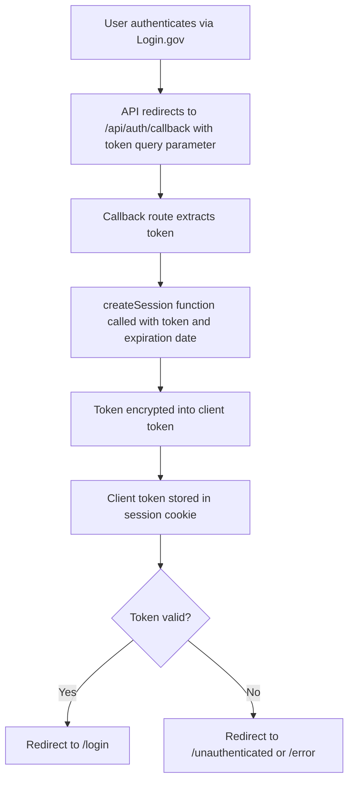
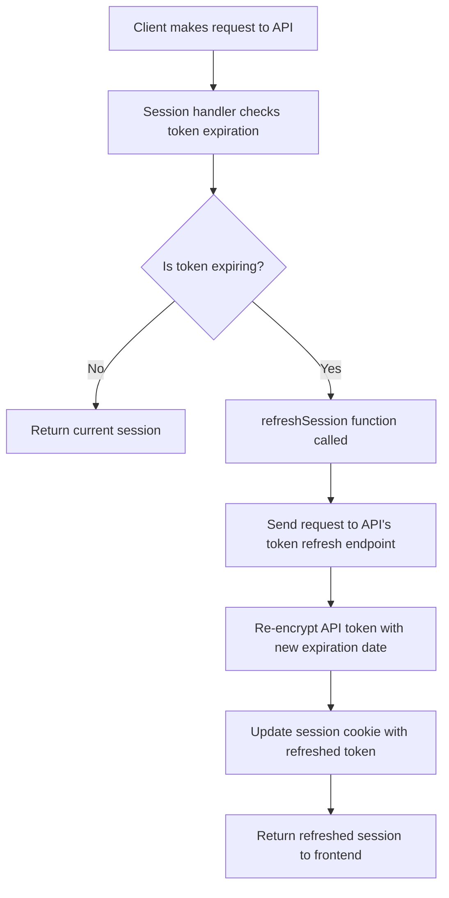

# Authentication

This document explains how the Simpler Grants Next JS frontend application handles token creation, token checks, and expiration refreshes to manage user authentication.

## Token Creation

Tokens are created at the end of the login process, which is initiated when a user authenticates against Login.gov via the Simpler API. The API / Login.gov process is covered in the API documentation here(https://github.com/HHS/simpler-grants-gov/blob/main/documentation/api/authentication.md).

Once the flow takes you into the frontend code, the token:

- is extracted from the query param in the callback route

  - After successful authentication, the API redirects the user to the `/api/auth/callback` route with a `token` query parameter.
  - The `GET` handler in `callback/route.ts` processes this request.

- is encrypted into a client cookie

  - the token from the query param is encrypted with a new expiration date and stored in a `session` cookie

- sent down to the client on redirect
  - If the token is valid and the session is successfully created, the user is redirected to the `/login` page.
  - If the token is missing or an error occurs during session creation, the user is redirected to an error page (`/unauthenticated` or `/error`).

## Token Checks

### How and When Tokens Are Checked

Tokens are validated during user interactions with the application. Specifically:

- Routine Session Retrieval

  - whenever the client makes a call to the Next API's /session route, the token provided from the session cookie will be validated
  - these calls can be traced from the [useUser `getUserSession` function](https://github.com/HHS/simpler-grants-gov/blob/7eab597355d4fc0d1e3e32a1a82d1987cc9a7df8/frontend/src/services/auth/UserProvider.tsx#L21)
  - generally, this is done whenever a user logs in or out

- Expiration Checks
  - expiration checks are run on each route change and API request within the client application. See:
    - [useClientFetch](https://github.com/HHS/simpler-grants-gov/blob/7eab597355d4fc0d1e3e32a1a82d1987cc9a7df8/frontend/src/hooks/useClientFetch.ts#L21)
    - [RouteChangeWatcher](https://github.com/HHS/simpler-grants-gov/blob/main/frontend/src/components/RouteChangeWatcher.tsx)
  - checks are also run whenever the session is retrieved from the API as described above

### What Happens If a Token Check Fails

If a token is invalid or expired the user is logged out of the system, and shown a message that they have been logged out. In most cases this requires an automated page refresh in order to fully log the user out of the UI.

The logged out message is controlled by [logic in the Header component](https://github.com/HHS/simpler-grants-gov/blob/7eab597355d4fc0d1e3e32a1a82d1987cc9a7df8/frontend/src/components/Header.tsx#L258).

---

## Token Expiration Refreshes

### How Tokens Are Refreshed

The application refreshes tokens to extend the user's session without requiring them to log in again. This process involves:

1. **Client Request**

   - Whenever the client makes a request to the NextJS api using the `clientFetch` function returned by the `useClientFetch` hook, the client will make a call to the /session endpoint

1. **Expiration Detection**:

   - When the session handler is called, it checks if the session is expiring using the `isExpiring` function. Currently `isExpiring` is set to consider any token that is less than 10 minutes from expiring to be eligible for refresh

1. **Token Refresh Process**:

   - The `refreshSession` function in `session.ts` is called to refresh the token.
   - This function:
     - Sends a request to the Simpler API's token refresh endpoint (`postTokenRefresh`) to update the expiration on the server side.
     - Re-encrypts the existing API token with a new expiration date using the `createAndReturnSession` function.
     - Updates the `session` cookie with the refreshed token.

1. **Frontend Behavior**:
   - The refreshed session is returned to the frontend, ensuring the user remains authenticated without interruption.

## Diagrams

### Token Creation

### Token Refresh

