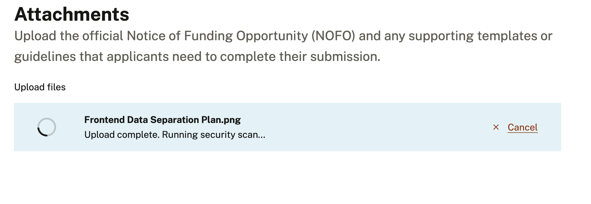
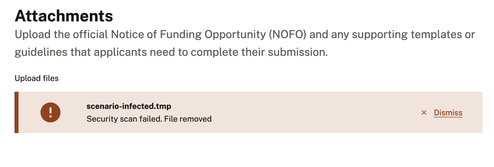
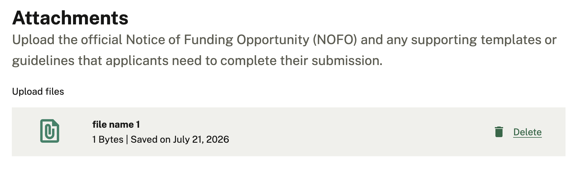
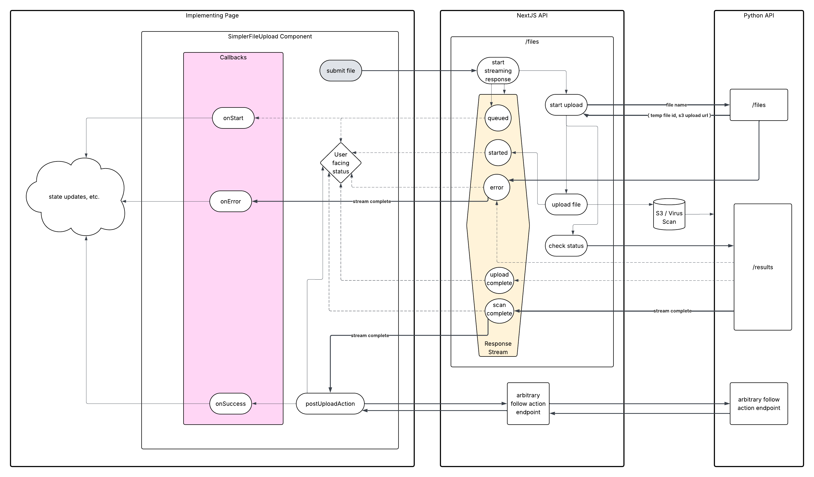

# SimplerFileInput

This component, and NextJS APIs it communicates with, provide an client side / frontend interface for interacting with the [Python API's file upload system documented here](https://github.com/HHS/simpler-grants-gov/blob/main/documentation/api/file-upload-and-scanning.md)

## Overview

The SimplerFileInput provides the entire Simpler Grants application with an easy way to manage file uploads. It should be used for all file uploads across the application.

The component and the backend systems it communicates provide:

- virus scanning and file triage
- upload cancellation
- file deletion
- display of previously uploaded files
- upload status tracking
- concurrent multi-file uploads

The SimplerFileInput wraps the [Trussworks FileInput](https://github.com/trussworks/react-uswds/blob/main/src/components/forms/FileInput/FileInput.tsx).

## Usage

### Upload States and Error Handling

The component will track display status messaging as the upload moves through the following statuses:

- queued
  - we're obtaining metadata necessary for processing the upload
- uploading
  - the file is uploading to s3
- "starting-scan"
  - scan request has begun but no scan status has been returned yet
- pending
  - virus scan in progress
- complete
  - virus scan complete and successful
- "post-upload"
  - post upload action in progress
- success
  - post upload adction complete

Display of an in progress upload will look like this:



The following error statuses may also be displayed, depending on which phase of the upload process the error occurred during

- error
  - a generic error - displayed when the system can't determine what else to show
- infected
  - the virus scan determined that the file was infected
- "upload-error"
  - error during s3 upload
- "scan-error"
  - non-infection-related error during virus scan
- "file-id-error"
  - if the error occurs between completion of the virus scan and starting the post upload action, the culprit is a missing file id that should be returned from the API at this juncture.
- "pre-upload-error"
  - error while retrieving upload metadata prior to s3 upload
- "post-upload-error"
  - error while running the post upload action

Display of an in progress upload will look like this:



### Single vs Multifile

The component supports both single and multi file uploads based on the `multiFile` prop. Non-multifile inputs will disallow selection of more than one file. On drag and drop, non-multifile inputs will accept only the first file in the list. Non-multifile inputs with an existing file will only accept a new file after deleting the existing file. There is no replacement functionality, but deleting and reuploading accomplishes the same thing.

If an upload on a single file input errors out, a new file can be uploaded once the error is dismissed

Multi-file uploads will accept any number of files either concurrently or in sequence.

### Customization

The following props are exposed by the component to allow for customization:

#### Status messages

- postUploadActionProgressMessage
  - status message to display during post upload action
- postUploadActionSuccessMessage
  - status message to display after post upload action success
- postUploadActionErrorMessage
  - status message to display on post upload action error

#### Callbacks

Callbacks are supported to allow pages to respond to events during upload in any way that they need to. For instance, a page may want to display a custom banner on success or error, or run some logic or make an API call when the upload starts or completes.

- onDelete
  - callback to run after file deletion
- onError
  - callback to run after any error during upload or post upload
- onSuccess
  - callback to run after successful post upload action
- onStart
  - callback to run when beginning an upload
- onComplete
  - callback to run after completed upload (success or error)

### Post Upload Actions

A successful file upload and virus scan will result in:

- a file stored in a temporary S3 bucket
- a temporary file record stored in the database

In order to support actually doing something with the file after upload, the SimplerFileInput allows for a "post upload action". What the post upload action does will be different for each form but in most cases it will associate the file with a given entity and move the file into a permanent S3 bucket.

For example, in the case of uploading a file to be attached to an application form, this function would make a request to attach the given file id as an attachment to a given form.

On a technical level, once the file upload and virus scan have completed successfully, the component will call the postUploadAction function provided via prop with the file id returned from the file upload request.

The upload process will not be considered complete until this function resolves, and will display the message provided in the postSaveActionProgressMessage prop while the request is in progress. If the function errors, the postSaveActionErrorMessage will be displayed to the user.

Note that postUploadAction is a required prop, since without a post upload action, the file upload itself will only create the file in s3 and record it in a temporary file table, and not create an idea of what the file represents in the system. Thus, there is no reasonable use case for file upload that will not involve a post upload action to provide context for where the file should be referenced.

### Display of existing / previously uploaded files

Each previously uploaded file will be passed in as an object with metadata to display for the file in the “existingFiles” prop

```
{
  id: string;
  fileName: string;
  fileSize?: number;
  mimeType?: string;
  downloadUrl?: string;
  updatedAt: string;
}
```

The component will:

- format the file size (which will come in as a byte size from the API) into a readable format in KB, MB, GB
- format time stamp into standard format (see designs)
- display a “card” with a delete button for each uploaded file.

For single file inputs, when a previously uploaded file exists, the file input itself (Trussworks component) will be hidden. If the file is deleted it will be unhidden.

Note that tracking uploaded files is the job of the parent form or page. Once a file upload has completed, the file input component does not track its status internally or move it into an internally tracked “existingFiles” state. This means that on upload or delete, the parent page should implement a mechanism to refetch the list of uploaded files and populate “existingFiles” from above.

Display of an existing file will look like this:



## Data Flow

### Diagram



## What it doesn't do

- support autosave
  - any functionality related to saving a form will always be the form or its parent page, rather than the file upload component, so this is something feature teams will need to handle at a higher level

- status messages beyond what the API is currently designed to support, such as upload progress percentage indication
  - this is out of scope based on the limitations of the systems we are using

- filtering / blocking upload by file type
  - this is out of scope pending decisions around priority and requirements for system wide file type filtering. Would need to be implemented on API as well, and is not required for this work

- preview / thumbnail of uploaded files
  - potentially v2 feature

- pause / resume upload
  - high complexity from a backend perspective that may not be solveable. If this is ever a requirement we would need to explore feasibility

- maximum concurrent uploads
  - potentially v2 feature

- maximum uploads per field
  - potentially v2 feature

- display of metadata other than filename, including link to download, for uploaded files
  - potentially v2 feature
