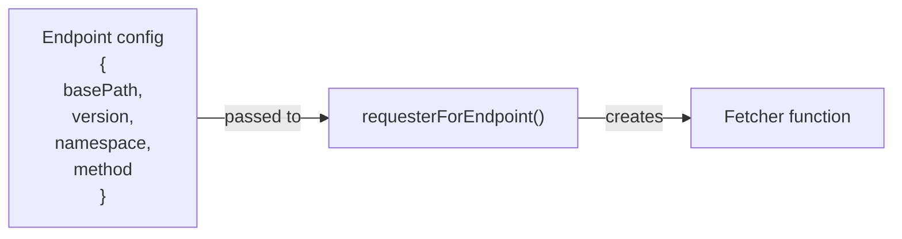
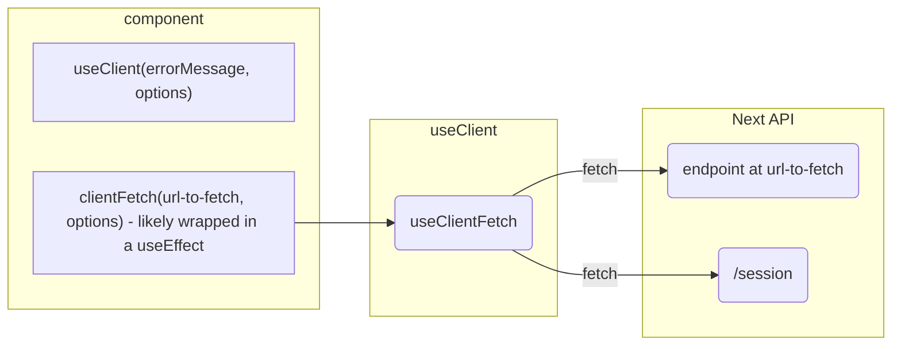

# Simpler Grants Next JS Request Patterns

## Background

In creating an application that is easy to extend, and allows for contributors to build new functionality without getting continuously bogged down in the same implementation details, we've created some utlities and patterns for making requests to outside services that should be used whenever the application communicates with outside entities.

Patterns differ depending on where requests are originating. Because the NextJS ecosystem encompasses server and client code, requests from the application can be made from both the client and the server, with different limitations and needs depending on where they are coming from.

For the most part, patterns as set up in the following places:

- For server requests - [the fetch service directory](https://github.com/HHS/simpler-grants-gov/tree/main/frontend/src/services/fetch)

  - [endpointConfigs](https://github.com/HHS/simpler-grants-gov/blob/main/frontend/src/services/fetch/endpointConfigs.ts)
  - [fetchers](https://github.com/HHS/simpler-grants-gov/blob/main/frontend/src/services/fetch/fetchers/fetchers.ts)
  - individual fetcher implementations

- For client requests - [useClientFetch hook](https://github.com/HHS/simpler-grants-gov/blob/main/frontend/src/hooks/useClientFetch.ts)

## Server

Server side requests can be made using fetcher functions defined by a config for each requested path that will be requested from the Simpler API. Each fetcher will, by default:

- insert the header for the Simpler API's API key
- format request body based on the type of body passed and request method
- log, format and throw errors for non 200 requests and other errors

### Creating a Fetcher

- Create a endpoint config
  - Define the path and method for your request using the pattern found in [endpointConfigs](https://github.com/HHS/simpler-grants-gov/blob/main/frontend/src/services/fetch/endpointConfigs.ts)
- Create a fetcher function by wrapping the endpoint config in the `requesterForEndpoint` function
  - Follow the pattern in [fetchers](https://github.com/HHS/simpler-grants-gov/blob/main/frontend/src/services/fetch/fetchers/fetchers.ts) to define a function for your configuration

### Using a Fetcher

Once you have your fetcher function created, you can call it with any supported options necessary for the particular call. Available options are:

- subPath - any dynamic path segments following the namespace path defined in the endpoint config
- body - json body used either for POST / PUT payloads, or stringified into a query string for a GET request
- additionalHeaders - any headers to add or overwrite on top of the default "X-AUTH" and "content-type"
- nextOptions - see https://nextjs.org/docs/app/api-reference/functions/fetch#fetchurl-options

Fetchers will return a raw response object on success.

To format requests or responses beyond the fetcher itself, such as to format a request body or return a json object from the response, you can build a function to consume the fetcher. See the individual fetcher implementations in [the fetch services directory](https://github.com/HHS/simpler-grants-gov/tree/main/frontend/src/services/fetch) for examples.

### Diagram

## Client

The system for client side fetches is less about defining reusable functions based on endpoints, and more about performing common functions around each request, particularly in relation to authentication. The useClientFetch hook accomplishes this, and leaves much of the rest of the job of defining logic up to the component making the request.

One consideration to keep in mind with client fetch functionality is async handling - while server functions are free to be asynchronous in a normal way, client functions, since they are built to be run in client components, need to take into account limitations and obligations in regards to async behavior. Client components cannot use `async - await` syntax in their renders the way that server components canm, and must keep the UI aware of any operations going on (with loading spinners, etc.) more manually.

### What the hook does

The useClient hook is designed to perform authentication related actions under the hood without exposing the intricacies of that interaction to the components making requests.

When making a request using the `clientFetch` function returned by the hook, the hook will:

- check to see if a user's token is expired
  - if the token is expired and the hook is set (using the `authGatedRequest` option) to error if unauthenticated, the function will throw an error before making the fetch request
- check to see if user's token is expiring, and needs to be refreshed
  - if the token's expiration date is within the refresh window (currently set at 10 minutes in the future) a request will be made to proactively extend the life of the token by 15 minutes
- when gating requests for authentication, the function will refresh the page on any unauthenticated calls
  - this is necessary to effectively "log out" the user. This refreshes the server side cache and rerenders any server side rendered parts of the UI which may need to be updated to reflect a "not logged in" state

### Using the hook

The hook takes one required argument - an error message string to append to any errors received while fetching - and one optional options argument with the following parameters:

- jsonResponse - does the function return the json object body of the response, or the raw response object? Defaults to true
- authGatedRequest - should the function fail if a user token is missing or expired? Defaults to false

The hook is generically typed, based on the return type of the fetch function - for functions that return json, this will be the type of the json object returned, for functions returning a raw response object, it will be the resopnse object type.

The hook returns the `clientFetch` function, which can be called with the same signature as a standard `fetch`.

### Diagram

