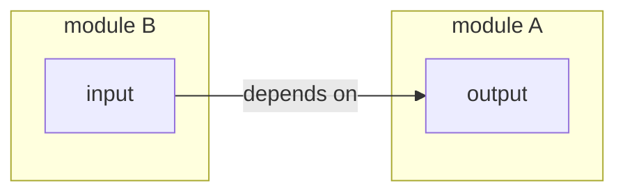
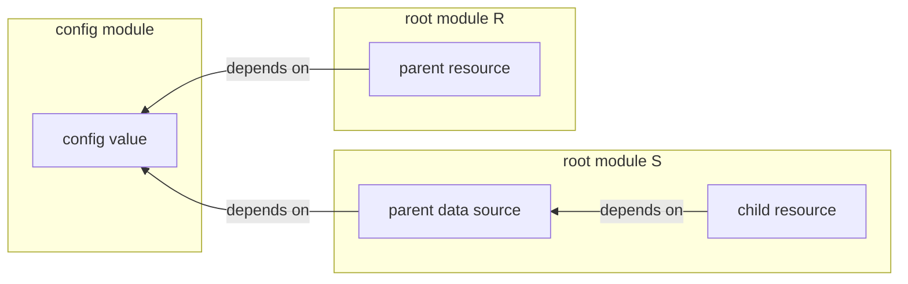

# Managing module dependencies

These are the principles that guide the design of the infrastructure template.

## Use explicit outputs and variables to connect resources across child modules in the same root module

If a resource in module B depends on a resource in module A, and both modules are called from the same root module, then create an output in module A with the information that is needed by module B, and pass that into module B as an input variable.

```terraform
# root-module/main.tf

module "a" {
  ...
}

module "b" {
  input = module.a.output
}
```

This makes the dependencies between the resources explicit:



**Do not** use [data sources](https://developer.hashicorp.com/terraform/language/data-sources) to reference resource dependencies in the same root module. A data source does not represent a dependency in [terraform's dependency graph](https://developer.hashicorp.com/terraform/internals/graph), and therefore there will potentially be a race condition, as Terraform will not know that it needs to create/update the resource in module A before it creates/updates the resource in module B that depends on it.

## Use config modules and data resources to manage dependencies between root modules

If a resource in root module S depends on a resource in root module R, it is not possible to specify the dependency directly since the resources are managed in separate state files. In this situation, use a [data source](https://developer.hashicorp.com/terraform/language/data-sources) in module S to reference the resource in module R, and use a shared configuration module that specifies identifying information that is used both to create the resource in R and to query for the resource in S.

```terraform
# root module R

module "config" {
  ...
}

resource "parent" "p" {
  identifier = module.config.parent_identifier
}
```

```terraform
# root module S

module "config" {
  ...
}

data "parent" "p" {
  identifier = module.config.parent_identifier
}

resource "child" "c" {
  input = data.parent.p.some_attribute
}
```

This makes the dependency explicit, but indirect. Instead of one resource directly depending on the other, both resources depend on a shared config value(s) that uniquely identifies the parent resource. If the parent resource changes, the data source will also change, triggering the appropriate change in the child resource. If identifying information about the parent resource changes, it must be done through the shared configuration module so that the data source's query remains in sync.



## When it is not feasible to create resources using static configuration values, use root module outputs and configuration scripts to manage dependencies between root modules

In rare cases, it is not feasible to use configuration values to create a resource. In this situation, if a resource in root module S depends on a resource in root module R, create an output in R with the information that is needed by module S. Then create a configuration script for S that reads from R's output and saves the relevant information in a `.tfvars` file that S can use to specify input variables.

One example of this is the terraform bucket name that is used by the `data.terraform_remote_state.current_image_tag` data source in the `service` module. The bucket name is generated dynamically using the current AWS user's account ID, and is therefore is not specified statically via configuration.

This method should be used minimally as it is the least explicit and most brittle of all the methods. The dependency between modules remains implicit, and there is additional logic in shell scripts to maintain.
