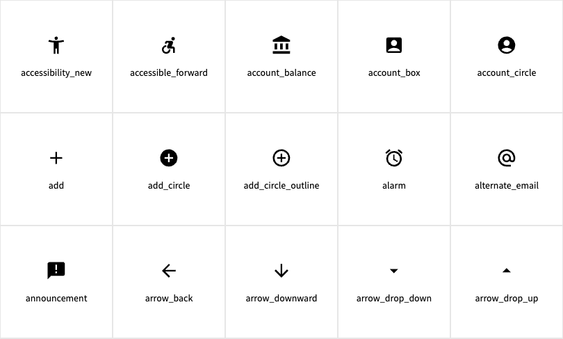

---
layout:
  title:
    visible: true
  description:
    visible: false
  tableOfContents:
    visible: true
  outline:
    visible: true
  pagination:
    visible: true
---

# Iconography

## Overview

Icons are simple symbols that attract attention, aid navigation, signal an action, add emphasis, or provide feedback. Icons serve as recognizable cues that users can understand easily — typically without thinking too hard.

## USWDS Icon Component

Icons must be used consistently across our site and communications applications in order to accomplish their purpose well. For example, using an envelope icon for both email and a mailing address would likely confuse people. Viewers should be able to trust that a certain icon always means the same thing, no matter where it’s used.

All USWDS icons have passed WCAG 2.1 AA.

<figure><figcaption></figcaption></figure>

[View icon components from USWDS](https://designsystem.digital.gov/components/icon/)

## Examples

Icons can be used as a graphic device to present information. It has the unique quality of creating both visual interest and carrying content with a seamless relationship. Use the following examples as a starting point for creating graphic visuals with typography.

* _Coming Soon_
