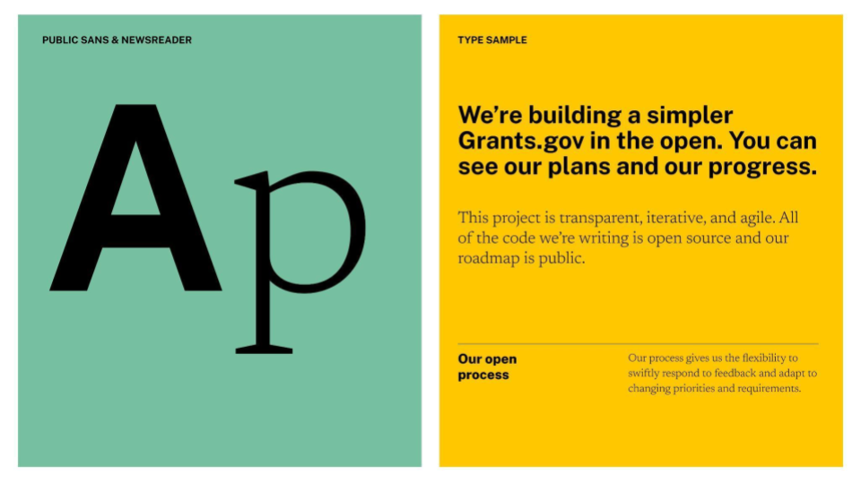

---
layout:
  title:
    visible: true
  description:
    visible: false
  tableOfContents:
    visible: true
  outline:
    visible: true
  pagination:
    visible: true
---

# Typography

## Overview

Typography is one of the most, if not the most, important communication tools for our brand. It carries our brand voice; with it, we establish our tone, personality, and message.&#x20;

<figure><figcaption></figcaption></figure>

## Primary Typeface

### Public Sans

Public Sans is a strong, neutral, open-source typeface for interfaces, text, and headings developed by USWDS. It is seen across US government websites and communications, giving Grants an additional source of credibility.

[Download Public Sans](https://fonts.google.com/specimen/Public+Sans). It is already included in USWDS but should be added to HHS staff computers to maintain brand alignment.

<figure><figcaption></figcaption></figure>

Public Sans Regular and Regular Italic:

<figure><figcaption></figcaption></figure>

Public Sans ExtraBold and Extrabold Italic:

<figure><figcaption></figcaption></figure>

## Secondary Typeface

### Newsreader

Newsreader is an open-source font from Production Type designed for on-screen, longer-form reading. NewsReader’s shapes are open and familiar, fostering engaged reading, with features like optical sizes and large display cuts that maximize the type’s ability to be expressive.&#x20;

[Download NewsReader](https://fonts.google.com/specimen/Newsreader). It should be added to HHS staff computers to maintain brand alignment.

<figure><figcaption></figcaption></figure>

NewsReader Regular and Regular Italic:

<figure><figcaption></figcaption></figure>

NewsReader SemiBold and Semibold Italic:

<figure><figcaption></figcaption></figure>

## Hierarchy

Different type sizes should always have a relationship to one another. There is no exact rule, but select a base type size in a composition and make all other sizes proportionate to this foundation—our brand defaults to a 1.35 type scale.

<figure><figcaption></figcaption></figure>

## Alternates

Use these alternates when there are program limitations for typeface use, such as fallback fonts on the web or PowerPoint decks:

* Public Sans → Arial
* NewsReader → Georgia

## Examples

Typography is used to deliver information and express our brand characters. Below are some examples of the typography in use.

* _Coming Soon_

## Don’ts

* Do not outline the type
* Do not set the type too small
* Do not apply effects
* Do not set type in all caps
* Do not use low-contrast combinations
* Do not set in all lowercase
* Do not use past typefaces
* Do not use unapproved typefaces
* Do not use low-contrast combinations
* Do not justify text
* Do not center-align
* Do not right align
