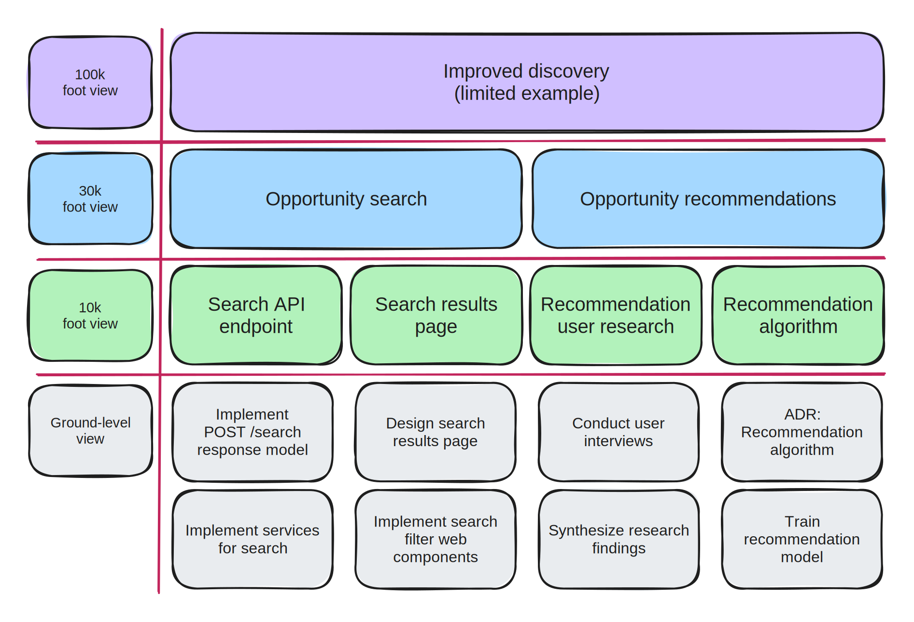

# Product roadmap


**Important**

This section contains forward-looking statements and descriptions of functionality that are subject to change. These statements involve known and unknown risks, uncertainties, and other factors that may cause our actual results to differ from what is described here.

Forward-looking statements give our expectations or forecasts of future events, and you should not place undue reliance on these statements.


## Roadmap levels

Throughout our documentation and wiki, you'll like likely see references to "30k" and "10k". These terms refer to deliverables on our roadmap described at various levels of granularity. Each level is described in further detail below and a quick summary can be found in the [terminology section](../about/terminology.md) of our wiki.&#x20;


**Important**

The deliverables listed in the diagram and table below are not guaranteed to be in our future roadmap. They are meant to simply serve as _**limited**_ _**examples**_ of how work is broken down in our roadmap.

Additionally, we've only included a few deliverables at each level to illustrate the relationships between them. The actual roadmap includes many more deliverables.


<table><thead><tr><th width="162">Roadmap level</th><th width="339">Description</th><th>Examples</th></tr></thead><tbody><tr><td>100K foot view</td><td>Describes major product work streams at a 100,000 foot view, which aim to deliver a set of related features over a multi-year timeline.</td><td><ul><li>Improved discovery</li><li>Streamlined apply</li></ul></td></tr><tr><td>30K foot view</td><td>Describes major product features at a 30,00 foot view, which aim to deliver new or improved functionality to users over a multi-month timeline.</td><td><ul><li>Search MVP</li><li>Opportunity recommendations</li></ul></td></tr><tr><td>10K foot view</td><td>Describes a group of related tasks at a 10,000 foot view, which aim to deliver functionality necessary for a given 30K deliverable over a multi-sprint period.</td><td><ul><li>Search API endpoint</li><li>Search page results</li></ul></td></tr></tbody></table>

## Roadmap slide deck

The following slide deck contains a description of our approach to the Simpler.Grants.gov project as well as description of the project roadmap at various levels of detail.


Product roadmap slide deck


## 100k foot roadmap

This section describes our product roadmap at a 100,000 foot view on a multi-year timeline. It is meant to describe the major phases and work streams of the Simpler.Grants.gov initiative.

### Improved discovery

* **Goal:** Make it easier for **all** applicants to **discover** funding opportunities that they are qualified for and that meet their needs.
* **Proposed strategies**
  * Improve the user experience for search
  * Increase the accuracy of search results
  * Proactively recommend possible funding opportunities based on applicant profile
* **Measures of success**
  * ⬆ Increase the conversion rate from viewing an opportunity to starting an application
  * ⬆ Increase the percentage of applicants who find opportunities through grants.gov
  * ⬇ Decrease the number of applications from applicants who are ineligible

### Streamlined apply

* **Goal:** Make it easier for **all** applicants to **apply** for a funding opportunity after discovering one that meets their needs.
* **Proposed strategies**
  * Improve the user experience of the application workflow
  * Reduce the complexity of application steps and requirements
  * Improve integrations with key systems like GrantSolutions, sam.gov, & login.gov
* **Measures of success**
  * ⬆ Increase the conversion rate from starting an application to submitting one
  * ⬆ Increase the number of applications from organizations with limited grant-seeking resources
  * ⬇ Decrease the amount of time it takes to prepare and submit an application

### Advanced reporting

* **Goal:** Improve our ability to report on the full grants pipeline, in order to evaluate its overall efficiency and fairness.
* **Proposed strategies**
  * Update and align federal data standards
  * Build automated data pipelines to join related data sources
  * Expand the scope and maturity of our data analysis
* **Measures of success**
  * ⬆ Increase the percentage of opportunities about which we can report award data
  * ⬆ Increase the number of questions we can reliably answer with grant pipeline data
  * ⬆ Increase the amount of non-sensitive data shared publicly about the grants pipeline
