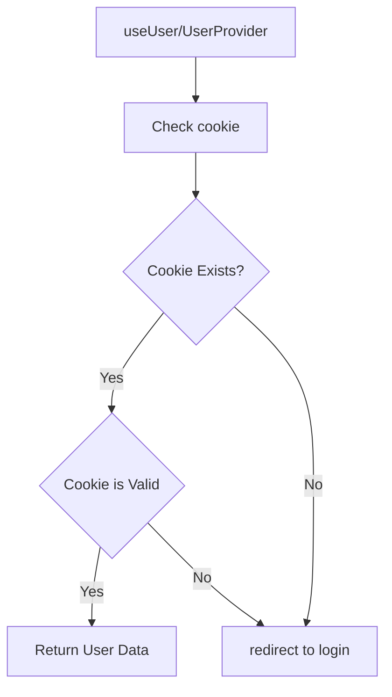
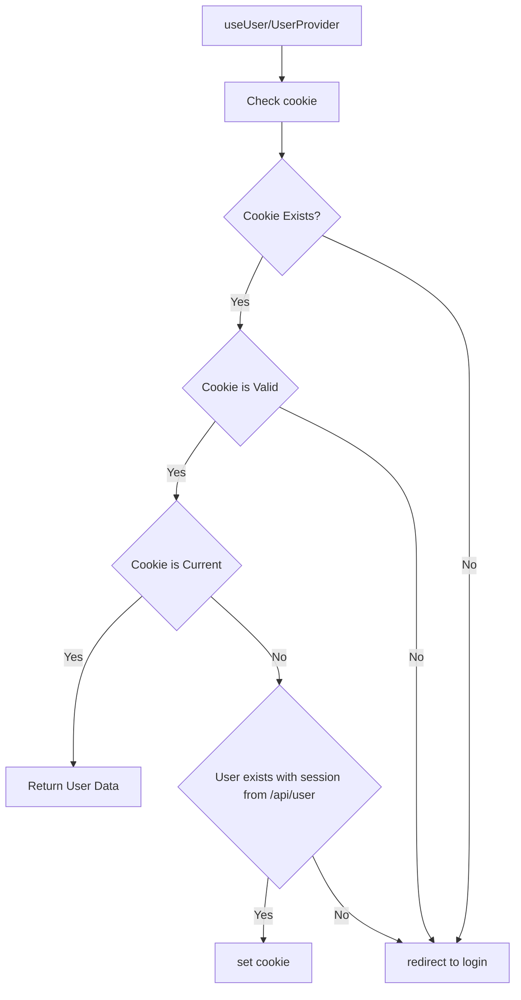

# User Auth

### Notes

* Server components can't write cookies, but  middleware, route handlers and server actions can.

### Login flow

* user clicks "login"
    * client side component directs users to /api link
* user comes back with a simpler JWT to /auth/callback
    * verifies JWT
    * sets cookie
* useUser / UserProvider
    * checks cookie / API (see diagram)

## Next step

